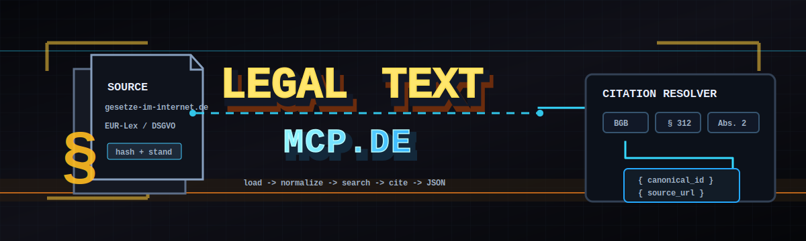

<p align="center">
  
</p>

<p align="center">
  <a href="https://pypi.org/project/legal-text-mcp-de/"></a>
  <a href="https://pypi.org/project/legal-text-mcp-de/"></a>
  <a href="https://github.com/klein-business/legal-text-mcp-de/blob/main/LICENSE"></a>
  <a href="https://github.com/klein-business/legal-text-mcp-de/releases/latest"></a>
  <a href="https://github.com/klein-business/legal-text-mcp-de/pkgs/container/legal-text-mcp-de"></a>
  <a href="https://klein-business.github.io/legal-text-mcp-de/"></a>
</p>
<p align="center">
  <a href="https://github.com/klein-business/legal-text-mcp-de/actions/workflows/ci.yml"></a>
  <a href="https://github.com/klein-business/legal-text-mcp-de/actions/workflows/codeql.yml"></a>
  <a href="https://api.securityscorecards.dev/projects/github.com/klein-business/legal-text-mcp-de"></a>
  <a href="https://www.bestpractices.dev/projects/12860"></a>
  <a href="https://slsa.dev"></a>
  <a href="https://github.com/sigstore/cosign"></a>
</p>

# legal-text-mcp-de

MCP-native research agent for German federal + state law, with HTTP API as secondary surface.

It is **local or server-side infrastructure**: no SaaS, no billing, no
accounts, no tenant model, and **no legal advice**. The runtime loads
either the committed fixture packages used by fast CI or a generated
production corpus package built outside Git. Official text comes from
`gesetze-im-internet.de` for German federal laws and from EUR-Lex /
Cellar for EU acts such as the GDPR.

> **No legal advice.** This software returns text and structured
> metadata. It does not interpret the law, advise on it, or produce
> any legal conclusion. The maintainer assumes no liability for use
> in legal decision-making contexts.

Older internal documentation has been archived under
[docs-legacy/summary.md](docs-legacy/summary.md).

## Status

| | |
| --- | --- |
| Lifecycle | Stable `v2.0.1` (patch on `v2.0.0` GA) — MCP-native domain server |
| Versioning | [SemVer 2.0.0](https://semver.org/spec/v2.0.0.html) (stability contract starts at `v1.0.0`) |
| Licence | Apache License 2.0 — see [LICENSE](LICENSE) and [NOTICE](NOTICE) |
| Upstream | Derived from [floleuerer/deutsche-gesetze-mcp](https://github.com/floleuerer/deutsche-gesetze-mcp) (MIT, preserved) |

## Features

- **MCP tools** for listing laws, fetching norms, resolving citations,
  full-text search, and source provenance.
- **HTTP API** (FastAPI) over the same runtime, with structured
  `/health`, `/ready`, `/laws`, `/search`, and OpenAPI endpoints.
- **Provenance-first design**: every law and norm carries source URL,
  fetch timestamp, content hash, and the parser path it traversed.
- **Two corpus modes**: committed fixture packages for deterministic
  tests and CI, or a generated production package built from official
  sources at runtime.
- **No editorial bundling**: this repository ships tooling, not legal
  text. Texts are loaded from official sources at runtime.

## Installation

### Mode 1 — `pip install` from PyPI (smallest dependency)

```bash
pip install legal-text-mcp-de==2.0.1
DATASET_PATH=/path/to/corpus.tar.zst legal-text-mcp-de
```

The package ships the runtime only; provide a corpus bundle via
`DATASET_PATH` (build with `prepare_data.build_corpus`, see Mode 4) or
point at an existing `.tar.zst` you trust.

### Mode 2 — `uvx` + auto-download (recommended, easiest)

```bash
uvx legal-text-mcp-de
```

Server fetches the latest signed corpus bundle from GHCR on first run.

### Mode 3 — Docker with pre-bundled corpus

```bash
docker run -p 8001:8001 ghcr.io/klein-business/legal-text-mcp-de-full:2.0.1
```

### Mode 4 — Self-built corpus (compliance-sensitive)

```bash
git clone https://github.com/klein-business/legal-text-mcp-de
cd legal-text-mcp-de
uv run python -m prepare_data.build_corpus --output ./my-corpus.tar.zst --sources land:by,land:nrw
DATASET_PATH=./my-corpus.tar.zst uvx legal-text-mcp-de
```

### Mode 5 — Public-hosted service

```json
// claude_desktop_config.json
{
  "mcpServers": {
    "legal-de": {
      "url": "https://mcp.klein.business/legal/de",
      "transport": "streamable-http"
    }
  }
}
```

## Quickstart

### Run the MCP server with the committed fixture corpus

```bash
uv sync --all-groups

DATASET_PATH=tests/fixtures/normalized \
STRICT_STARTUP=true \
uv run legal-text-mcp-de
```

The default transport is streamable HTTP at
`http://localhost:8001/mcp`. For desktop / offline clients use the
stdio transport instead — see
[Quickstart → stdio](https://klein-business.github.io/legal-text-mcp-de/latest/quickstart/stdio/).

> **Dev shortcut.** A [`Justfile`](Justfile) wraps the common `uv`
> invocations (`just install`, `just test`, `just lint`, `just run`,
> `just api`, `just docs`). Install via `brew install just`. The
> Justfile is optional — CI only uses `uv` directly.

### Run the HTTP API

```bash
DATASET_PATH=tests/fixtures/normalized \
STRICT_STARTUP=true \
uv run uvicorn legal_text_mcp_de.http_api:app --host 127.0.0.1 --port 8080
```

### Docker

The Docker image does not bundle legal text data. Mount a validated
package at `/data/legal-texts`:

```bash
docker run --rm -p 8001:8001 \
  -v /path/to/legal-text-package:/data/legal-texts:ro \
  ghcr.io/klein-business/legal-text-mcp-de:2.0.1
```

## MCP Resources

v2.0 exposes the corpus as read-only `legal://` URIs that any MCP client can load directly into its LLM context. Examples:

- `legal://laws` — paginated index
- `legal://laws/bgb` — BGB header + norm index
- `legal://laws/bgb/norms/par:433` — § 433 BGB as Markdown
- `legal://corpus/coverage` — what's in the corpus

See `docs/concepts/mcp-native.md` for the full URI catalogue.

## MCP Prompts (slash-commands)

Five curated workflows appear as slash-commands in MCP clients:

| Slash | Args | Purpose |
|---|---|---|
| `/rechtsfrage` | `frage`, `rechtsgebiet?` | Answer a German legal question with exact norm citations |
| `/zitation-checken` | `citation` | Resolve a citation (e.g. `§ 433 Abs. 1 BGB`) + Stand-Datum |
| `/norm-erklaeren` | `code`, `norm` | Plain-language explanation with cited cross-references |
| `/recherche` | `topic` | Multi-step research using `research_topic` smart tool |
| `/dsgvo-check` | `aktivitaet` | Walk through GDPR Art. 5, 6, 7, 9, 13, 14 against a processing activity |

## Smart Tools

`research_topic` is a multi-step research tool that orchestrates 2 LLM-sampling calls per invocation:

1. Corpus search for candidate norms
2. LLM ranking of candidates by relevance
3. Related-norms graph loading
4. LLM synthesis of a structured research report

When the client lacks sampling support, the tool returns a degraded report with ranked candidates only.

## Data Sources

| Source | Coverage | Reuse position |
| --- | --- | --- |
| `gesetze-im-internet.de` | German federal laws | Public-domain-equivalent under §5 (1) UrhG |
| EUR-Lex / Cellar (`publications.europa.eu`) | EU acts (GDPR, AI Act, Data Act, …) | Reuse permitted under Commission Decision 2011/833/EU with attribution |

No text from these sources is committed to this repository. The
generated-corpus pipeline fetches them at build time and stores
provenance in a manifest.

## MCP Tools

See the [MCP tools reference](docs/features/mcp-law-tools.md) for the
full surface. Highlights:

- `list_laws(query?)` — list loaded laws with optional metadata filter.
- `get_law(code)` — law metadata + normalised norm summaries.
- `get_norm(code, norm)` — return one structured norm.
- `search_laws(query, codes?)` — search normalised texts.
- `resolve_citation(...)` — resolve structured citations without legal
  interpretation.
- `get_source_metadata(code?)`, `get_source_limitations(...)`,
  `get_corpus_coverage()`, `get_related_norms(code, norm)`.

MCP tools return JSON-compatible objects. They do not return
double-serialised JSON strings.

## HTTP API

| Method | Path | Purpose |
| --- | --- | --- |
| `GET` | `/health` | Liveness |
| `GET` | `/ready` | Readiness |
| `GET` | `/laws` | List laws |
| `GET` | `/laws/{code}` | Law detail |
| `GET` | `/laws/{code}/norms/{norm}` | Norm detail |
| `GET` | `/laws/{code}/norms/{norm}/relationships` | Relationship metadata |
| `GET` | `/corpus/coverage` | Corpus coverage summary |
| `GET` | `/corpus/source-limitations` | Source limitations query |
| `GET` | `/search` | Search |
| `GET` | `/openapi.json` | OpenAPI document |

Article-plus-section paths must be URL-encoded:

```
/laws/egbgb/norms/art%3A246a%2Fpar%3A1
```

## Documentation

Full documentation is published at
[klein-business.github.io/legal-text-mcp-de](https://klein-business.github.io/legal-text-mcp-de).

Quick links:

- [Quickstart](https://klein-business.github.io/legal-text-mcp-de/quickstart/uvx/)
- [MCP tools](https://klein-business.github.io/legal-text-mcp-de/tools/list_laws/)
- [HTTP API](https://klein-business.github.io/legal-text-mcp-de/api/)
- [Operations: security, SBOM, cosign-verify, versioning, threat model](https://klein-business.github.io/legal-text-mcp-de/operations/security/)
- [Roadmap](https://klein-business.github.io/legal-text-mcp-de/roadmap/)

Source-of-truth documents live in the repo: [README.md](README.md),
[CHANGELOG.md](CHANGELOG.md), [SECURITY.md](SECURITY.md),
[CONTRIBUTING.md](CONTRIBUTING.md), [GOVERNANCE.md](GOVERNANCE.md),
[NOTICE](NOTICE), [LICENSE](LICENSE).

## Development

```bash
uv sync --all-groups
PYTHONPATH=mcp uv run --group dev pytest mcp/tests -v
```

The full fixture-backed release gate:

```bash
PYTHONPATH=mcp uv run --group dev python scripts/verify_release.py
```

The public-flip readiness gate:

```bash
PYTHONPATH=mcp uv run --group dev python scripts/verify_pre_flip.py
```

## Contributing

See [CONTRIBUTING.md](CONTRIBUTING.md) for guidelines, code of conduct, and security policy.
All contributions must comply with the [Developer Certificate of Origin](https://developercertificate.org/)
(sign-off with `git commit -s`).

## Verification (post-v2.0.0)

Each release is signed and accompanied by an SBOM and SLSA-3
provenance. Examples below use `v2.0.1`; substitute the tag you pulled.

### Cosign image signature

```bash
cosign verify ghcr.io/klein-business/legal-text-mcp-de:2.0.1 \
  --certificate-identity-regexp 'https://github.com/klein-business/.*' \
  --certificate-oidc-issuer https://token.actions.githubusercontent.com
```

See [Verify with cosign](https://klein-business.github.io/legal-text-mcp-de/operations/verify-with-cosign/)
for SBOM and SLSA attestation verification.

## Licence and acknowledgements

This project is licensed under the [Apache License 2.0](LICENSE).
See [NOTICE](NOTICE) for required attribution.

Derived from [floleuerer/deutsche-gesetze-mcp](https://github.com/floleuerer/deutsche-gesetze-mcp)
(Copyright (c) 2025 Florian Leuerer, MIT). Upstream licence terms are
preserved in [licenses/MIT-floleuerer.txt](licenses/MIT-floleuerer.txt).
