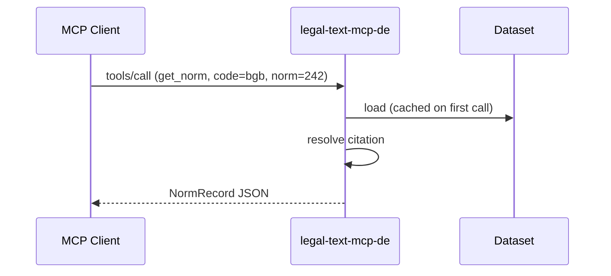
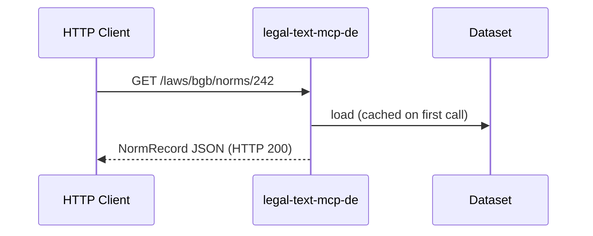

# MCP and HTTP surface

The server exposes two transport surfaces over the same runtime.

## MCP (streamable HTTP)

Default transport: `http://localhost:8001/mcp`. Streamable HTTP per
the MCP specification. Tools return JSON-compatible objects (not
double-serialised JSON strings).



Ten tools are exposed (9 v1 law tools plus `research_topic`). See the
[MCP tools reference](../tools/list_laws.md) for the full list and parameters.

### Starting the MCP server

```bash
DATASET_PATH=mcp/tests/fixtures/normalized \
STRICT_STARTUP=true \
PYTHONPATH=mcp \
uv run python mcp/server.py
```

Or with `uvx` (post-v1.0.0; recommended path since v2.0.0 GA):

```bash
DATASET_PATH=/path/to/package uvx legal-text-mcp-de
```

### Verifying MCP connectivity

```bash
curl http://localhost:8001/mcp -X POST \
  -H "Content-Type: application/json" \
  -d '{"jsonrpc":"2.0","id":1,"method":"tools/list"}'
```

Expected: JSON response listing ten tools (9 v1 law tools +
`research_topic`).

## HTTP API (FastAPI)

For non-MCP clients. Default port `8080`. OpenAPI document at
`/openapi.json`; Swagger UI available at `/docs`.



### Starting the HTTP API

```bash
DATASET_PATH=mcp/tests/fixtures/normalized \
STRICT_STARTUP=true \
PYTHONPATH=mcp \
uv run uvicorn http_api:app --host 127.0.0.1 --port 8080
```

### HTTP endpoints

| Method | Path | Purpose |
| --- | --- | --- |
| `GET` | `/health` | Liveness |
| `GET` | `/ready` | Readiness |
| `GET` | `/laws` | List laws |
| `GET` | `/laws/{code}` | Law detail |
| `GET` | `/laws/{code}/norms/{norm}` | Norm detail |
| `GET` | `/laws/{code}/norms/{norm}/relationships` | Relationship metadata |
| `GET` | `/corpus/coverage` | Corpus coverage summary |
| `GET` | `/corpus/source-limitations` | Source limitations query |
| `GET` | `/search` | Full-text search |
| `GET` | `/openapi.json` | OpenAPI document |

## Shared runtime

Both surfaces share the same in-memory `LegalTextRuntime` instance.
Dataset loading is lazy and cached — the first request loads the
corpus, subsequent requests are fast. Consistency between MCP and HTTP
responses is guaranteed by construction.

## Related

- [HTTP API overview](../api/index.md)
- [Data modes](data-modes.md)
