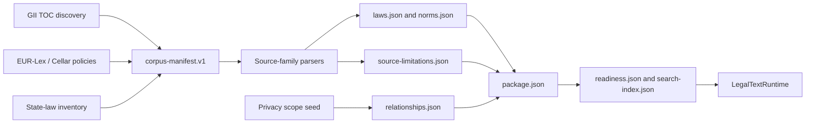

# Feature: law-loading-and-indexing

> Part of [legal-text-mcp-de](../overview.md)

## Summary

Law loading now means loading a validated normalized dataset package, not scraping or cloning demo Markdown at server startup. Search indexing is deterministic over normalized text-bearing norms.

## Generated Package Flow

## How It Works

### Operator Flow

1. Import official source artifacts into a raw snapshot directory.
2. Store source URL, retrieval timestamp, stand date when available, and SHA-256 hashes in a manifest.
3. Discover GII TOC entries when building a full corpus, then normalize raw
   artifacts into a legacy serving package or a generated package.
4. Start MCP or HTTP with `DATASET_PATH` set to the validated package.

### Runtime Flow

1. `LegalTextRuntime.from_settings` reads `DATASET_PATH`.
2. `validate_dataset_package` checks legacy required files, or switches to strict generated-package validation when `package.json` is present.
3. `NormalizedDataset` loads laws and norms and resolves law aliases through `LawRegistry`.
4. `SearchService` builds deterministic in-memory rows from text-bearing norms.
5. MCP and HTTP tools read only from the validated runtime.

## Implementation

| Module | Symbols | Role |
| ------ | ------- | ---- |
| [mcp-server](../modules/mcp-server.md) | `SOURCE_SPECS`, `probe_source`, `import_snapshot`, `diff_manifests` | Source import and manifest handling. |
| [mcp-server](../modules/mcp-server.md) | `parse_gii_zip`, `parse_dsgvo_xml`, `normalize_snapshot` | Raw source normalization. |
| [mcp-server](../modules/mcp-server.md) | `validate_dataset_package`, `validate_generated_package`, `NormalizedDataset` | Dataset readiness, generated-package validation, and loading. |
| [mcp-server](../modules/mcp-server.md) | `SearchService` | Search indexing and result generation. |

## Data Contract

Legacy normalized serving packages contain:

- `laws.json`
- `norms.json`
- `readiness.json`
- `search-index.json`

Every text-bearing norm requires canonical law ID, norm ID, text, URL, source metadata, and content hash. Container norms, such as `egbgb/art:246a`, carry child references instead of invented aggregate text.

Generated packages opt into a stricter contract by including `package.json`.
They keep `laws.json`, `norms.json`, `readiness.json`, and `search-index.json`,
and can add:

- `package.json`: `generated-package.v1` metadata with dataset/package IDs,
  generator name/version, `manifest_path`, `readiness_path`,
  `validation_mode`, `source_families`, non-negative record counts, and
  SHA-256 content hashes for package files.
- `manifest.json`: the `corpus-manifest.v1` source-completeness record.
- `source-limitations.json`: source-level terminal failures without fake law or
  norm records.
- `relationships.json`: relationship metadata with stable IDs, supported types,
  official-record or source-limitation targets, and provenance.
- `state-law-coverage.json`: optional 16-state state-law imported-or-limited
  coverage loaded into corpus coverage responses when present.

`package.json` is never listed in its own `content_hashes`; this avoids
self-hash ambiguity. Generated package validation verifies declared file hashes,
record counts, manifest references to generated law/norm IDs, source limitation
shape, relationship provenance, and relationship target resolution.

Generated norm records may use citation units `par`, `art`, `recital`,
`chapter`, `section`, `annex`, and `container`. This is a package-validation
contract only; the current resolver behavior for existing `par` and `art`
fixtures remains unchanged.

DSGVO recitals are modeled as first-class generated norms with
`norm_id="recital:<n>"`, `unit="recital"`, and canonical IDs such as
`dsgvo_eu_2016_679/recital:1`. Resolver support for `recital:*` is additive:
existing `par` and `art` citations keep their current behavior.

GII discovery artifacts use `gii-discovery-artifact.v1` and report numeric
`discovered_gii_items`, `source_path_count`, and `duplicate_count` fields.
Detailed records are stored separately as `discovered_gii_records`, alongside
`source_paths`, TOC URL, TOC hash, retrieval timestamp, parser version,
malformed-item diagnostics, validation errors, and an embedded discovery-mode
corpus manifest. This discovery metadata measures catalog coverage only;
terminal import states are assigned by later bulk import phases.

GII bulk fixture gates use `gii-corpus-gate.v1`. The gate consumes a discovery
artifact and local payload directory, writes a generated fixture package, and
reports discovered/imported/failure counts, terminal-state coverage,
critical-law outcomes, generated-package hash, parser variant matrix
path/version/hash, and validation errors. It is an explicit local/full-corpus
gate and is not run by ordinary release verification.

Runtime benchmark artifacts use `corpus-runtime-benchmark.v1`. They record
environment fields, package size, load time, sampled search p95, record counts,
dataset memory, search index memory, combined memory, and migration decisions.
The documented Phase 12 budgets are load at or below 120 seconds, sampled
search p95 below 1 second, and combined runtime/search memory at or below 2 GB.
Threshold misses are acceptable only when the benchmark records complete
migration decisions.

The final bundle gate writes `full-corpus-validation-bundle.v1`. It validates
section-specific GII, DSGVO, EU neighbor, state-law, relationship, benchmark,
and critical-law evidence. Runtime readiness accepts budget passes or complete
migration decisions; validation and package-load errors still fail the bundle.

## Edge Cases & Limitations

- Startup is strict by default and fails when no valid dataset is configured.
- Legacy packages without `package.json` keep the existing compatibility path.
- Generated packages with `package.json` are strict and fail readiness when
  metadata, manifest references, hashes, counts, citation units, source
  limitations, or relationship targets are malformed.
- Known invalid upstream paths, such as `tddsg` and `pangv`, are regression checks and not import sources.
- DSGVO uses Cellar XML (`CELEX:32016R0679`, German expression `0004.02`, `DOC_2`) and is separate from GII.
- Search is deterministic plain-text search, not backend-specific relevance ranking.
- DSGVO full article/recital count checks are explicit via
  `scripts/verify_dsgvo_full_counts.py --package <dir> --policy <path> --output <path>`;
  the release gate uses reduced fixtures and does not run the full-count gate.
- Live GII TOC discovery is an explicit gate via
  `scripts/verify_gii_discovery.py --output <path>` and is not part of ordinary
  release verification.
- GII corpus terminal-state checks are explicit via
  `scripts/verify_gii_corpus_gate.py --discovery <path> --payload-dir <dir> --package-dir <dir> --output <path>`;
  parser matrix and upstream outage evidence can be supplied with
  `--parser-variant-matrix <path>` and `--upstream-limitations <path>`;
  full generated corpus outputs remain outside Git.
- Final full-corpus release evidence is explicit via
  `scripts/verify_full_corpus_bundle.py --gii-artifact <path> --dsgvo-artifact <path> --eu-neighbors-artifact <path> --state-law-artifact <path> --relationships-artifact <path> --benchmark-artifact <path> --output <path>`;
  it validates existing artifacts and does not fetch network sources.

## Related Features

- [source-provenance](source-provenance.md)
- [supported-laws](supported-laws.md)
- [mcp-law-tools](mcp-law-tools.md)
