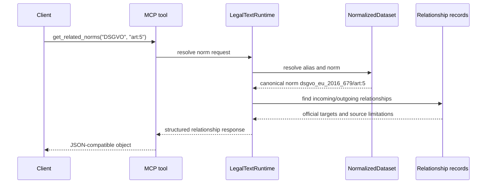

# Feature: mcp-law-tools

> Part of [legal-text-mcp-de](../overview.md)

## Summary

The MCP law tools expose the legal text runtime to MCP clients. They return JSON-compatible objects directly and share the same registry, resolver, search, readiness, and source metadata services as the HTTP API.

## How It Works

### User Flow

1. Start the server with `DATASET_PATH` pointing at a validated normalized dataset.
2. Connect an MCP client to `http://localhost:8001/mcp`.
3. Discover laws with `list_laws`.
4. Fetch law metadata with `get_law`.
5. Fetch exact norms with `get_norm` or structured citations with `resolve_citation`.
6. Search loaded laws with `search_laws`.
7. Inspect provenance with `get_source_metadata`.
8. Inspect corpus completeness with `get_corpus_coverage` and
   `get_source_limitations`.
9. Inspect generated package relationship metadata with `get_related_norms`.

### Technical Flow

1. `create_mcp_app` builds a FastMCP application.
2. Tool handlers call methods on `LegalTextRuntime`.
3. Runtime delegates to `LawRegistry`, `NormalizedDataset`, `resolve_citation`, `SearchService`, and generated-package coverage/relationship helpers.
4. Domain errors are returned as `{"error": {"code", "message", "details"}}`.
5. Successful responses are plain dictionaries/lists, not JSON strings.

## Implementation

| Module | Symbols | Role |
| ------ | ------- | ---- |
| [mcp-server](../modules/mcp-server.md) | `create_mcp_app` | Registers the MCP tool surface. |
| [mcp-server](../modules/mcp-server.md) | `LegalTextRuntime` | Shared service layer for all tools. |
| [mcp-server](../modules/mcp-server.md) | `LawRegistry` | Resolves aliases and exposes canonical IDs. |
| [mcp-server](../modules/mcp-server.md) | `resolve_citation` | Handles exact citation requests. |
| [mcp-server](../modules/mcp-server.md) | `SearchService` | Handles deterministic search. |

## Tool Contract

| Tool | Required Inputs | Output |
| ---- | --------------- | ------ |
| `list_laws` | optional `query` | Law summaries with canonical ID, display code, display name, source kind, and norm count. |
| `get_law` | `code` | Law metadata and normalized norm summaries. |
| `get_norm` | `code`, `norm` | Structured norm data for a canonical norm path or shorthand. |
| `resolve_citation` | `code`, `unit`, `paragraph_or_article`, optional child/subdivision fields | Citation response with law, norm, source, canonical citation, and optional selection. |
| `search_laws` | `query`, optional `codes` | Deterministically ordered search results with plain snippets and normalized scores. |
| `get_source_metadata` | optional `code` | Source metadata for one law or all supported laws. |
| `get_corpus_coverage` | none | Generated-package, manifest, terminal-state, source-family, source-limitation, relationship, and state-law coverage summary. |
| `get_source_limitations` | optional `source_family`, `terminal_state`, `state_code`, `law_id` | Filtered source limitation records. |
| `get_related_norms` | `code`, `norm` | Relationship metadata for a resolved norm, including official-record or source-limitation targets. |

## Citation and Relationship Request Flow

## Edge Cases & Limitations

- Missing datasets return `DATASET_NOT_READY`.
- Unknown laws return `LAW_NOT_FOUND` with suggestions.
- Ambiguous aliases return `AMBIGUOUS_LAW_ALIAS`; no law is selected silently.
- Missing norms return `NORM_NOT_FOUND`.
- Invalid citation shapes return `INVALID_CITATION`.
- Empty or punctuation-only search input returns `INVALID_QUERY`.
- The tools do not provide legal interpretation or hallucinated fallback text.
- Relationship tools return metadata and provenance only. They do not import or
  quote third-party editorial text.
- A plain HTTP probe against `/mcp` is not a valid MCP readiness check and may return `406 Not Acceptable`; use a real MCP streamable-HTTP client handshake for E2E verification.

## E2E Verification

`scripts/verify_e2e.py` starts MCP server processes with the fixture dataset and
the generated-package fixture, connects through
`mcp.client.streamable_http.streamablehttp_client`, initializes a `ClientSession`,
and verifies the stable tool list. It calls every registered tool over the real
MCP transport: `list_laws`, `get_law`, `get_norm`, `resolve_citation`,
`search_laws`, `get_source_metadata`, `get_corpus_coverage`,
`get_source_limitations`, and `get_related_norms`. The generated-package pass
also verifies DSGVO `recital:1`, source limitations, relationship metadata, and
normalized search behavior; the legacy pass verifies the structured
missing-norm error path.

## Related Features

- [api-contracts](api-contracts.md)
- [law-loading-and-indexing](law-loading-and-indexing.md)
- [source-provenance](source-provenance.md)
