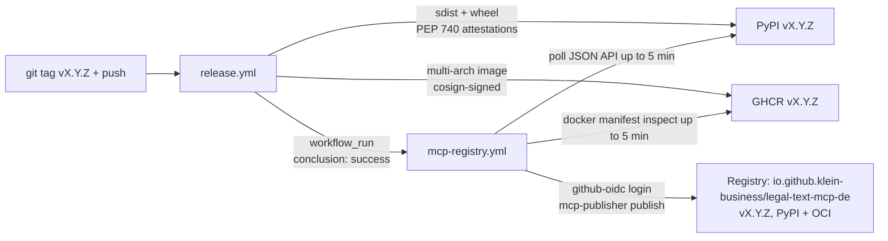

# Feature: MCP Registry Distribution

> Part of [legal-text-mcp-de](../overview.md)

## Summary

Every `v*.*.*` tag push auto-publishes a fresh release of
`io.github.klein-business/legal-text-mcp-de` to the
[official Model Context Protocol Registry](https://registry.modelcontextprotocol.io).
The registry is the canonical discovery surface that any MCP-aware client
(Claude Desktop, Cursor, Cline, Smithery CLI, …) can query to find this
server; the publish flow runs without any long-lived secrets via GitHub
Actions OIDC.

A parallel, file-driven entry on [Smithery.ai](https://smithery.ai) is provided
through `smithery.yaml`, which Smithery auto-crawls.

## How It Works

### User Flow

An end-user does not interact with the registry-publish flow directly. They
benefit from it transparently:

1. They install an MCP client that supports registry-backed discovery
   (e.g., `smithery mcp search legal-text-mcp-de`, the Claude Desktop registry
   browser, or any HTTP client hitting the registry API).
2. The client surfaces `io.github.klein-business/legal-text-mcp-de` with its
   current version, PyPI / OCI install options, and the documented environment
   variables.
3. Installation reduces to one of:
   - **PyPI / uvx** — `uvx legal-text-mcp-de serve`
   - **OCI** — `docker run ghcr.io/klein-business/legal-text-mcp-de:<version> serve`

### Technical Flow

Triggered automatically on every `v*.*.*` tag push. Sequence:



The `workflow_run` trigger (instead of a direct `push: tags` listener) means
`mcp-registry.yml` only starts **after** `release.yml` has actually pushed the
PyPI and GHCR artefacts. Two defence-in-depth readiness checks then poll PyPI
and GHCR for up to 5 minutes each before invoking the publisher; this absorbs
CDN propagation and GHCR registry caches.

Ownership verification is enforced by the registry itself, *not* by our
workflow:

| Package type | Verification mechanism |
| ------------ | ---------------------- |
| `pypi`       | The PyPI README must contain a `mcp-name: io.github.<owner>/<server>` marker line. We emit it as a sub-line in the README footer (cannot live inside an HTML comment because PyPI strips those). |
| `oci`        | The OCI image manifest must carry a `LABEL io.modelcontextprotocol.server.name="io.github.<owner>/<server>"` baked in at build time. We add it as a Dockerfile `LABEL` directly under the `FROM`. |
| GitHub-OIDC login | Registry verifies the OIDC claim against the `io.github.klein-business` namespace prefix in `server.json`. |

If any verification fails, `mcp-publisher publish` exits non-zero and the
workflow surfaces the registry's structured error message in CI.

## Implementation

| Module | Symbols / Files | Role |
|--------|----------------|------|
| (repo root) | `server.json` | Single source of truth for the registry entry. Conforms to the published schema 2025-12-11. Lists the `pypi` and `oci` packages with stdio transport, runtime hints (`uvx`), and the env-var contract. |
| (repo root) | `smithery.yaml` | Smithery.ai auto-discovery manifest. Declares `runtime: container`, `startCommand.type: stdio`, and a `configSchema` for the three optional env vars (`datasetPath`, `strictDataset`, `anthropicApiKey`). |
| (repo root) | `Dockerfile` | Carries `LABEL io.modelcontextprotocol.server.name="…"` directly under `FROM` — required for OCI ownership verification. |
| (repo root) | `README.md` | Footer line `mcp-name: io.github.klein-business/legal-text-mcp-de` — required for PyPI ownership verification. |
| [container-runtime](../modules/container-runtime.md) | `Dockerfile` | Source of the LABEL'd image consumed by `oci` package. |
| CI | `.github/workflows/mcp-registry.yml` | `workflow_run`-triggered publish workflow. Runs after `release.yml` succeeds. Uses GitHub OIDC for auth. Polls PyPI + GHCR for artefact availability. |
| CI | `.github/workflows/release.yml` | Tag-triggered upstream publish to PyPI + GHCR. Does *not* know about the registry — the trigger chain is reverse. |
| Release flow | `.release-please-config.json` | `extra-files` keeps `server.json` in lockstep with `pyproject.toml`: bumps `$.version`, `$.packages[0].version`, and the OCI identifier line via a generic line-pattern. |

## Configuration

This feature is workflow-only — no runtime env vars to set. Maintainer
operations:

| Knob | Purpose |
|------|---------|
| `workflow_dispatch` of `mcp-registry.yml` with `dry_run: true` | Validates `server.json` against the live registry schema without publishing. |
| `workflow_dispatch` of `mcp-registry.yml` with `dry_run: false` | Manually re-publishes the current `main` `server.json` (skips the tag-vs-version guard). Used after manual server.json edits that do not warrant a full release. |
| `mcp-publisher validate` (local) | Same schema check, runs against the registry's public schema endpoint. |

Local tooling install on macOS:

```bash
brew install mcp-publisher
mcp-publisher validate          # check server.json
```

## Edge Cases & Limitations

- **Registry name prefix is permanent.** The `io.github.<owner>` namespace
  is verified once via OIDC; renaming the GitHub org or repo would break
  publish until a new namespace is verified.
- **OCI version lives inside the identifier**, not as a separate `version`
  field — `release-please` bumps it via a generic line-pattern instead of a
  JSON-path. If that line ever drifts in formatting, the bump silently
  becomes a no-op.
- **PyPI README marker must be in rendered Markdown.** PyPI strips HTML
  comments, so the marker line sits *under* the explanatory comment, not
  inside it. Removing the line breaks the next publish.
- **OCI label is build-time-only.** Adding the label requires a fresh image
  build (i.e., a new release tag). Already-pushed images cannot be retro-fitted.
- **5-minute readiness ceiling.** PyPI and GHCR each get up to 5 minutes
  (`30 × 10 s`) to propagate. If their CDNs are slower than that, the
  workflow fails fast; re-run manually after the artefact appears.
- **Smithery still requires a one-time UI submission.** `smithery.yaml`
  enables auto-discovery, but a maintainer must click "Add Server" once at
  [smithery.ai](https://smithery.ai) to seed the listing; thereafter
  Smithery's crawler updates it automatically.
- **glama.ai is fully crawler-driven.** No config file; relies on the
  GitHub topics (`mcp`, `mcp-server`, `model-context-protocol`) plus the
  presence of `smithery.yaml`.

## Related Features

- [http-api](http-api.md) — same artefacts feed the registry's OCI
  package and the live HTTP endpoint.
- [cli-shell-surface](cli-shell-surface.md) — registry consumers
  typically install via `uvx legal-text-mcp-de serve`, which is the CLI
  entry-point.
- [public-hosted-service](public-hosted-service.md) — separate from
  registry distribution; the public hosted instance uses the same artefacts
  but is not consumed via the registry.
