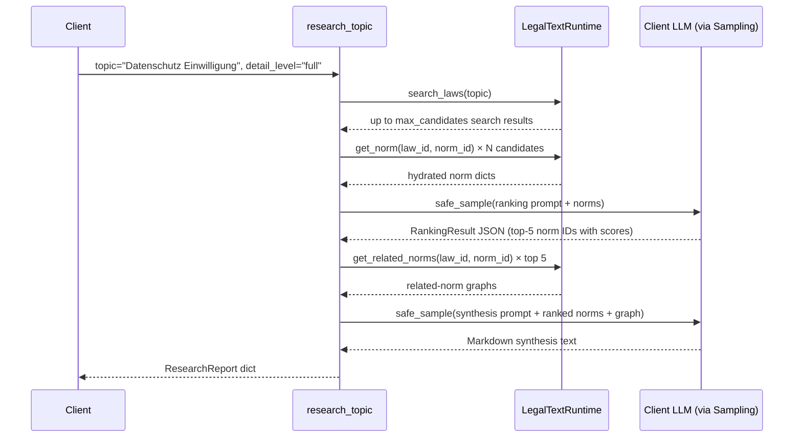

# Feature: research-topic-smart-tool

> Part of [legal-text-mcp-de](../overview.md)

## Summary

`research_topic` is a multi-step smart tool that combines corpus search, norm
hydration, LLM-assisted ranking, related-norm graph traversal, and LLM synthesis
into a single structured research report. It is the flagship v2 smart-tool and
the primary consumer of the [MCP Sampling](mcp-sampling.md) capability.

## How It Works

### User Flow

1. Call `research_topic` with a German legal research topic.
2. Optionally set `max_candidates` (default 20) and `detail_level`
   (`"brief"` or `"full"`, default `"full"`).
3. The tool reports progress via `ctx.report_progress` at each step.
4. The tool returns a `ResearchReport` dict with the following fields:
   - `topic`: the original query string
   - `top_norms`: up to 5 `RankedNorm` objects with `canonical_id`, `title`, and `relevance_score` (0–10)
   - `related_norms`: a dict mapping each top norm's `canonical_id` to its related-norm list
   - `synthesis`: a Markdown research summary (only in `"full"` mode)
   - `candidates_examined`: how many search results were hydrated
   - `sampling_calls`: number of LLM sampling calls made (0, 1, or 2)
   - `provenance`: source metadata for each top norm
   - `status`: `"ok"` | `"no_matches"` | `"degraded_no_sampling"` | `"error"`

### 5-Step Workflow



### Degraded Mode

When `ctx.client_supports_sampling()` is false, the tool skips both sampling
calls and returns up to 5 raw search results as equal-score `RankedNorm` objects
with `status="degraded_no_sampling"`. The tool does not error; it degrades
gracefully.

## Implementation

| Module | Symbols | Role |
| ------ | ------- | ---- |
| `src/legal_text_mcp_de/tools/research_topic.py` | `register_research_topic`, `_run_research` | Tool registration and 5-step workflow. |
| `src/legal_text_mcp_de/tools/research_models.py` | `RankedNorm`, `ResearchReport` | Output Pydantic models. |
| `src/legal_text_mcp_de/tools/research_prompts.py` | `build_ranking_prompt`, `build_synthesis_prompt` | Prompt builders for the two sampling calls. |
| [sampling](../modules/sampling.md) | `safe_sample`, `RankingResult` | Retried LLM calls and ranking schema. |
| [mcp-server](../modules/mcp-server.md) | `LegalTextRuntime` | Search, norm hydration, and relationship lookup. |

## Tool Signature

```python
async def research_topic(
    topic: str,
    max_candidates: int = 20,
    detail_level: Literal["brief", "full"] = "full",
    ctx: Context | None = None,
) -> dict[str, Any]:
    ...
```

Registered by `register_research_topic(app, runtime)` in `tools/__init__.py`.

## Output Contract

A full-mode successful response:

```json
{
  "topic": "Datenschutz Einwilligung",
  "top_norms": [
    {"canonical_id": "dsgvo_eu_2016_679/art:7", "title": "Art. 7", "relevance_score": 9.5}
  ],
  "related_norms": {
    "dsgvo_eu_2016_679/art:7": [{"canonical_id": "dsgvo_eu_2016_679/art:6", ...}]
  },
  "synthesis": "## Datenschutz Einwilligung …",
  "candidates_examined": 15,
  "sampling_calls": 2,
  "provenance": [{"canonical_id": "dsgvo_eu_2016_679/art:7", "source": {...}}],
  "status": "ok"
}
```

## Status Values

| Status | Meaning |
| ------ | ------- |
| `"ok"` | Full workflow completed with at least one sampling call. |
| `"no_matches"` | Corpus search or norm hydration returned no results. |
| `"degraded_no_sampling"` | Client lacks sampling; raw search results returned. |
| `"error"` | Search or ranking sampling failed; error message in `note`. |

## Related

- [mcp-sampling](mcp-sampling.md) — the sampling capability this tool depends on
- [sampling module](../modules/sampling.md)
- [mcp-prompts](mcp-prompts.md) — the `/recherche` prompt describes the manual equivalent
- [mcp-law-tools](mcp-law-tools.md)
