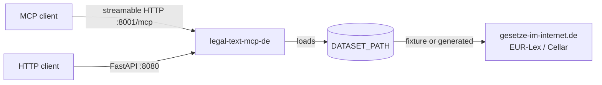

# legal-text-mcp-de

A Python [Model Context Protocol](https://modelcontextprotocol.io)
server and HTTP API for loading, validating, searching, and resolving
**German legal texts** with source provenance.

!!! warning "Not legal advice"
    This software returns text and structured metadata. It does not
    interpret the law, advise on it, or produce any legal conclusion.
    The maintainer assumes no liability for use in legal
    decision-making contexts.

## What it is

- An MCP server (streamable HTTP transport, default `:8001/mcp`) that
  exposes nine tools for German federal laws and EU acts.
- A FastAPI HTTP API over the same runtime, for non-MCP clients.
- Local or server-side infrastructure: no SaaS, no accounts, no
  tenant model, no editorial-content bundling.

## What it is not

- A legal-advice engine. No interpretation, no AI legal reasoning.
- A hosted service. You run it locally or on your own infrastructure.
- A bundler of editorial law text. Texts come from official sources
  (gesetze-im-internet.de, EUR-Lex / Cellar) at runtime.

## Quickstart

```bash
uvx legal-text-mcp-de
```

See [Quickstart → uvx](quickstart/uvx.md) for the full setup,
[Claude Desktop](quickstart/claude-desktop.md), or
[Docker](quickstart/docker.md).

## Architecture at a glance



The server runs against either committed fixture packages (deterministic
CI tests) or a generated production corpus (`DATASET_PATH=...`).

## Where to next

- [Concepts → Data modes](concepts/data-modes.md)
- [Concepts → Provenance](concepts/provenance.md)
- [MCP tools reference](tools/list_laws.md)
- [HTTP API overview](api/index.md)
