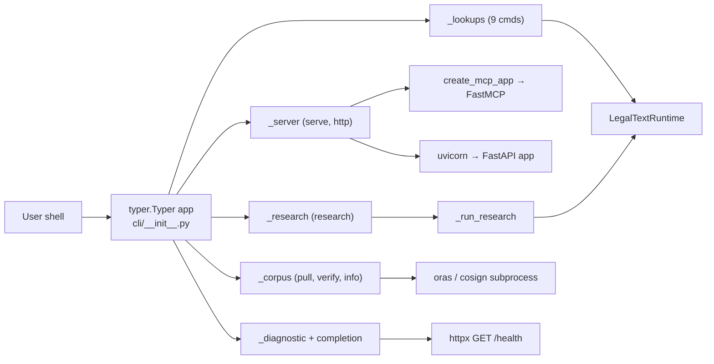

# Module: cli

> Part of [legal-text-mcp-de](../overview.md)

## Overview

The `src/legal_text_mcp_de/cli/` package implements the user-facing shell CLI
introduced in v2.1.0. It is a [Typer](https://typer.tiangolo.com) application
that wraps every existing MCP tool, the FastMCP server lifecycle, the FastAPI
HTTP transport, the corpus bundle pipeline, and a small set of diagnostic
commands behind 14 explicit subcommands.

The CLI is now the user-facing entry point: the `legal-text-mcp-de` console
script repoints from `legal_text_mcp_de.server:main` to
`legal_text_mcp_de.cli:main`. Bare invocation prints `--help` instead of
starting the MCP server. The MCP server is now reachable through the
`serve` subcommand. This is a **breaking change** documented in CHANGELOG
under `[2.1.0]` and in [features/cli-shell-surface](../features/cli-shell-surface.md).

### Responsibility

This module is responsible for:

- exposing 14 typer subcommands that 1:1 mirror the MCP tool surface plus
  server/HTTP lifecycle, corpus management, and diagnostics;
- rendering payloads as either Rich-styled text (TTY) or JSON (pipe or
  `--json`) using the existing `http_models` Pydantic shapes as the JSON
  contract;
- mapping internal exception types (`LegalTextError`, `SamplingError`,
  subprocess failures, `httpx.HTTPError`) to seven well-defined process
  exit codes;
- lazily loading and caching a single `LegalTextRuntime` per process so that
  read-only subcommands stay cheap when invoked back-to-back.

It is not responsible for the business logic of any subcommand — every
subcommand delegates to existing runtime methods (`LegalTextRuntime.*`),
`create_mcp_app`, `_run_research`, or external binaries (`oras`, `cosign`).

### Dependencies

| Dependency | Type | Purpose |
| ---------- | ---- | ------- |
| `typer` | library | Subcommand registration, argument parsing, help rendering. Promoted in v2.1.0 from a transitive dep (via `mcp[cli]`) to a direct dep pinned at `>=0.20,<1`. |
| `rich` | library | TTY-aware text rendering for `render_data` and `render_error`. Reused from `mcp[cli]`. |
| `httpx` | library | `health` subcommand: HTTP probe against a running server. |
| `uvicorn` | library | Started in-process by the `http` subcommand. |
| `oras`, `cosign` | external binaries | Invoked via `subprocess` by `corpus pull` and `corpus verify`. Not Python deps. |
| `legal_text_mcp_de.legal_texts.runtime.LegalTextRuntime` | internal | Backs every read-only lookup subcommand. |
| `legal_text_mcp_de.server.create_mcp_app` | internal | Started by the `serve` subcommand. |
| `legal_text_mcp_de.tools.research_topic._run_research` | internal | Backs the `research` subcommand. |
| `legal_text_mcp_de.http_models.*` | internal | Implicit JSON-output contract — every subcommand's JSON envelope matches the corresponding HTTP response model. |
| `legal_text_mcp_de.sampling.errors.SamplingError` | internal | Mapped to exit code 3. |
| `legal_text_mcp_de.legal_texts.errors.LegalTextError` | internal | Mapped to exit code 1 with the structured `{code, message, details}` envelope. |

## Structure

| Path | Type | Purpose |
| ---- | ---- | ------- |
| `src/legal_text_mcp_de/cli/__init__.py` | file | Root `typer.Typer` app, global flags (`--json`, `--quiet`, `--debug`, `--version`), subcommand registration loop, `main()` entry point. |
| `src/legal_text_mcp_de/cli/_output.py` | file | TTY-vs-JSON detection, `render_data` / `render_error` / `render_table` helpers, exit-code constants. |
| `src/legal_text_mcp_de/cli/_runtime.py` | file | `get_runtime_or_die()` + `reset_runtime_cache()` — lazy, per-process `LegalTextRuntime` loader. |
| `src/legal_text_mcp_de/cli/_lookups.py` | file | 9 read-only lookup subcommands (1:1 with the v1 MCP tools). |
| `src/legal_text_mcp_de/cli/_server.py` | file | `serve` (MCP, streamable HTTP) and `http` (FastAPI via uvicorn) lifecycle subcommands. |
| `src/legal_text_mcp_de/cli/_research.py` | file | `research` subcommand wrapping `tools/research_topic._run_research`. |
| `src/legal_text_mcp_de/cli/_corpus.py` | file | `corpus` sub-Typer: `pull` (ORAS), `verify` (cosign), `info`. |
| `src/legal_text_mcp_de/cli/_diagnostic.py` | file | `version`, `health`, and `completion` sub-Typer (`show` / `install`). |

## Key Symbols

### `cli/__init__.py`

| Symbol | Kind | Purpose |
| ------ | ---- | ------- |
| `app` | `typer.Typer` | Root Typer app; constructed with `invoke_without_command=True` and `add_completion=False` (completion is handled by the explicit `completion` sub-Typer). |
| `_root` | callback | Captures the four global flags into `ctx.obj` and exits 0 after printing help when no subcommand was given. |
| `_resolve_version` | function | Reads the installed package version via `importlib.metadata.version`; returns `"0.0.0+unknown"` on `PackageNotFoundError`. |
| `_version_callback` | function | Eager callback for `--version`. |
| `main` | function | Console-script entry point (`legal-text-mcp-de = legal_text_mcp_de.cli:main`). |

### `cli/_output.py`

| Symbol | Kind | Purpose |
| ------ | ---- | ------- |
| `EXIT_SUCCESS` / `EXIT_RUNTIME` / `EXIT_USAGE` / `EXIT_SAMPLING` / `EXIT_CORPUS` / `EXIT_CONNECTIVITY` / `EXIT_INTERRUPT` | `Final[int]` | The seven exit-code constants: `0`, `1`, `2`, `3`, `4`, `5`, `130`. |
| `is_json_mode` | function | Decides text vs JSON: `--json` always wins; otherwise checks `stream.isatty()`. Pipe / redirect → JSON (machine-friendly default). |
| `render_data` | function | Writes a success payload as JSON envelope `{"data": …, "error": null}` or as text via an optional `text_renderer(payload, console)`. |
| `render_error` | function | Writes an error envelope `{"data": null, "error": {"code", "message", "details"}}` (matches HTTP `ErrorBody`). In JSON mode the envelope still goes to stdout (so `\| jq` works); in text mode it goes to stderr. |
| `render_table` | function | Rich-table helper for text mode. |

### `cli/_runtime.py`

| Symbol | Kind | Purpose |
| ------ | ---- | ------- |
| `get_runtime_or_die` | function | Returns a ready `LegalTextRuntime`; instantiates `Settings()` (reads env vars at call time) and `LegalTextRuntime.from_settings(settings, strict=True)`. Caches the runtime per process. Raises `LegalTextError` when the dataset is missing/invalid. |
| `reset_runtime_cache` | function | Clears the module-level cache. Used by tests that need to swap `DATASET_PATH` between cases. |
| `_cached_runtime` | module global | The per-process cache. |

### `cli/_lookups.py`

| Symbol | Kind | Purpose |
| ------ | ---- | ------- |
| `lookups_app` | `typer.Typer` | Holds 9 commands; lifted onto the root in `__init__.py` so they appear without a `lookups` prefix. |
| `laws`, `law`, `norm`, `cite`, `search`, `meta`, `coverage`, `limitations`, `related` | commands | 1:1 with `LegalTextRuntime.list_laws / get_law / get_norm / resolve_citation / search_laws / get_source_metadata / get_corpus_coverage / get_source_limitations / get_related_norms`. |

### `cli/_server.py`

| Symbol | Kind | Purpose |
| ------ | ---- | ------- |
| `server_app` | `typer.Typer` | Holds `serve` and `http`; lifted onto the root. |
| `serve` | command | Starts FastMCP over streamable HTTP. **Replaces the pre-v2.1.0 bare invocation.** |
| `http` | command | Starts FastAPI via `uvicorn.run("legal_text_mcp_de.http_api:app", …)`. |
| `_run_mcp`, `_run_http` | functions | Test-friendly indirection so the lifecycle entries can be monkey-patched without reaching into MCP / uvicorn internals. Each only applies CLI-supplied flags when explicitly set; otherwise env-driven `Settings` win. |

### `cli/_research.py`

| Symbol | Kind | Purpose |
| ------ | ---- | ------- |
| `research_app` | `typer.Typer` | Holds the single `research` command; lifted onto the root. |
| `research` | command | Wraps `_run_research(runtime, topic, max_candidates, detail, ctx=None)` and serialises the resulting `ResearchReport` Pydantic model. |
| `_run_async` | function | `asyncio.run(coro)` wrapper that restores a fresh default event loop afterwards (fixes test-ordering flakiness in `tests/test_resources`). |

### `cli/_corpus.py`

| Symbol | Kind | Purpose |
| ------ | ---- | ------- |
| `corpus_app` | `typer.Typer` | Sub-Typer; attached via `app.add_typer(corpus_app, name="corpus")` so commands keep the `corpus` prefix. |
| `pull` | command | Shells out to `oras pull ghcr.io/klein-business/legal-text-mcp-de-corpus:{version}` into the XDG cache. |
| `verify` | command | Shells out to `cosign verify-blob` against the cached `*.tar.zst`. |
| `info` | command | Lists cached bundles with size in bytes. |
| `_cache_dir` | function | Returns `$XDG_CACHE_HOME/legal-text-mcp-de` (defaults to `~/.cache/legal-text-mcp-de`). |

### `cli/_diagnostic.py`

| Symbol | Kind | Purpose |
| ------ | ---- | ------- |
| `diagnostic_app` | `typer.Typer` | Holds `version` and `health`; lifted onto the root. |
| `completion_app` | `typer.Typer` | Attached via `app.add_typer(completion_app, name="completion")` so commands keep the `completion` prefix. |
| `version_cmd` | command | Prints `{version, python, platform}`. |
| `health` | command | `httpx.get(url)` against `/health`; exits `EXIT_CONNECTIVITY` on transport error or non-200. |
| `completion_show` | command | Calls `typer.completion.get_completion_script` directly (because the root Typer is built with `add_completion=False`). |
| `completion_install` | command | Prints shell-specific install instructions (does not write RC files unattended). |

## Subcommand Registration Pattern

The root Typer follows two patterns:

```python
# Flat tree — commands from these sub-Typers appear directly on `app`:
for command_info in lookups_app.registered_commands:
    app.registered_commands.append(command_info)
for command_info in server_app.registered_commands:
    app.registered_commands.append(command_info)
for command_info in research_app.registered_commands:
    app.registered_commands.append(command_info)
for command_info in diagnostic_app.registered_commands:
    app.registered_commands.append(command_info)

# Sub-Typers — these keep their prefix:
app.add_typer(corpus_app, name="corpus")
app.add_typer(completion_app, name="completion")
```

The flat pattern keeps the day-to-day surface short
(`legal-text-mcp-de search "widerruf"` rather than
`legal-text-mcp-de lookups search "widerruf"`). The sub-Typer pattern is
reserved for verbs that benefit from grouping (`corpus pull|verify|info`,
`completion show|install`).

## Output Mode and JSON Contract

`render_data` and `render_error` decide their output format from the stream
being written, not from the process's overall `--json` flag (the flag still
takes precedence — it is OR-ed in). The default rules:

- stdout is a TTY → text (Rich); errors go to stderr.
- stdout is piped or redirected → JSON envelope on stdout; errors also go
  to stdout so `\| jq '.error.message'` works.

The JSON envelope shape matches `http_models.ErrorBody` for errors
(`{code, message, details}`) and produces `{"data": …, "error": null}` on
success. Subcommands that wrap an `LegalTextRuntime` method return the
runtime's plain `dict` payload unchanged inside `data`, which means a CLI
JSON response is interchangeable with the corresponding HTTP response body.

## Exit Codes

| Code | Constant | Triggered by |
| ---- | -------- | ------------ |
| `0` | `EXIT_SUCCESS` | Normal success; also degraded `research` runs without `ANTHROPIC_API_KEY`. |
| `1` | `EXIT_RUNTIME` | `LegalTextError` from runtime (missing dataset, unknown law/norm, invalid citation). |
| `2` | `EXIT_USAGE` | typer's default for usage errors (unknown flag, missing argument); also `completion {show,install}` on an unsupported shell name. |
| `3` | `EXIT_SAMPLING` | `SamplingError` raised by `_run_research` (timeout, schema violation, refusal). |
| `4` | `EXIT_CORPUS` | `corpus pull` (oras failure) and `corpus verify` (no bundle present or cosign failure). |
| `5` | `EXIT_CONNECTIVITY` | `health` subcommand: `httpx.HTTPError` or non-200 response. |
| `130` | `EXIT_INTERRUPT` | SIGINT (typer / Python default). |

## Data Flow / Surface Map



## Testing

Tests live under `tests/test_cli/` (8 modules):

| File | Tests | What it covers |
| ---- | ----- | -------------- |
| `test_main.py` | 3 | Bare invocation prints help and exits 0; `--version`; subcommand registration. |
| `test_output.py` | 10 | `is_json_mode`, `render_data`, `render_error`, `render_table`, TTY/pipe symmetry. |
| `test_runtime.py` | 3 | `get_runtime_or_die` happy path, missing-dataset failure, `reset_runtime_cache`. |
| `test_lookups.py` | 14 | All 9 lookup subcommands in both text and JSON mode. |
| `test_server.py` | 1 | `serve` calls `_run_mcp` with the resolved settings. |
| `test_research.py` | 3 | Degraded mode (exit 0), `SamplingError` mapped to exit 3, normal path with mocked runtime. |
| `test_corpus.py` | 6 | `pull` / `verify` / `info` with `subprocess.run` monkey-patched; missing-bundle path returns `EXIT_CORPUS`. |
| `test_diagnostic.py` | 8 | `version`, `health` (success / 5xx / transport error), `completion show` / `install` for bash/zsh/fish, unsupported shell. |

Coverage: ≥86% across `src/legal_text_mcp_de/cli/`. `_server.py` is
intentionally at ~39% (its only meaningful uncovered branches reach into
`mcp.run(transport=…)` and `uvicorn.run(…)` which are exercised end-to-end
by `scripts/verify_e2e.py`, not by unit tests).

## Inventory Notes

- **Coverage**: full for argument parsing, output rendering, exit-code
  mapping, and per-subcommand happy/sad paths. Live server lifecycle is
  covered by the existing E2E gate, not by unit tests.
- **Console-script entry**: as of v2.1.0,
  `legal-text-mcp-de = legal_text_mcp_de.cli:main`. `server.py:main()` is
  preserved as an internal entry but is no longer the user-facing entry —
  the `serve` subcommand replaces it.
- **See also**:
  - [cli-shell-surface feature](../features/cli-shell-surface.md) — the
    user-facing description, flow, and edge-case catalogue.
  - [docs/cli/index.md](../cli/index.md) — the curated CLI reference for
    end users.
  - [mcp-server module](mcp-server.md) — the underlying FastMCP + HTTP
    runtime that the CLI wraps.
