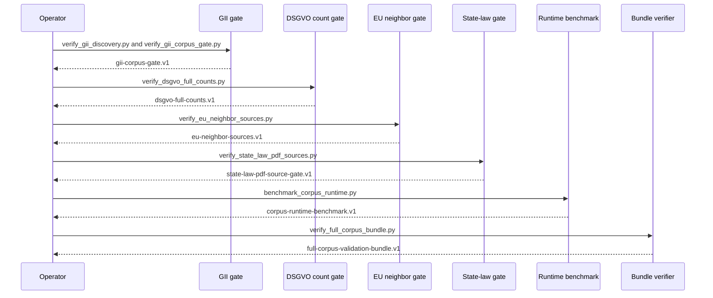

# Module: mcp-server

> Part of [legal-text-mcp-de](../overview.md)

## Overview

`src/legal_text_mcp_de/` contains the MCP server, HTTP app factory, legal text
services, source import helpers, normalization parsers, generated-package
validators, operational corpus gates, validated fixture data, and tests.

In v2 the `server.py` entry point is a slim orchestrator: the MCP tool surface,
resource handlers, and prompt templates live in the dedicated sub-packages
`tools/`, `resources/`, and `prompts/`. Corpus bundle loading is handled by the
`corpus/` sub-package. The `sampling/` sub-package provides the smart-tool
sampling helpers.

Since v2.1.0 the user-facing entry point is the `cli/` sub-package, not
`server.py`. The `legal-text-mcp-de` console script repoints to
`legal_text_mcp_de.cli:main`, and the MCP server is started via the
`serve` subcommand. `server.py:main()` is preserved as an internal entry
point that the CLI's `serve` subcommand delegates to — bare invocation no
longer reaches it. See [features/cli-shell-surface](../features/cli-shell-surface.md)
for the BREAKING-change details.

### Responsibility

This module is responsible for:

- loading a validated normalized dataset package or a v2 corpus bundle;
- resolving law aliases through a versioned registry;
- returning source-backed law, norm, citation, search, and metadata JSON objects;
- exposing corpus coverage, source limitations, and relationship metadata;
- exposing the same domain services through MCP tools, MCP resources, MCP
  prompts, and the HTTP API;
- failing with structured errors when data or citations are invalid.

It is not responsible for legal evaluation, user management, billing, tenant isolation, or production hosting.

### Dependencies

| Dependency | Type | Purpose |
| ---------- | ---- | ------- |
| `mcp.server.fastmcp.FastMCP` | library | MCP streamable HTTP tool/resource/prompt transport. |
| `fastapi`, `uvicorn` | library | HTTP API and OpenAPI generation. |
| `pydantic-settings` | library | Runtime settings from environment and `.env`. |
| `xml.etree.ElementTree`, `zipfile`, `hashlib` | standard library | Source parsing, snapshot handling, and hash manifests. |
| `zstandard` | library | Decompression of v2 `.tar.zst` corpus bundles. |
| `pytest`, `pytest-asyncio` | test library | Unit, parser, service, transport, sampling, and release-gate tests. |

## Structure

| Path | Type | Purpose |
| ---- | ---- | ------- |
| `src/legal_text_mcp_de/server.py` | file | Slim FastMCP app factory; orchestrates registration of tools, resources, and prompts. |
| `src/legal_text_mcp_de/http_api.py` | file | FastAPI app factory and HTTP routes. |
| `src/legal_text_mcp_de/http_models.py` | file | Pydantic response models for HTTP/OpenAPI. |
| `src/legal_text_mcp_de/config.py` | file | Runtime settings including dataset path, corpus auto-download, startup strictness, host, port, and debug flag. |
| `src/legal_text_mcp_de/corpus/` | dir | v2 corpus bundle loader, cache, verifier, and schema. See [corpus module](corpus.md). |
| `src/legal_text_mcp_de/tools/` | dir | v1 law tools + `research_topic` smart tool + models and prompts. |
| `src/legal_text_mcp_de/resources/` | dir | `legal://` URI handlers and Markdown renderer. See [resources module](resources.md). |
| `src/legal_text_mcp_de/prompts/` | dir | 5 slash-command templates. See [prompts module](prompts.md). |
| `src/legal_text_mcp_de/sampling/` | dir | `safe_sample` helper, schemas, errors, MockSamplingClient. See [sampling module](sampling.md). |
| `src/legal_text_mcp_de/legal_texts/data/laws.v1.json` | file | Versioned law registry with aliases, canonical IDs, display codes, and source metadata. |
| `src/legal_text_mcp_de/legal_texts/sources.py` | file | Canonical GII and Cellar source specifications plus invalid-path regressions. |
| `src/legal_text_mcp_de/legal_texts/gii_toc.py` | file | GII TOC parser, discovery manifest/artifact builder, and opt-in live fetch helper. |
| `src/legal_text_mcp_de/legal_texts/gii_bulk.py` | file | Fixture-backed GII bulk normalization, terminal-state package generation, and critical-law gate helpers. |
| `src/legal_text_mcp_de/legal_texts/importer.py` | file | Source probing, snapshot download, SHA-256 hashing, manifest generation, and manifest diffing. |
| `src/legal_text_mcp_de/legal_texts/gii_xml.py` | file | GII XML ZIP parser for German legal texts. |
| `src/legal_text_mcp_de/legal_texts/eurlex_xml.py` | file | DSGVO Cellar/Formex article parser. |
| `src/legal_text_mcp_de/legal_texts/eu_neighbors.py` | file | Bounded EU neighbor source records, source limitations, and fixture parsing. |
| `src/legal_text_mcp_de/legal_texts/state_law.py` | file | State-law adapter gate helpers and generated package writing. |
| `src/legal_text_mcp_de/legal_texts/state_law_coverage.py` | file | State-law 16-outcome coverage and PDF/source gate artifact helpers. |
| `src/legal_text_mcp_de/legal_texts/relationships.py` | file | Privacy scope policy/seed validation and relationship package transforms. |
| `src/legal_text_mcp_de/legal_texts/normalizer.py` | file | Snapshot-manifest to normalized dataset conversion. |
| `src/legal_text_mcp_de/legal_texts/validation.py` | file | Legacy normalized dataset validation, strict generated-package validation, and readiness state generation. |
| `src/legal_text_mcp_de/legal_texts/manifest.py` | file | Versioned full-corpus manifest contract and source-completeness validation. |
| `src/legal_text_mcp_de/legal_texts/dataset.py` | file | Normalized dataset loader and lookup layer. |
| `src/legal_text_mcp_de/legal_texts/resolver.py` | file | Structured citation and norm resolver. |
| `src/legal_text_mcp_de/legal_texts/search.py` | file | Deterministic plain-text search over normalized norms. |
| `src/legal_text_mcp_de/legal_texts/runtime.py` | file | Runtime composition for registry, dataset, resolver, search, and metadata services. |
| `src/legal_text_mcp_de/legal_texts/errors.py` | file | Shared structured error codes and envelopes. |
| `src/legal_text_mcp_de/parser.py` | file | Legacy Markdown parser retained for compatibility tests. |
| `src/tests/` | dir | Fixture-backed test suite and release-gate coverage. |
| `scripts/verify_release.py` | file | Runs the full release gate and then local network E2E. |
| `scripts/verify_e2e.py` | file | Starts real local HTTP/MCP server processes and verifies both transports end-to-end. |
| `scripts/verify_dsgvo_full_counts.py` | file | Validates DSGVO article/recital count, Cellar policy, boundary samples, and content hash evidence. |
| `scripts/verify_eu_neighbor_sources.py` | file | Builds EU neighbor imported-or-limited source evidence. |
| `scripts/verify_state_law_pdf_sources.py` | file | Writes final state-law PDF/source coverage evidence. |
| `scripts/benchmark_corpus_runtime.py` | file | Measures package load, search p95, and combined dataset/search memory. |
| `scripts/verify_full_corpus_bundle.py` | file | Composes and validates the full-corpus release evidence bundle. |

## Key Symbols

| Symbol | Kind | Location | Purpose |
| ------ | ---- | -------- | ------- |
| `Settings` | class | `src/legal_text_mcp_de/config.py` | Defines `DATASET_PATH`, `CORPUS_AUTO_DOWNLOAD`, `STRICT_STARTUP`, host, port, debug, and legacy parser settings. |
| `create_mcp_app` | function | `src/legal_text_mcp_de/server.py` | Builds the FastMCP app and registers tools, resources, and prompts. |
| `create_http_app` | function | `src/legal_text_mcp_de/http_api.py` | Builds the FastAPI app over an injected or configured runtime. |
| `LegalTextRuntime` | class | `src/legal_text_mcp_de/legal_texts/runtime.py` | Shared application service used by both transports. |
| `LawRegistry` | class | `src/legal_text_mcp_de/legal_texts/registry.py` | Resolves aliases to canonical IDs and validates collisions. |
| `NormalizedDataset` | class | `src/legal_text_mcp_de/legal_texts/dataset.py` | Loads `laws.json`, `norms.json`, and readiness data. |
| `resolve_citation` | function | `src/legal_text_mcp_de/legal_texts/resolver.py` | Resolves exact structured legal citations. |
| `SearchService` | class | `src/legal_text_mcp_de/legal_texts/search.py` | Runs deterministic search and produces HTML-free snippets. |
| `validate_dataset_package` | function | `src/legal_text_mcp_de/legal_texts/validation.py` | Verifies dataset readiness and dispatches to strict generated-package validation when `package.json` is present. |
| `validate_generated_package` | function | `src/legal_text_mcp_de/legal_texts/validation.py` | Validates generated package metadata, hashes, manifest references, source limitations, relationships, and citation units. |
| `validate_corpus_manifest` | function | `src/legal_text_mcp_de/legal_texts/manifest.py` | Validates `corpus-manifest.v1` source families, terminal states, canonical IDs, and relationship-source policy. |
| `parse_gii_toc` | function | `src/legal_text_mcp_de/legal_texts/gii_toc.py` | Parses official GII TOC XML into deterministic discovery records and diagnostics. |
| `fetch_gii_discovery_artifact` | function | `src/legal_text_mcp_de/legal_texts/gii_toc.py` | Fetches the live GII TOC and builds a `gii-discovery-artifact.v1` payload. |
| `write_gii_discovery_artifact` | function | `src/legal_text_mcp_de/legal_texts/gii_toc.py` | Writes discovery artifacts to an explicit path for live-gate evidence. |
| `run_gii_bulk_normalization` | function | `src/legal_text_mcp_de/legal_texts/gii_bulk.py` | Consumes discovery records plus local payloads and writes a generated fixture package with terminal states. |
| `build_gii_corpus_gate_artifact` | function | `src/legal_text_mcp_de/legal_texts/gii_bulk.py` | Builds `gii-corpus-gate.v1` evidence with coverage counts, critical-law outcomes, and package hash. |
| `validate_privacy_scope_seed` | function | `src/legal_text_mcp_de/legal_texts/relationships.py` | Validates relationship-source metadata, official targets, limitations, and relationship endpoints. |
| `build_state_law_pdf_gate_artifact` | function | `src/legal_text_mcp_de/legal_texts/state_law_coverage.py` | Builds `state-law-pdf-source-gate.v1` and `state-law-coverage.v1` artifacts. |
| `import_snapshot` | function | `src/legal_text_mcp_de/legal_texts/importer.py` | Downloads source snapshots and writes a hash manifest. |
| `normalize_snapshot` | function | `src/legal_text_mcp_de/legal_texts/normalizer.py` | Produces normalized `laws.json` and `norms.json` from a snapshot manifest. |

## Data Flow

1. Source specs identify fixture GII XML ZIP URLs and the DSGVO Cellar XML URL.
2. GII discovery can parse the official TOC into discovery-mode manifest records
   for full-corpus builds.
3. Bulk GII gates can consume discovery records plus explicit local payloads and
   assign terminal states for fixture/full-corpus evidence.
4. Import helpers download raw artifacts, compute hashes, and write manifests.
5. Normalizers parse raw XML into structured law and norm records.
6. Validation checks required fields, duplicate IDs, source metadata, readiness, and, for generated packages, package metadata, content hashes, manifest consistency, source limitations, and relationships.
7. Operational gate scripts validate full-corpus evidence without adding
   network-heavy work to default PR CI.
8. Runtime loads the normalized dataset and exposes registry, citation, search,
   coverage, source-limitation, and relationship services.
9. MCP and HTTP transports delegate to runtime methods and wrap `LegalTextError` as structured JSON.

## Full-Corpus Gate Sequence



## Configuration

| Setting | Default | Purpose |
| ------- | ------- | ------- |
| `DATASET_PATH` / `dataset_path` | `None` | Path to a validated normalized dataset package or v2 bundle. |
| `CORPUS_AUTO_DOWNLOAD` | `false` | Enable `oras pull` of the corpus bundle from GHCR when `DATASET_PATH` is unset. |
| `CORPUS_VERSION` | `"latest"` | OCI tag to pull when auto-download is active. |
| `CORPUS_CERT_IDENTITY` | `None` | Enables cosign signature verification when set. |
| `STRICT_STARTUP` / `strict_startup` | `true` | Fail process startup when the dataset is missing or invalid. |
| `HOST` / `host` | `0.0.0.0` | MCP bind host. |
| `PORT` / `port` | `8001` | MCP bind port. |
| `DEBUG` / `debug` | `false` | FastMCP debug flag. |

## Test Coverage

The release gate is `PYTHONPATH=mcp uv run --group dev python scripts/verify_release.py`. It runs docs link/image checks, active workflow checks, fixture coverage, corpus manifest tests, generated-package validation tests, GII TOC fixture discovery tests, GII bulk fixture-gate tests, importer tests, parser/normalizer tests, resolver tests, search tests, operational corpus gate tests, MCP tool tests, HTTP/OpenAPI tests, structured error tests, scope checks, and local network E2E through `scripts/verify_e2e.py`. Live source matrix probes run only when explicitly enabled.

The live GII TOC gate is opt-in:

```bash
PYTHONPATH=mcp uv run --group dev python scripts/verify_gii_discovery.py --output .artifacts/gii-discovery/latest.json
```

It fetches only `gii-toc.xml`, writes a `gii-discovery-artifact.v1` file, and does not import every `xml.zip` payload.

The GII corpus gate is also explicit:

```bash
PYTHONPATH=mcp uv run --group dev python scripts/verify_gii_corpus_gate.py --discovery .artifacts/gii-discovery/latest.json --payload-dir <payload-dir> --package-dir .artifacts/gii-corpus/package --output .artifacts/gii-corpus/gate.json --parser-variant-matrix mcp/tests/fixtures/gii_bulk/parser_variant_matrix.json
```

It writes a `gii-corpus-gate.v1` file and generated package under explicit
output paths. Explicit upstream outage evidence can be supplied with
`--upstream-limitations <path>`. These artifacts are local evidence and stay
outside Git.

The DSGVO full-count gate is explicit:

```bash
PYTHONPATH=mcp uv run --group dev python scripts/verify_dsgvo_full_counts.py --package <package-dir> --policy mcp/tests/fixtures/eurlex_dsgvo/source_policy.json --output .artifacts/dsgvo/full-counts.json
```

It validates generated article/recital counts and boundary samples against the
official EUR-Lex/Cellar source policy; release verification uses reduced
fixtures.

The final full-corpus bundle gate is explicit:

```bash
PYTHONPATH=mcp uv run --group dev python scripts/verify_full_corpus_bundle.py --gii-artifact .artifacts/gii-corpus/gate.json --dsgvo-artifact .artifacts/dsgvo/full-counts.json --eu-neighbors-artifact .artifacts/eu-neighbors/evidence.json --state-law-artifact .artifacts/state-law/pdf-gate.json --relationships-artifact mcp/legal_texts/data/privacy_scope_seed.v1.json --benchmark-artifact .artifacts/benchmarks/generated-package-benchmark.json --output .artifacts/full-corpus/validation-bundle.json
```

It validates artifact schemas, section-specific evidence, critical-law runtime
resolution, benchmark threshold decisions, and relationship seed status without
performing network fetches itself.

The E2E script starts temporary Uvicorn/FastMCP processes on free localhost ports for both the legacy fixture dataset and the generated-package fixture. It checks HTTP with real network requests, validates that OpenAPI exposes every documented path, covers generated-package recitals/search and representative error responses, and checks MCP through `mcp.client.streamable_http.streamablehttp_client` plus `ClientSession`. The MCP pass verifies the stable tool list and calls every registered tool, including source metadata, corpus coverage, source limitations, and relationship lookup. It intentionally waits for MCP TCP readiness rather than probing `/mcp` with a plain HTTP request because MCP streamable HTTP requires protocol-specific headers.

## Inventory Notes

- **Coverage**: full for the supported runtime and tests.
- **Notes**: The legacy Markdown parser remains documented as compatibility code, not as the production data source.
