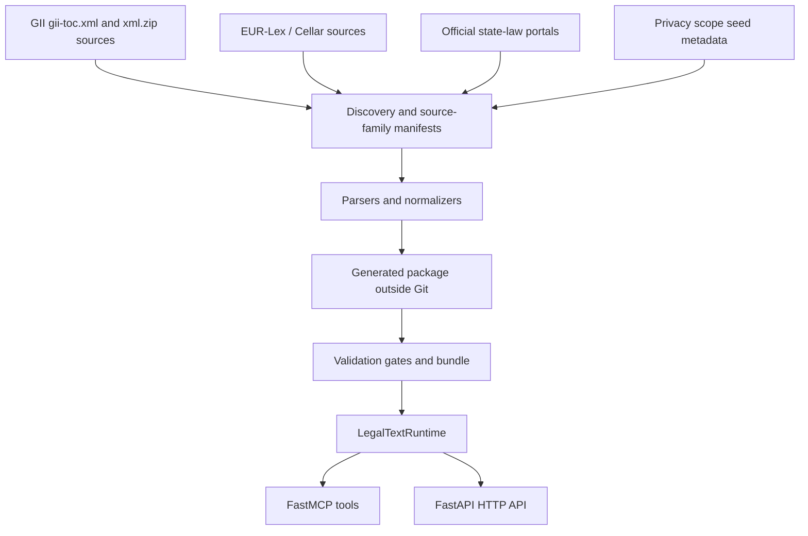

# legal-text-mcp-de

## Purpose

`legal-text-mcp-de` provides source-backed German and EU privacy-law texts
through MCP and a small HTTP API. The runtime serves validated local packages:
small committed fixtures for fast CI, or generated production corpus packages
kept outside Git.

The project is proprietary commercial software. It does not provide legal
advice and does not include SaaS, billing, account, authorization, or
multi-tenant features.

## Architecture



Generated packages include `laws.json`, `norms.json`, `package.json`,
`manifest.json`, `source-limitations.json`, `relationships.json`,
`readiness.json`, and `search-index.json`. Full-corpus gates persist artifacts
for GII terminal-state coverage, DSGVO count/version/hash evidence, EU neighbor
outcomes, state-law outcomes, privacy-scope relationship metadata, runtime
benchmarks, and the final validation bundle.

### Tech Stack

- Python 3.12
- uv with `pyproject.toml` and `uv.lock` for locked dependencies
- FastMCP via `mcp[cli]`
- FastAPI and Uvicorn for the HTTP API
- Pydantic settings for runtime configuration
- Standard-library XML/ZIP/JSON/hash tooling for source import and validation
- Pytest for unit, parser, service, transport, docs, and release-gate tests

## Modules

| Module | Description | Documentation |
| ------ | ----------- | ------------- |
| mcp-server | MCP server, HTTP app, legal text services, source adapters, generated package validation, operational gates, and tests. | [Detail](modules/mcp-server.md) |
| container-runtime | Docker packaging for the server with external validated package mounting. | [Detail](modules/container-runtime.md) |
| data-preparation | Legacy helper workflow for Markdown-era data preparation; not the production source path. | [Detail](modules/data-preparation.md) |
| google-adk-agent | Optional legacy demo agent kept outside the reliable legal text runtime. | [Detail](modules/google-adk-agent.md) |

## Key Features

| Feature | Description | Documentation |
| ------- | ----------- | ------------- |
| supported-laws | Fixture law set plus generated full-corpus scope and critical-law rules. | [Detail](features/supported-laws.md) |
| source-provenance | Official source provenance, source limitations, manifest terminal states, and relationship-source metadata. | [Detail](features/source-provenance.md) |
| law-loading-and-indexing | Legacy and generated package loading, readiness, search indexing, and operational artifacts. | [Detail](features/law-loading-and-indexing.md) |
| mcp-law-tools | Stable MCP tool surface including coverage, source limitation, and relationship lookups. | [Detail](features/mcp-law-tools.md) |
| api-contracts | Shared JSON response and error contracts. | [Detail](features/api-contracts.md) |
| http-api | FastAPI endpoints and OpenAPI contract. | [Detail](features/http-api.md) |
| scope-and-invariants | Explicit product boundaries, source invariants, and compatibility metadata. | [Detail](features/known-issues.md) |

## Generated Corpus Behavior

- GII coverage starts from the official TOC and requires one terminal state per
  discovered source.
- DSGVO articles and recitals are generated from official EUR-Lex/Cellar
  provenance and verified against count, version, expression/document, and hash
  policy.
- EU neighbor acts such as AI Act and Data Act are bounded by approved CELEX
  seeds and must be imported or recorded as source limitations.
- German state privacy laws require all 16 state outcomes as imported records or
  accepted source limitations.
- Relationship metadata links official records and source limitations without
  copying third-party editorial text.
- Runtime coverage and source-limitation APIs expose corpus completeness without
  forcing full-corpus generation into default PR CI.

## Development

### Setup

```bash
uv sync --all-groups
```

### Run MCP

```bash
DATASET_PATH=mcp/tests/fixtures/normalized \
STRICT_STARTUP=true \
PYTHONPATH=mcp \
uv run python mcp/server.py
```

### Run HTTP API

```bash
DATASET_PATH=mcp/tests/fixtures/normalized \
STRICT_STARTUP=true \
PYTHONPATH=mcp \
uv run uvicorn http_api:app --host 127.0.0.1 --port 8080
```

### Testing

```bash
PYTHONPATH=mcp uv run --group dev python scripts/verify_release.py
```

This command includes docs verification, fixture-backed tests, and local HTTP
and MCP streamable-HTTP E2E checks. Network-heavy corpus gates are explicit or
scheduled, not default PR CI.

## References

- [Model Context Protocol](https://modelcontextprotocol.io)
- [gesetze-im-internet.de](https://www.gesetze-im-internet.de)
- [EUR-Lex CELEX 32016R0679](https://eur-lex.europa.eu/legal-content/DE/TXT/?uri=CELEX:32016R0679)
- Legacy documentation archive: [docs-legacy/summary.md](../docs-legacy/summary.md)
