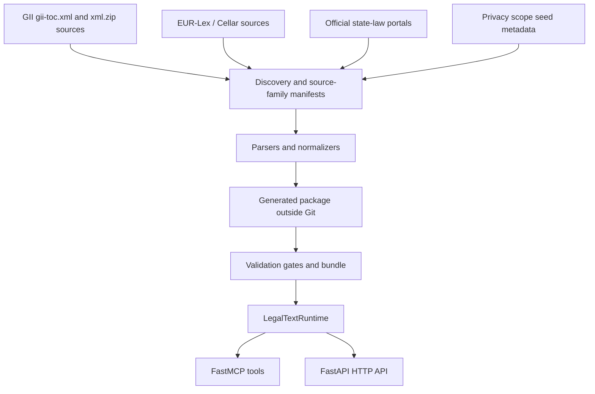

# legal-text-mcp-de

## Purpose

`legal-text-mcp-de` provides source-backed German and EU privacy-law texts
through MCP (v2 surface), a small HTTP API, and — since v2.1 — a typer-based
shell CLI that exposes the same tool surface, server lifecycle, and corpus
pipeline behind explicit subcommands. The runtime serves validated local
packages — small committed fixtures for fast CI — or a signed v2 corpus bundle
(~8,500 laws from GII, 5 state portals, and EUR-Lex Cellar) distributed as an
OCI artifact from GHCR. An optional public hosted instance is available at
`mcp.klein.business`.

Since v2.1.2 the server is listed in the
[official Model Context Protocol Registry](https://registry.modelcontextprotocol.io)
as `io.github.klein-business/legal-text-mcp-de` so MCP-aware clients can
auto-discover it; see [features/mcp-registry-distribution](features/mcp-registry-distribution.md).

The project is open source under the Apache License 2.0. It does not provide legal
advice and does not include SaaS, billing, account, authorization, or
multi-tenant features.

## Architecture



Generated packages include `laws.json`, `norms.json`, `package.json`,
`manifest.json`, `source-limitations.json`, `relationships.json`,
`readiness.json`, and `search-index.json`. Full-corpus gates persist artifacts
for GII terminal-state coverage, DSGVO count/version/hash evidence, EU neighbor
outcomes, state-law outcomes, privacy-scope relationship metadata, runtime
benchmarks, and the final validation bundle.

### Tech Stack

- Python 3.12
- uv with `pyproject.toml` and `uv.lock` for locked dependencies
- FastMCP via `mcp[cli]` (tools, resources, prompts, sampling)
- FastAPI and Uvicorn for the HTTP API
- Pydantic settings for runtime configuration
- Standard-library XML/ZIP/JSON/hash tooling for source import and validation
- `zstandard` for corpus bundle compression/decompression
- `SPARQLWrapper` for EUR-Lex Cellar queries
- `prometheus_client` for hosted-service metrics
- `typer` (>=0.20, <1) as a direct dep since v2.1 — backs the user-facing CLI surface (promoted from transitive via `mcp[cli]`)
- `httpx` for the CLI `health` subcommand probe
- Pytest + `pytest-asyncio` for unit, parser, service, transport, sampling, CLI, docs, and release-gate tests

## Modules

| Module | Description | Documentation |
| ------ | ----------- | ------------- |
| mcp-server | MCP server, HTTP app, legal text services, source adapters, generated package validation, operational gates, and tests. | [Detail](modules/mcp-server.md) |
| cli | typer-based CLI: 14 subcommands wrapping the MCP/HTTP/corpus surfaces. | [Detail](modules/cli.md) |
| corpus | v2 corpus bundle loader, XDG cache, cosign verifier, and `BundleManifest` schema. | [Detail](modules/corpus.md) |
| resources | `legal://` URI resource handlers and Markdown renderer (10 URIs). | [Detail](modules/resources.md) |
| prompts | 5 MCP slash-command templates for German legal workflows. | [Detail](modules/prompts.md) |
| sampling | `safe_sample` helper, schemas, error hierarchy, and `MockSamplingClient`. | [Detail](modules/sampling.md) |
| container-runtime | Docker packaging for the server — standard image and hosted-service image. | [Detail](modules/container-runtime.md) |
| data-preparation | v2 corpus build pipeline (state-law scrapers, EU-act loaders, `build_corpus` CLI) and legacy helper. | [Detail](modules/data-preparation.md) |
| hosted-deployment | Rate-limit middleware, bearer-token auth, Prometheus metrics, Caddy config for `mcp.klein.business`. | [Detail](modules/hosted-deployment.md) |
| google-adk-agent | Optional legacy demo agent kept outside the reliable legal text runtime. | [Detail](modules/google-adk-agent.md) |

## Key Features

| Feature | Description | Documentation |
| ------- | ----------- | ------------- |
| supported-laws | Fixture law set plus generated full-corpus scope (~8,500 laws) and critical-law rules. | [Detail](features/supported-laws.md) |
| source-provenance | Official source provenance, source limitations, manifest terminal states, and relationship-source metadata. | [Detail](features/source-provenance.md) |
| law-loading-and-indexing | Legacy and generated package loading, readiness, search indexing, and operational artifacts. | [Detail](features/law-loading-and-indexing.md) |
| mcp-law-tools | Stable MCP tool surface including coverage, source limitation, and relationship lookups. | [Detail](features/mcp-law-tools.md) |
| cli-shell-surface | typer-based CLI exposing every MCP tool + server lifecycle + corpus + diagnostics. BREAKING in v2.1.0: bare invocation prints --help. | [Detail](features/cli-shell-surface.md) |
| mcp-resources | 10 `legal://` URIs exposing law and norm texts as Markdown resources. | [Detail](features/mcp-resources.md) |
| mcp-prompts | 5 slash-command templates for common German legal workflows. | [Detail](features/mcp-prompts.md) |
| mcp-sampling | MCP Sampling capability with `safe_sample` helper for smart tools. | [Detail](features/mcp-sampling.md) |
| research-topic-smart-tool | Multi-step legal research with LLM-assisted norm ranking and synthesis. | [Detail](features/research-topic-smart-tool.md) |
| public-hosted-service | Optional publicly hosted instance at `mcp.klein.business` with daily corpus refresh. | [Detail](features/public-hosted-service.md) |
| data-preparation | v2 corpus build pipeline: state-law scrapers, EU-act loaders, `build_corpus` CLI. | [Detail](features/data-preparation.md) |
| api-contracts | Shared JSON response and error contracts. | [Detail](features/api-contracts.md) |
| http-api | FastAPI endpoints and OpenAPI contract. | [Detail](features/http-api.md) |
| mcp-registry-distribution | Auto-publish to the official Model Context Protocol Registry on every tag push via `server.json` + `mcp-publisher` + GitHub OIDC. Also drives Smithery.ai auto-discovery via `smithery.yaml`. (Since v2.1.2.) | [Detail](features/mcp-registry-distribution.md) |
| scope-and-invariants | Explicit product boundaries, source invariants, and compatibility metadata. | [Detail](features/known-issues.md) |

## Generated Corpus Behavior

- GII coverage starts from the official TOC and requires one terminal state per
  discovered source.
- DSGVO articles and recitals are generated from official EUR-Lex/Cellar
  provenance and verified against count, version, expression/document, and hash
  policy.
- EU neighbor acts such as AI Act and Data Act are bounded by approved CELEX
  seeds and must be imported or recorded as source limitations.
- German state privacy laws require all 16 state outcomes as imported records or
  accepted source limitations.
- Relationship metadata links official records and source limitations without
  copying third-party editorial text.
- Runtime coverage and source-limitation APIs expose corpus completeness without
  forcing full-corpus generation into default PR CI.

## Development

### Setup

```bash
uv sync --all-groups
```

### Run MCP

```bash
DATASET_PATH=src/tests/fixtures/normalized \
STRICT_STARTUP=true \
uv run legal-text-mcp-de serve
```

> **Breaking change in v2.1.0:** the bare `uv run legal-text-mcp-de`
> invocation now prints `--help` instead of starting the MCP server. Use the
> explicit `serve` subcommand. See [features/cli-shell-surface](features/cli-shell-surface.md).

### Run HTTP API

```bash
DATASET_PATH=src/tests/fixtures/normalized \
STRICT_STARTUP=true \
uv run uvicorn legal_text_mcp_de.http_api:app --host 127.0.0.1 --port 8001
```

The same FastAPI app is also reachable through the CLI (added in v2.1.0):

```bash
DATASET_PATH=src/tests/fixtures/normalized \
STRICT_STARTUP=true \
uv run legal-text-mcp-de http
```

The default port is `8001` (from `PORT` env / `settings.port`); pass `--port <N>` to override.

### Testing

```bash
uv run --group dev python scripts/verify_release.py
```

This command includes docs verification, fixture-backed tests, and local HTTP
and MCP streamable-HTTP E2E checks. The local E2E gate runs real server
processes for the legacy fixture dataset and generated-package fixture, verifies
the documented OpenAPI paths, and exercises every MCP tool over a real
`ClientSession`. Network-heavy corpus gates are explicit or scheduled, not
default PR CI.

## References

- [Model Context Protocol](https://modelcontextprotocol.io)
- [gesetze-im-internet.de](https://www.gesetze-im-internet.de)
- [EUR-Lex CELEX 32016R0679](https://eur-lex.europa.eu/legal-content/DE/TXT/?uri=CELEX:32016R0679)
- Legacy documentation archive: [docs-legacy/summary.md](../docs-legacy/summary.md)
