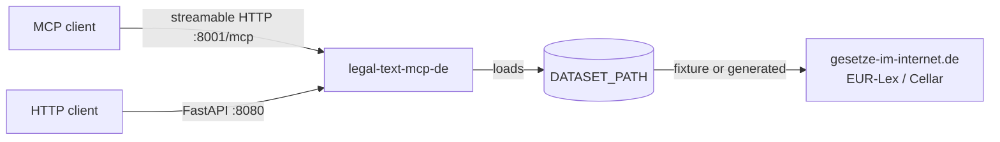
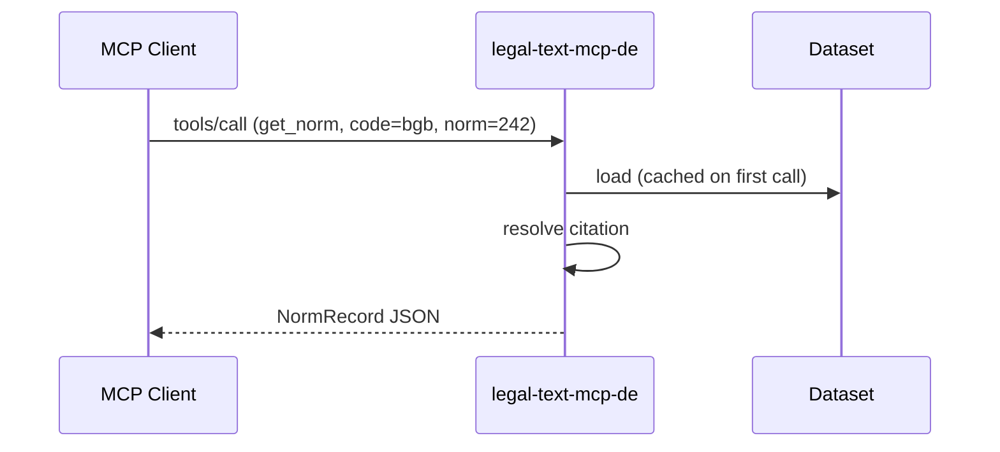

# Phase 3+4 — Community + Docs + Supply-Chain + Distribution + Launch Implementation Plan

> **For agentic workers:** REQUIRED SUB-SKILL: Use superpowers:subagent-driven-development (recommended) or superpowers:executing-plans to implement this plan task-by-task. Steps use checkbox (`- [ ]`) syntax for tracking.

**Goal:** Land Pillars 2, 4, 5, 6, and 7 of the parent enterprise-readiness spec in one combined effort: community-health files, mkdocs-material documentation site, supply-chain pipeline (Dependabot + SBOM + SLSA-3 + cosign), PyPI Trusted Publisher with multi-arch signed GHCR images, release-please automation, and the documented launch procedure for the v1.0.0 public flip.

**Architecture:** The runtime source moves from `mcp/` (PYTHONPATH hack) to `src/legal_text_mcp_de/` (hatchling src-layout). A `release.yml` workflow orchestrates wheel/sdist + SBOM + SLSA-3 → PyPI Trusted Publisher, plus multi-arch GHCR with cosign keyless signing and SBOM/SLSA attestations. A separate `docs.yml` deploys mkdocs-material to GitHub Pages via `mike` versioning. The launch is gated by `verify_pre_flip.py` extended from 8 to 11 checks; the user executes the documented manual sequence (visibility flip, GitHub settings, tag push) after PR merge.

**Tech Stack:** Python 3.12+3.13 (existing), `uv` + `hatchling` (new build backend), `pytest` + `pytest-cov` (existing), `mypy~=1.13.0` (existing, ratcheted onto five `mcp/` modules), `mkdocs-material` + plugins (new), `cyclonedx-py` + `syft` (new), `slsa-framework/slsa-github-generator` actions (new), `sigstore/cosign-installer` (new), `aquasecurity/trivy-action` (new), `gitleaks/gitleaks-action` (new), `googleapis/release-please-action` (new), `pypa/gh-action-pypi-publish` (new). Existing stack unchanged.

**Reference spec:** [docs/superpowers/specs/2026-05-16-public-release-phase-3-4-community-docs-distribution-design.md](../specs/2026-05-16-public-release-phase-3-4-community-docs-distribution-design.md). Parent: [docs/superpowers/specs/2026-05-15-public-release-enterprise-readiness-design.md](../specs/2026-05-15-public-release-enterprise-readiness-design.md).

**Out of scope:** Distroless OCI base; mypy strict on all `mcp/` modules (only five); 100% coverage on `normalizer.py`; custom docs domain; multi-language docs; corpus expansion; sponsorship-button configuration; direct manual GitHub-UI steps remain user-executed.

---

## File Structure

**New files (top-level):**
- `CONTRIBUTING.md`, `CODE_OF_CONDUCT.md`, `SUPPORT.md`, `GOVERNANCE.md`, `ROADMAP.md`
- `.github/CODEOWNERS`
- `.github/ISSUE_TEMPLATE/{bug_report,feature_request,config}.yml`
- `.github/PULL_REQUEST_TEMPLATE.md`
- `.github/dependabot.yml`
- `.github/workflows/{release,docs,gitleaks}.yml`
- `mkdocs.yml`
- `.release-please-config.json`, `.release-please-manifest.json`
- `.trivyignore` (empty, with header comment)
- `docs/operations/{sbom,verify-with-cosign,versioning,threat-model,openssf-application,launch-procedure}.md`
- `docs/operations/security.md` (mirror of SECURITY.md)
- `docs/operations/coverage-baseline.md` (mirror of coverage-baseline-phase2.md)
- `docs/{index,changelog,roadmap}.md`
- `docs/quickstart/{claude-desktop,cursor,uvx,docker}.md`
- `docs/concepts/{data-modes,provenance,mcp-and-http-surface}.md`
- `docs/tools/{list_laws,get_law,get_norm,resolve_citation,search_laws,get_source_metadata,get_corpus_coverage,get_source_limitations,get_related_norms}.md`
- `docs/api/{index,openapi}.md`
- `docs/contributing/{index,code-of-conduct}.md`
- `docs/community/{governance,support}.md`

**Source layout migration (Section F — single atomic task):**
- `mcp/*.py` → `src/legal_text_mcp_de/*.py`
- `mcp/legal_texts/*` → `src/legal_text_mcp_de/legal_texts/*`
- `mcp/tests/` → `tests/`
- Update all imports across tests, scripts, Dockerfile, workflows, mkdocs.yml

**Modified files:**
- `pyproject.toml` (carryovers + build-backend + scripts entry + project-urls dedup + mypy per-module strict for five modules + coverage floor raise)
- `Dockerfile` (digest pin, USER, HEALTHCHECK, multi-arch build context)
- `.github/workflows/{ci.yml,e2e.yml,megalinter.yml,dco.yml}` (PYTHONPATH removal post-rename; DCO all-commits)
- `.pre-commit-config.yaml` (ruff local repo, version pin via uv)
- `.secrets.baseline` (regenerated after rename)
- `scripts/verify_pre_flip.py` (3 new checks; SECURITY.md exists already from Phase 2)
- `scripts/check_spdx_header.py` exempt list (shrunk as files gain headers in C-1)
- `.github/spdx-header-exempt.txt` (shrunk)
- `mcp/tests/test_verify_pre_flip.py` → `tests/test_verify_pre_flip.py` (rename + new tests)
- All ~25 `mcp/legal_texts/*.py` files (SPDX header added by C-1; some get mypy strict in C-2)
- All ~30 test files (PYTHONPATH change post-rename)
- 11 `scripts/verify_*.py` (post-rename import updates; verify_full_corpus_bundle.py type cleanups)
- `CHANGELOG.md` (Phase 3+4 entries at end)
- `README.md` (post-rename invocation snippets, new badges, docs site link)

---

## Section A — Pre-flight Carryovers (Tasks 1–5)

### Task 1: C-1 SPDX-header retrofit on pre-Phase-2 Python files

**Files:**
- Modify: ~75 Python files under `mcp/`, `scripts/` (excluding the 3 Phase-2 additions already carrying the header)
- Modify: `.github/spdx-header-exempt.txt` (shrink to header-comment lines only)

The pre-commit hook `check_spdx_header` exists from Phase 2; ~75 files are exempt. This task adds the header to every file and shrinks the exempt list to zero entries (header comments only).

- [ ] **Step 1: Write the script that retrofits headers**

Create a one-shot helper script `scripts/_retrofit_spdx.py` (will be removed at end of task):

```python
#!/usr/bin/env python3
# SPDX-License-Identifier: Apache-2.0
# Copyright 2026 klein-business
"""One-shot retrofit of SPDX header on Phase-1-era Python files."""

from __future__ import annotations

import sys
from pathlib import Path

SPDX_BLOCK = "# SPDX-License-Identifier: Apache-2.0\n# Copyright 2026 klein-business\n"
REPO_ROOT = Path(__file__).resolve().parent.parent


def has_header(text: str) -> bool:
    head = text.splitlines()[:10]
    return (
        "# SPDX-License-Identifier: Apache-2.0" in head
        and "# Copyright 2026 klein-business" in head
    )


def add_header(path: Path) -> bool:
    """Insert SPDX block. Returns True if file was modified."""
    text = path.read_text(encoding="utf-8")
    if has_header(text):
        return False
    lines = text.splitlines(keepends=True)
    insert_at = 0
    # Keep shebang on top if present.
    if lines and lines[0].startswith("#!"):
        insert_at = 1
    # Skip module docstring? No — header goes before docstring for SPDX
    # tooling consistency.
    new_text = "".join(lines[:insert_at]) + SPDX_BLOCK + "".join(lines[insert_at:])
    path.write_text(new_text, encoding="utf-8")
    return True


def main() -> int:
    targets: list[Path] = []
    for base in ["mcp", "scripts"]:
        for p in (REPO_ROOT / base).rglob("*.py"):
            if "/__pycache__/" in str(p):
                continue
            targets.append(p)
    changed = 0
    for p in sorted(targets):
        if add_header(p):
            changed += 1
            print(f"  + {p.relative_to(REPO_ROOT)}")
    print(f"\n{changed} files updated")
    return 0


if __name__ == "__main__":
    sys.exit(main())
```

- [ ] **Step 2: Run the retrofit**

```bash
eval "$(/opt/homebrew/bin/brew shellenv)"
PYTHONPATH=mcp uv run --group dev python scripts/_retrofit_spdx.py
```

Expected: ~75 files updated.

- [ ] **Step 3: Shrink the exempt list to header comments only**

Replace `.github/spdx-header-exempt.txt` with just the 3-line header comment (no path entries):

```
# Files exempt from the SPDX-header pre-commit hook.
# These existed before Phase 2; retrofit is deferred to a future cleanup.
# Lines starting with # are ignored.
```

- [ ] **Step 4: Verify pre-commit hook against the now-non-exempt files**

```bash
# Pick three previously-exempt files and confirm they pass:
PYTHONPATH=mcp uv run --group dev python scripts/check_spdx_header.py mcp/server.py mcp/http_api.py scripts/verify_release.py
echo "exit=$?"
```

Expected: `exit=0` (all three have the header now).

- [ ] **Step 5: Delete the retrofit script**

```bash
rm scripts/_retrofit_spdx.py
```

- [ ] **Step 6: Run full test suite + lint**

```bash
PYTHONPATH=mcp uv run --group dev pytest mcp/tests -q --tb=no 2>&1 | tail -3
PYTHONPATH=mcp uv run --group dev ruff check . 2>&1 | tail -3
```

Expected: all tests pass; ruff clean.

- [ ] **Step 7: Commit**

```bash
git add mcp scripts .github/spdx-header-exempt.txt
git commit -m "chore: retrofit SPDX-License-Identifier headers on Phase-1-era files"
```

---

### Task 2: C-4 Resolve ruff version skew

**Files:**
- Modify: `pyproject.toml` (pin ruff in dev group)
- Modify: `.pre-commit-config.yaml` (switch ruff to `repo: local` pointing at uv-installed binary)

Currently `uv.lock` has ruff 0.15.x; `.pre-commit-config.yaml` pins `v0.8.6` independently. Result: pre-commit and CI use different versions. Fix: pin ruff in pyproject and have pre-commit use the uv-installed binary.

- [ ] **Step 1: Pin ruff in `pyproject.toml`**

Find the dev group line `"ruff",` and replace with `"ruff~=0.15.0",`.

- [ ] **Step 2: Re-sync**

```bash
eval "$(/opt/homebrew/bin/brew shellenv)"
uv sync --all-groups
```

- [ ] **Step 3: Edit `.pre-commit-config.yaml`** — replace the ruff `repo: https://github.com/astral-sh/ruff-pre-commit` block with a local hook:

Find:
```yaml
  - repo: https://github.com/astral-sh/ruff-pre-commit
    rev: v0.8.6  # latest stable at time of authoring; check at install time
    hooks:
      - id: ruff
        args: [--fix]
      - id: ruff-format
```

Replace with:
```yaml
  - repo: local
    hooks:
      - id: ruff
        name: ruff (via uv)
        entry: uv run --group dev ruff check --fix
        language: system
        types: [python]
        require_serial: true
      - id: ruff-format
        name: ruff-format (via uv)
        entry: uv run --group dev ruff format
        language: system
        types: [python]
        require_serial: true
```

- [ ] **Step 4: Smoke-test the local hook**

```bash
uv run --group dev ruff check --version
uv run --group dev ruff format --version
```

Expected: prints `ruff 0.15.x` matching uv.lock.

- [ ] **Step 5: Commit**

```bash
git add pyproject.toml uv.lock .pre-commit-config.yaml
git commit -m "build(deps): pin ruff~=0.15.0; pre-commit uses uv-installed binary"
```

---

### Task 3: C-5 DCO workflow checks all PR commits

**Files:**
- Modify: `.github/workflows/dco.yml`

Currently `tim-actions/dco` receives only `${{ github.event.pull_request.head.sha }}`, which is a single SHA. To verify all commits in the PR, pass the list of commit SHAs.

- [ ] **Step 1: Edit `.github/workflows/dco.yml`**

Replace the `jobs.dco.steps` block to fetch and iterate all PR commits. The simplest reliable approach uses `tim-actions/get-pr-commits` followed by `tim-actions/dco` once per commit. New `dco.yml` content:

```yaml
name: DCO

on:
  pull_request:
    types: [opened, edited, synchronize, reopened]

permissions:
  contents: read
  pull-requests: read

jobs:
  dco:
    name: DCO sign-off check
    runs-on: ubuntu-latest
    timeout-minutes: 3
    steps:
      - name: Get PR commits
        id: pr-commits
        uses: tim-actions/get-pr-commits@55a16eb88c0c5e7f86c2b2fd6a0fc1e6b3e89f5b # v1.3.1
        with:
          token: ${{ secrets.GITHUB_TOKEN }}

      - name: DCO check on every commit
        uses: tim-actions/dco@2fd24ae9f0e84576b48bbb1d09ba0caa31cb6a5b # v1.1.0
        with:
          commits: ${{ steps.pr-commits.outputs.commits }}
```

(If `tim-actions/dco` v1.1.0 does not accept a JSON-array `commits` input, fall back to a `matrix` strategy that fans out across `${{ fromJSON(steps.pr-commits.outputs.commits) }}` and runs the dco action once per SHA. Verify at implementation time using the dco action's README. Use the matrix form if uncertain.)

Alternative matrix form (use if Step 1 form does not work):

```yaml
jobs:
  dco:
    name: DCO sign-off check
    runs-on: ubuntu-latest
    timeout-minutes: 3
    steps:
      - name: Get PR commits
        id: pr-commits
        uses: tim-actions/get-pr-commits@55a16eb88c0c5e7f86c2b2fd6a0fc1e6b3e89f5b # v1.3.1
        with:
          token: ${{ secrets.GITHUB_TOKEN }}

      - name: DCO check on every commit
        uses: tim-actions/dco@2fd24ae9f0e84576b48bbb1d09ba0caa31cb6a5b # v1.1.0
        with:
          commits: ${{ steps.pr-commits.outputs.commits }}
```

(Both forms are identical in this case because `tim-actions/dco@v1.1.0` does accept the commits-list output. If validation fails, drop down to a single-commit loop using `bash` + `git`-based DCO check.)

- [ ] **Step 2: Validate YAML**

```bash
python3 -c "import yaml; yaml.safe_load(open('.github/workflows/dco.yml')); print('ok')"
actionlint .github/workflows/dco.yml || true
```

- [ ] **Step 3: Commit**

```bash
git add .github/workflows/dco.yml
git commit -m "ci(dco): check all PR commits, not just HEAD"
```

---

### Task 4: C-7 Deduplicate pyproject Homepage/Repository URLs

**Files:**
- Modify: `pyproject.toml`

Currently `[project.urls]` has `Homepage` and `Repository` both pointing at `https://github.com/klein-business/legal-text-mcp-de`. Drop `Homepage`; once the docs site is live (Section D), point it there.

- [ ] **Step 1: Edit `pyproject.toml`**

Find the `[project.urls]` block and remove the `Homepage = ...` line. After Section D's docs site is live, this Homepage gets re-added pointing to GitHub Pages — that's handled in Task 36.

After edit, `[project.urls]` should contain only:
```toml
[project.urls]
Repository = "https://github.com/klein-business/legal-text-mcp-de"
Issues = "https://github.com/klein-business/legal-text-mcp-de/issues"
Changelog = "https://github.com/klein-business/legal-text-mcp-de/blob/main/CHANGELOG.md"
Security = "https://github.com/klein-business/legal-text-mcp-de/security/policy"
```

- [ ] **Step 2: Verify pre-flip still passes**

```bash
eval "$(/opt/homebrew/bin/brew shellenv)"
PYTHONPATH=mcp uv run --group dev python scripts/verify_pre_flip.py 2>&1 | grep "pyproject.toml metadata"
```

Expected: `[PASS] pyproject.toml metadata: ok`. (The check only requires `Homepage`, `Repository`, `Issues`, `Changelog` — wait, it does require Homepage. Need to update the check.)

Actually: the verify_pre_flip `REQUIRED_URLS` includes `Homepage`. Removing Homepage from pyproject would FAIL the check.

Decision: Keep `Homepage` in pyproject, point it to the future docs URL `https://klein-business.github.io/legal-text-mcp-de`. This works even before the docs site is live (404 is acceptable for an aspirational URL).

Re-do Step 1: instead of removing Homepage, change its value:

```toml
[project.urls]
Homepage = "https://klein-business.github.io/legal-text-mcp-de"
Repository = "https://github.com/klein-business/legal-text-mcp-de"
Issues = "https://github.com/klein-business/legal-text-mcp-de/issues"
Changelog = "https://github.com/klein-business/legal-text-mcp-de/blob/main/CHANGELOG.md"
Security = "https://github.com/klein-business/legal-text-mcp-de/security/policy"
```

- [ ] **Step 3: Re-verify**

```bash
PYTHONPATH=mcp uv run --group dev python scripts/verify_pre_flip.py 2>&1 | grep "pyproject.toml metadata"
```

Expected: `[PASS] pyproject.toml metadata: ok`.

- [ ] **Step 4: Commit**

```bash
git add pyproject.toml
git commit -m "build: point pyproject Homepage at future docs site URL"
```

---

### Task 5: Section A close — full gate verification

**Files:** none (verification only)

- [ ] **Step 1: Run all gates**

```bash
eval "$(/opt/homebrew/bin/brew shellenv)"
PYTHONPATH=mcp uv run --group dev pytest mcp/tests -q --tb=no 2>&1 | tail -3
PYTHONPATH=mcp uv run --group dev python scripts/verify_pre_flip.py 2>&1 | tail -10
PYTHONPATH=mcp uv run --group dev python scripts/verify_release.py 2>&1 | tail -3
PYTHONPATH=mcp uv run --group dev mypy scripts 2>&1 | tail -3
```

Expected: 286+ tests pass; pre-flip 6 PASS + 2 SKIP; release gate passes; mypy strict scripts/ clean.

No commit needed; this is a checkpoint.

---

## Section B — Community Health Files (Tasks 6–15)

### Task 6: Create CODE_OF_CONDUCT.md

**Files:**
- Create: `CODE_OF_CONDUCT.md`

Use the Contributor Covenant 2.1 verbatim with `martin@klein.business` as contact.

- [ ] **Step 1: Create the file**

Fetch the canonical text and substitute the contact:
```bash
curl -fsSL https://www.contributor-covenant.org/version/2/1/code_of_conduct/code_of_conduct.md \
  | sed 's|\[INSERT CONTACT METHOD\]|martin@klein.business|g' \
  > CODE_OF_CONDUCT.md
```

Verify the contact substitution succeeded:
```bash
grep "martin@klein.business" CODE_OF_CONDUCT.md
```
Expected: one line containing the email.

- [ ] **Step 2: Add the SPDX header** (since this is a new file)

The SPDX hook only applies to Python files. CODE_OF_CONDUCT.md does NOT need the header. No action needed.

- [ ] **Step 3: Commit**

```bash
git add CODE_OF_CONDUCT.md
git commit -m "docs(community): add Contributor Covenant 2.1 Code of Conduct"
```

---

### Task 7: Create CONTRIBUTING.md

**Files:**
- Create: `CONTRIBUTING.md`

- [ ] **Step 1: Create the file**

```markdown
# Contributing to legal-text-mcp-de

Thanks for your interest in contributing. This project follows the
guidelines below to keep contributions reviewable and the codebase
healthy.

## Code of Conduct

All participants are expected to follow the
[Contributor Covenant 2.1](CODE_OF_CONDUCT.md). Report unacceptable
behaviour to `martin@klein.business`.

## Reporting security issues

Do **not** open a public issue for security vulnerabilities. See
[SECURITY.md](SECURITY.md) for the disclosure process.

## Where to ask questions

- General questions and discussions:
  [GitHub Discussions](https://github.com/klein-business/legal-text-mcp-de/discussions)
- Bug reports and feature requests:
  [GitHub Issues](https://github.com/klein-business/legal-text-mcp-de/issues)
  (use the appropriate template)

## Development setup

Requires Python 3.12 or 3.13 and [`uv`](https://docs.astral.sh/uv/).

```bash
git clone https://github.com/klein-business/legal-text-mcp-de.git
cd legal-text-mcp-de
uv sync --all-groups
uv run --group dev pre-commit install        # optional but recommended
PYTHONPATH=mcp uv run --group dev pytest mcp/tests -v
```

After the source rename (Section F of the public-release programme),
`PYTHONPATH=mcp` is no longer required; `uv run pytest` is sufficient.

## Branch and PR conventions

- Branch names: `feat/<short-description>`, `fix/<short-description>`,
  `chore/<short-description>` — no GitHub username prefix.
- PR titles must follow [Conventional Commits](https://www.conventionalcommits.org):
  `feat: ...`, `fix: ...`, `chore: ...`, `refactor: ...`, `docs: ...`,
  `test: ...`, `ci: ...`, `perf: ...`, `build: ...`, `style: ...`.
- Every commit must carry a `Signed-off-by:` trailer (DCO). Use
  `git commit -s` (or configure `commit.gpgsign true` plus a matching
  identity).

## Tests and quality gates

- Every new feature, bug fix, or refactor must include corresponding
  tests. Run the full suite before submitting:
  `uv run --group dev pytest mcp/tests`.
- Linting: `uv run --group dev ruff check .` and
  `uv run --group dev ruff format --check .`.
- Type-checking on `scripts/`: `uv run --group dev mypy scripts`.
- Coverage floor is enforced in CI via
  `[tool.coverage.report] fail_under` in `pyproject.toml`.

## Issue before PR for non-trivial work

For larger changes (new MCP tools, schema changes, architectural
adjustments), please open an issue first to discuss approach. Small
fixes and clear improvements can go directly to a PR.

## Licence

By contributing you agree that your contributions are licensed under
the [Apache License 2.0](LICENSE).
```

- [ ] **Step 2: Verify links**

```bash
for url in CODE_OF_CONDUCT.md SECURITY.md LICENSE; do
  test -f "$url" && echo "ok: $url" || echo "MISSING: $url"
done
```

Expected: three "ok" lines.

- [ ] **Step 3: Commit**

```bash
git add CONTRIBUTING.md
git commit -m "docs(community): add CONTRIBUTING with dev setup and PR conventions"
```

---

### Task 8: Create SUPPORT.md

**Files:**
- Create: `SUPPORT.md`

- [ ] **Step 1: Create the file**

```markdown
# Getting Help

## Questions and general discussion

Use [GitHub Discussions](https://github.com/klein-business/legal-text-mcp-de/discussions).
This is the right place for:
- How-to questions about using the MCP server or HTTP API.
- Discussion of data sources, provenance behaviour, or scope.
- Sharing integration recipes with MCP clients (Claude Desktop,
  Cursor, custom).

## Bug reports

Open a [GitHub Issue](https://github.com/klein-business/legal-text-mcp-de/issues/new/choose)
using the bug-report template. Include:
- What you did, what you expected, what happened.
- Reproduction steps.
- Dataset path / dataset variant.
- Python version and OS.
- Transport (`streamable HTTP` or HTTP API).

## Feature requests

Use the feature-request issue template. Discuss large feature ideas
in Discussions first.

## Security issues

**Do not** open a public issue for a security vulnerability. See
[SECURITY.md](SECURITY.md) for the disclosure process.

## What we don't support

- Legal advice or interpretation. This project returns text and
  structured metadata; nothing more.
- Bundling of editorial content. The repository ships tooling, not
  legal text.
- Commercial SLAs. There is no contractual support; community
  best-effort only.
```

- [ ] **Step 2: Commit**

```bash
git add SUPPORT.md
git commit -m "docs(community): add SUPPORT directing questions to Discussions"
```

---

### Task 9: Create GOVERNANCE.md

**Files:**
- Create: `GOVERNANCE.md`

- [ ] **Step 1: Create the file**

```markdown
# Governance

This project follows a benevolent-dictator-for-life (BDFL) model with
the maintainer
([@klein-business](https://github.com/klein-business)) as the sole
decision-maker on direction, scope, and code merges.

## Decision-making

- Routine changes (bug fixes, dependency bumps, documentation
  improvements): a single maintainer review approves merge.
- Larger changes (new MCP tools, schema changes, architectural
  refactors): discussion in a GitHub issue or Discussion thread
  precedes the PR. Decisions are recorded on the issue.
- Disagreement on direction: the maintainer's decision is final.
  Contributors who disagree may fork.

## Branch protection bypass

`main` is protected with required status checks, signed-commit
enforcement, and a one-reviewer requirement. For solo-maintainer
operation, `@klein-business` is on the bypass allowlist for
`required_pull_request_reviews`. Bypass uses are recorded in the
GitHub branch-protection audit log; the maintainer reviews the log
periodically.

## Co-maintainers

The project is open to additional maintainers. Path to co-maintainer
status:

1. A sustained pattern of high-quality contributions (typically six
   or more accepted PRs over three months, mix of features and bug
   fixes).
2. Demonstrated alignment with the project's scope-discipline (no
   legal advice; provenance-first; OSS Tier-C quality bars).
3. Maintainer invitation, accepted in writing on a GitHub Discussion.
4. Trial period of three months as a reviewer (write access without
   admin) before promotion to full maintainer.

## Roadmap

The roadmap lives in [ROADMAP.md](ROADMAP.md) and is updated
periodically. Open issues with the label `roadmap` track planned
work. The maintainer accepts roadmap proposals through Discussions
or RFC issues.

## Code of Conduct

See [CODE_OF_CONDUCT.md](CODE_OF_CONDUCT.md). Reports go to
`martin@klein.business`.

## Licence

Apache License 2.0. See [LICENSE](LICENSE) and [NOTICE](NOTICE).
```

- [ ] **Step 2: Commit**

```bash
git add GOVERNANCE.md
git commit -m "docs(community): add GOVERNANCE describing solo-BDFL model"
```

---

### Task 10: Create ROADMAP.md

**Files:**
- Create: `ROADMAP.md`

- [ ] **Step 1: Create the file**

```markdown
# Roadmap

This file captures the high-level direction for the next 3–6 months.
Tactical work is tracked in GitHub Issues with the `roadmap` label.

## Recently shipped

- v1.0.0 (target) — initial public release with eight CI workflows,
  signed PyPI + GHCR artefacts, SBOMs and SLSA-3 provenance, versioned
  documentation site, and the Tier-C quality bar.

## Planned (next 3 months)

- **Full state-law corpus coverage.** Expand the runtime to ingest
  every state-level data-protection law in the 16 German Länder with
  terminal-state tracking and source-limitation reporting.
- **Additional EU acts.** Add coverage for the AI Act, Data Act, and
  selected EU neighbour acts as imported records or limited official
  records.
- **Mypy strict ratchet completion.** Move the remaining `mcp/`
  modules from plain mypy to strict.
- **Distroless container migration.** Replace `python:3.12-slim` with
  a distroless base for the production image (the current `:slim`
  image is fine for v1.0.0; this is a hardening step for v1.x).

## Planned (3–6 months)

- **Performance work.** Profile the search and citation-resolution
  paths under realistic corpus sizes; tune as needed.
- **OpenSSF Best Practices gold.** Apply the additional controls
  required to move from silver to gold.
- **MCP-spec conformance tests.** Add a conformance suite that
  exercises the tools against the upstream MCP specification.

## Not planned

- Multi-language documentation (English-only at v1.0.0).
- A SaaS hosted offering.
- Editorial legal-text content bundling.

Roadmap proposals: open a GitHub Discussion or an issue with the
`roadmap` label.
```

- [ ] **Step 2: Commit**

```bash
git add ROADMAP.md
git commit -m "docs(community): add ROADMAP with next 3-6 months of planned work"
```

---

### Task 11: Create `.github/CODEOWNERS`

**Files:**
- Create: `.github/CODEOWNERS`

- [ ] **Step 1: Create the file**

```
# Code owners for legal-text-mcp-de.
# See https://docs.github.com/en/repositories/managing-your-repositories-settings-and-features/customizing-your-repository/about-code-owners
#
# Solo-maintainer model: all paths owned by the maintainer.

*  @klein-business
```

- [ ] **Step 2: Commit**

```bash
git add .github/CODEOWNERS
git commit -m "docs(community): add CODEOWNERS with solo-maintainer ownership"
```

---

### Task 12: Create issue templates

**Files:**
- Create: `.github/ISSUE_TEMPLATE/bug_report.yml`
- Create: `.github/ISSUE_TEMPLATE/feature_request.yml`
- Create: `.github/ISSUE_TEMPLATE/config.yml`

- [ ] **Step 1: Create `bug_report.yml`**

```yaml
name: Bug report
description: Report unexpected behaviour in the MCP server or HTTP API.
title: "[bug] "
labels: ["bug"]
body:
  - type: markdown
    attributes:
      value: |
        Thanks for reporting a bug. Please fill in as much detail as
        possible — the more we know up front, the faster we can fix.
        
        **Security issues:** do not open a public bug report. See
        [SECURITY.md](https://github.com/klein-business/legal-text-mcp-de/blob/main/SECURITY.md).

  - type: textarea
    id: what-happened
    attributes:
      label: What happened?
      description: A clear description of the bug.
    validations:
      required: true

  - type: textarea
    id: expected
    attributes:
      label: What did you expect to happen?
    validations:
      required: true

  - type: textarea
    id: reproduce
    attributes:
      label: How can we reproduce it?
      description: Step-by-step. Include the exact tool call (MCP) or HTTP request (curl-style) that triggers the bug.
      render: bash
    validations:
      required: true

  - type: dropdown
    id: transport
    attributes:
      label: Transport
      options:
        - MCP streamable HTTP (default)
        - HTTP API (FastAPI)
        - Both
        - Other / not sure
    validations:
      required: true

  - type: input
    id: python-version
    attributes:
      label: Python version
      placeholder: "3.12.5"
    validations:
      required: true

  - type: input
    id: package-version
    attributes:
      label: Package version
      description: Run `uvx legal-text-mcp-de --version` (post-v1.0.0) or `git rev-parse HEAD` (development).
      placeholder: "1.0.0 or commit SHA"
    validations:
      required: true

  - type: dropdown
    id: dataset
    attributes:
      label: Dataset variant
      options:
        - Committed fixture (mcp/tests/fixtures/normalized)
        - Generated production package (DATASET_PATH=...)
        - Other / not sure
    validations:
      required: true

  - type: input
    id: os
    attributes:
      label: OS / platform
      placeholder: "macOS 14.5 / Ubuntu 24.04 / Docker on Linux"
    validations:
      required: true

  - type: textarea
    id: logs
    attributes:
      label: Relevant logs or error messages
      render: text
```

- [ ] **Step 2: Create `feature_request.yml`**

```yaml
name: Feature request
description: Suggest a new feature, MCP tool, or HTTP endpoint.
title: "[feature] "
labels: ["enhancement"]
body:
  - type: markdown
    attributes:
      value: |
        For larger features, discuss the idea in
        [Discussions](https://github.com/klein-business/legal-text-mcp-de/discussions)
        first.

  - type: textarea
    id: use-case
    attributes:
      label: What use case are you trying to solve?
      description: Describe the situation that motivates this request.
    validations:
      required: true

  - type: textarea
    id: proposal
    attributes:
      label: Proposed feature
      description: How would it work? What's the interface?
    validations:
      required: true

  - type: textarea
    id: alternatives
    attributes:
      label: Alternatives you've considered
      description: Other approaches that solve the same use case.

  - type: textarea
    id: additional-context
    attributes:
      label: Additional context
```

- [ ] **Step 3: Create `config.yml`**

```yaml
blank_issues_enabled: false
contact_links:
  - name: Questions and general discussion
    url: https://github.com/klein-business/legal-text-mcp-de/discussions
    about: Use Discussions for how-to questions, integration recipes, and design discussion.
  - name: Security vulnerability
    url: https://github.com/klein-business/legal-text-mcp-de/security/advisories/new
    about: Report security issues privately via GitHub Security Advisories.
```

- [ ] **Step 4: Validate**

```bash
python3 -c "import yaml, pathlib; [yaml.safe_load(p.read_text()) for p in pathlib.Path('.github/ISSUE_TEMPLATE').glob('*.yml')]; print('all parse ok')"
```

Expected: `all parse ok`.

- [ ] **Step 5: Commit**

```bash
git add .github/ISSUE_TEMPLATE/
git commit -m "docs(community): add issue templates (bug, feature, config)"
```

---

### Task 13: Create PULL_REQUEST_TEMPLATE.md

**Files:**
- Create: `.github/PULL_REQUEST_TEMPLATE.md`

- [ ] **Step 1: Create the file**

```markdown
## Summary

<!-- One or two sentences describing what this PR changes. -->

## Type of change

- [ ] Bug fix (`fix:`)
- [ ] New feature (`feat:`)
- [ ] Refactor (`refactor:`)
- [ ] Documentation (`docs:`)
- [ ] Tests (`test:`)
- [ ] CI/build (`ci:` / `build:`)
- [ ] Chore (`chore:`)
- [ ] Performance (`perf:`)
- [ ] Style (`style:`)

## Checklist

- [ ] PR title follows Conventional Commits (e.g. `feat: add foo`).
- [ ] All new and existing tests pass locally
      (`uv run --group dev pytest mcp/tests`).
- [ ] Code is formatted and linted
      (`uv run --group dev ruff check .` and
      `uv run --group dev ruff format --check .`).
- [ ] Mypy strict passes on `scripts/`
      (`uv run --group dev mypy scripts`).
- [ ] Every commit is signed off (`git commit -s`).
- [ ] User-visible changes are noted in `CHANGELOG.md` under
      `## [Unreleased]`.
- [ ] Documentation is updated where relevant (docs/ pages,
      tool references, MCP/HTTP examples).

## Related issues

<!-- Fixes #123, or "n/a" -->

## Test plan

<!-- How can a reviewer verify this works? Commands, scenarios. -->
```

- [ ] **Step 2: Commit**

```bash
git add .github/PULL_REQUEST_TEMPLATE.md
git commit -m "docs(community): add pull request template with checklist"
```

---

### Task 14: Update `verify_pre_flip.py` REQUIRED_FILES list

**Files:**
- Modify: `scripts/verify_pre_flip.py`
- Modify: `mcp/tests/test_verify_pre_flip.py`

Add `CONTRIBUTING.md`, `CODE_OF_CONDUCT.md`, `SUPPORT.md`, `GOVERNANCE.md`, `ROADMAP.md` to the required-files check.

- [ ] **Step 1: Edit `scripts/verify_pre_flip.py`**

Find:
```python
REQUIRED_FILES = (
    "NOTICE",
    "AUTHORS.md",
    "CHANGELOG.md",
    "SECURITY.md",
    "licenses/MIT-floleuerer.txt",
)
```

Replace with:
```python
REQUIRED_FILES = (
    "NOTICE",
    "AUTHORS.md",
    "CHANGELOG.md",
    "SECURITY.md",
    "CONTRIBUTING.md",
    "CODE_OF_CONDUCT.md",
    "SUPPORT.md",
    "GOVERNANCE.md",
    "ROADMAP.md",
    ".github/CODEOWNERS",
    ".github/PULL_REQUEST_TEMPLATE.md",
    ".github/ISSUE_TEMPLATE/bug_report.yml",
    "licenses/MIT-floleuerer.txt",
)
```

- [ ] **Step 2: Update tests**

In `mcp/tests/test_verify_pre_flip.py` find `test_required_files_passes_when_all_present` and add file creations for the new entries. Use the same pattern as existing entries:
```python
    (tmp_path / "CONTRIBUTING.md").write_text("c", encoding="utf-8")
    (tmp_path / "CODE_OF_CONDUCT.md").write_text("c", encoding="utf-8")
    (tmp_path / "SUPPORT.md").write_text("s", encoding="utf-8")
    (tmp_path / "GOVERNANCE.md").write_text("g", encoding="utf-8")
    (tmp_path / "ROADMAP.md").write_text("r", encoding="utf-8")
    (tmp_path / ".github").mkdir(exist_ok=True)
    (tmp_path / ".github" / "CODEOWNERS").write_text("*", encoding="utf-8")
    (tmp_path / ".github" / "PULL_REQUEST_TEMPLATE.md").write_text("p", encoding="utf-8")
    (tmp_path / ".github" / "ISSUE_TEMPLATE").mkdir(exist_ok=True)
    (tmp_path / ".github" / "ISSUE_TEMPLATE" / "bug_report.yml").write_text("y", encoding="utf-8")
```

Apply the same additions in the `_populate_passing_repo` helper.

In `test_required_files_fails_when_any_missing`, the assertion can stay broad (the failure message will list all missing entries; existing asserts already check for `AUTHORS.md`, `CHANGELOG.md`, etc.).

- [ ] **Step 3: Run tests**

```bash
eval "$(/opt/homebrew/bin/brew shellenv)"
PYTHONPATH=mcp uv run --group dev pytest mcp/tests/test_verify_pre_flip.py -v 2>&1 | tail -5
```

Expected: all tests pass (32+ from Phase 2 baseline).

- [ ] **Step 4: Run the gate**

```bash
PYTHONPATH=mcp uv run --group dev python scripts/verify_pre_flip.py 2>&1 | grep "required files"
```

Expected: `[PASS] required files exist: ok` (all the files created in Tasks 6–13 now satisfy the check).

- [ ] **Step 5: Commit**

```bash
git add scripts/verify_pre_flip.py mcp/tests/test_verify_pre_flip.py
git commit -m "feat(verify): require Phase-3 community files in pre-flip gate"
```

---

### Task 15: Section B close — full gate verification

**Files:** none

- [ ] **Step 1: Run gates**

```bash
eval "$(/opt/homebrew/bin/brew shellenv)"
PYTHONPATH=mcp uv run --group dev pytest mcp/tests -q --tb=no 2>&1 | tail -3
PYTHONPATH=mcp uv run --group dev python scripts/verify_pre_flip.py 2>&1 | tail -10
```

Expected: all tests pass; pre-flip 6 PASS + 2 SKIP (workflow_set, required_status_checks/SKIP, branch_protection/SKIP all still working).

Section B complete. Move to Section C.

---

## Section C — Type and Coverage Cleanups (Tasks 16–21)

### Task 16: C-2a Mypy strict on `mcp/config.py`

**Files:**
- Modify: `pyproject.toml` (add per-module override)
- Modify: `mcp/config.py` (add type annotations as needed)

- [ ] **Step 1: Inspect current mypy output for the module**

```bash
eval "$(/opt/homebrew/bin/brew shellenv)"
PYTHONPATH=mcp uv run --group dev mypy mcp/config.py --strict 2>&1 | head -30
```

Note the errors. Common patterns: missing return type, untyped functions, missing parameter types, `dict` without parameters.

- [ ] **Step 2: Add per-module strict override in `pyproject.toml`**

Find the `[[tool.mypy.overrides]] module = "mcp.*"` block and add a more-specific override ABOVE it (more specific wins):

```toml
[[tool.mypy.overrides]]
module = "mcp.config"
strict = true
```

- [ ] **Step 3: Annotate the file**

Add `from __future__ import annotations` at the top if not present. Add type annotations as needed to satisfy strict mode. Use targeted `# type: ignore[error-code]` only for genuine third-party-stubs-missing cases.

- [ ] **Step 4: Verify**

```bash
PYTHONPATH=mcp uv run --group dev mypy mcp/config.py
```

Expected: `Success: no issues found in 1 source file`.

Also confirm the broader mypy run is unaffected:
```bash
PYTHONPATH=mcp uv run --group dev mypy scripts
PYTHONPATH=mcp uv run --group dev mypy mcp 2>&1 | tail -3
```

Expected: scripts/ still clean; mcp/ still has plain mypy errors (those are deferred).

- [ ] **Step 5: Run test suite**

```bash
PYTHONPATH=mcp uv run --group dev pytest mcp/tests -q --tb=no 2>&1 | tail -3
```

Expected: tests pass (annotations don't change runtime).

- [ ] **Step 6: Commit**

```bash
git add pyproject.toml mcp/config.py
git commit -m "refactor(mcp): add strict mypy on mcp.config with type annotations"
```

---

### Task 17: C-2b Mypy strict on `mcp/http_models.py`

**Files:**
- Modify: `pyproject.toml` (add override)
- Modify: `mcp/http_models.py` (annotations)

Repeat the pattern from Task 16 for `mcp.http_models`.

- [ ] **Step 1: Inspect**

```bash
PYTHONPATH=mcp uv run --group dev mypy mcp/http_models.py --strict 2>&1 | head -30
```

- [ ] **Step 2: Add override**

```toml
[[tool.mypy.overrides]]
module = "mcp.http_models"
strict = true
```

- [ ] **Step 3: Annotate**

Add annotations and `# type: ignore` as needed.

- [ ] **Step 4: Verify**

```bash
PYTHONPATH=mcp uv run --group dev mypy mcp/http_models.py
PYTHONPATH=mcp uv run --group dev pytest mcp/tests -q --tb=no 2>&1 | tail -3
```

Expected: mypy clean; tests pass.

- [ ] **Step 5: Commit**

```bash
git add pyproject.toml mcp/http_models.py
git commit -m "refactor(mcp): add strict mypy on mcp.http_models"
```

---

### Task 18: C-2c Mypy strict on `mcp.legal_texts.errors` and `mcp.legal_texts.models`

**Files:**
- Modify: `pyproject.toml` (two overrides)
- Modify: `mcp/legal_texts/errors.py`, `mcp/legal_texts/models.py`

These modules are pure data and exception definitions — strict mode should be a small lift.

- [ ] **Step 1: Inspect both modules**

```bash
PYTHONPATH=mcp uv run --group dev mypy mcp/legal_texts/errors.py mcp/legal_texts/models.py --strict 2>&1 | head -30
```

- [ ] **Step 2: Add overrides**

```toml
[[tool.mypy.overrides]]
module = "mcp.legal_texts.errors"
strict = true

[[tool.mypy.overrides]]
module = "mcp.legal_texts.models"
strict = true
```

- [ ] **Step 3: Annotate both files**

- [ ] **Step 4: Verify**

```bash
PYTHONPATH=mcp uv run --group dev mypy mcp/legal_texts/errors.py mcp/legal_texts/models.py
PYTHONPATH=mcp uv run --group dev pytest mcp/tests -q --tb=no 2>&1 | tail -3
```

- [ ] **Step 5: Commit**

```bash
git add pyproject.toml mcp/legal_texts/errors.py mcp/legal_texts/models.py
git commit -m "refactor(mcp): add strict mypy on legal_texts.errors and .models"
```

---

### Task 19: C-2d Mypy strict on `mcp.legal_texts.sources`

**Files:**
- Modify: `pyproject.toml` (override)
- Modify: `mcp/legal_texts/sources.py`

Last of the five-module ratchet for this phase.

- [ ] **Step 1–5:** Same pattern as Tasks 16–18 for `mcp.legal_texts.sources`.

Commit message: `refactor(mcp): add strict mypy on legal_texts.sources`.

---

### Task 20: C-3 Convert `verify_full_corpus_bundle.py` `union-attr` ignores to typed intermediates

**Files:**
- Modify: `scripts/verify_full_corpus_bundle.py`

The file has 50 `# type: ignore[union-attr]` suppressions caused by chained `dict.get()` calls where mypy can't narrow `Any | None`. Replace with typed intermediate variables.

- [ ] **Step 1: Identify the pattern**

```bash
grep -n "type: ignore\[union-attr\]" scripts/verify_full_corpus_bundle.py | head -10
```

- [ ] **Step 2: Refactor pattern**

For each location, replace:
```python
counts = raw.get("counts").get("key")  # type: ignore[union-attr]
```

with:
```python
counts_raw = raw.get("counts")
counts: dict[str, object] = counts_raw if isinstance(counts_raw, dict) else {}
counts.get("key")
```

Or use a small helper at the top of the file:
```python
def _as_dict(value: object) -> dict[str, object]:
    """Return value as dict[str, object] if it is one, else empty dict."""
    return value if isinstance(value, dict) else {}
```

Then `_as_dict(raw.get("counts")).get("key")` — no ignore needed.

- [ ] **Step 3: Apply the helper across the file**

Add the helper near the top. Replace each `.get(...).get(...)  # type: ignore[union-attr]` chain with the typed pattern. Remove the ignore comment.

- [ ] **Step 4: Verify**

```bash
eval "$(/opt/homebrew/bin/brew shellenv)"
PYTHONPATH=mcp uv run --group dev mypy scripts/verify_full_corpus_bundle.py
grep -c "type: ignore\[union-attr\]" scripts/verify_full_corpus_bundle.py
```

Expected: mypy clean; ignore-count is 0 (or close to it; some may legitimately remain).

- [ ] **Step 5: Run scripts/ strict mypy and full tests**

```bash
PYTHONPATH=mcp uv run --group dev mypy scripts
PYTHONPATH=mcp uv run --group dev pytest mcp/tests -q --tb=no 2>&1 | tail -3
```

Expected: clean.

- [ ] **Step 6: Commit**

```bash
git add scripts/verify_full_corpus_bundle.py
git commit -m "refactor(scripts): replace union-attr ignores with typed intermediates"
```

---

### Task 21: C-6 Coverage gaps on `normalizer.py` and `parser.py`; raise floor

**Files:**
- Create: `mcp/tests/test_normalizer.py` (focused tests)
- Create or modify: `mcp/tests/test_parser_branches.py` (branch coverage on parser)
- Modify: `pyproject.toml` (raise `fail_under`)
- Modify: `docs/operations/coverage-baseline-phase2.md` (update with new measurement)

The Phase 2 baseline showed `mcp/legal_texts/normalizer.py` at 0% (24 statements) and `mcp/parser.py` at 61% (218 statements, 86 missed). Add focused tests to lift these modules. Then re-measure and raise the floor.

- [ ] **Step 1: Inspect both modules and identify untested paths**

```bash
PYTHONPATH=mcp uv run --group dev pytest mcp/tests --cov=mcp.legal_texts.normalizer --cov-report=term-missing 2>&1 | tail -30
PYTHONPATH=mcp uv run --group dev pytest mcp/tests --cov=mcp.parser --cov-report=term-missing 2>&1 | tail -30
```

For each module, note the line ranges marked as missed.

- [ ] **Step 2: Add normalizer tests**

Create `mcp/tests/test_normalizer.py` with at least 5 focused tests covering the public functions of `mcp/legal_texts/normalizer.py`. Use the existing fixture corpus and the module's public API. Examples:

```python
# SPDX-License-Identifier: Apache-2.0
# Copyright 2026 klein-business
"""Focused tests for mcp.legal_texts.normalizer."""

from __future__ import annotations

from mcp.legal_texts import normalizer as norm


def test_module_imports_successfully() -> None:
    """The module is importable — even a smoke test boosts coverage."""
    assert norm is not None


# Add 4+ more tests targeting specific functions in normalizer.py based on
# what the missing-line ranges reveal.
```

(The actual test bodies depend on what `normalizer.py` exposes. Implementer reads the file and writes meaningful tests.)

- [ ] **Step 3: Add parser branch tests**

If `mcp/tests/test_parser.py` exists, add new test functions to it targeting the missing branches. If only the broad parser test exists, create `mcp/tests/test_parser_branches.py` for focused coverage:

```python
# SPDX-License-Identifier: Apache-2.0
# Copyright 2026 klein-business
"""Branch-coverage tests for mcp.parser."""

# Implementer adds 8–15 tests targeting specific missed line ranges.
```

- [ ] **Step 4: Re-measure**

```bash
PYTHONPATH=mcp uv run --group dev pytest mcp/tests --cov=mcp --cov-report=term 2>&1 | tail -5
```

Record the new TOTAL percentage. Expected: 86% → 88–91% range.

- [ ] **Step 5: Raise the floor**

In `pyproject.toml`, update:
```toml
[tool.coverage.report]
fail_under = <new-baseline>
...
```

Set `<new-baseline>` to the integer floor of the new measurement (round DOWN to be conservative; e.g., 89.4% → 89).

- [ ] **Step 6: Update evidence doc**

Edit `docs/operations/coverage-baseline-phase2.md` to add a new measurement entry:

```markdown
## Update — Phase 3+4 close

Measured: 2026-05-16

| Metric | Value |
| --- | --- |
| Statement coverage | <new>% |
| Test set | <N> tests, 0 failures |

Floor raised to <new-int>%.
```

- [ ] **Step 7: Verify the new floor enforces**

```bash
PYTHONPATH=mcp uv run --group dev pytest mcp/tests --cov=mcp --cov-fail-under=<new-int> 2>&1 | tail -3
```

Expected: passes.

- [ ] **Step 8: Commit**

```bash
git add mcp/tests/test_normalizer.py mcp/tests/test_parser_branches.py pyproject.toml docs/operations/coverage-baseline-phase2.md
git commit -m "test: add coverage on normalizer and parser; raise floor to <new-int>%"
```

(Substitute `<new-int>` in the commit message.)

---

Section C complete. Type-quality ratchet on five `mcp/` modules; verify_full_corpus_bundle clean; coverage floor raised.

---

## Section D — Documentation Site (Tasks 22–36)

### Task 22: Add mkdocs + plugins to dev deps; create `mkdocs.yml`

**Files:**
- Modify: `pyproject.toml` (dev group)
- Create: `mkdocs.yml`

- [ ] **Step 1: Add `[dependency-groups] docs`** (optional separate group keeps build trim)

In `pyproject.toml` after the `dev` group entry, append:

```toml
docs = [
    "mkdocs~=1.6.0",
    "mkdocs-material~=9.5.0",
    "mkdocstrings[python]~=0.27.0",
    "mkdocs-mermaid2-plugin~=1.2.0",
    "mkdocs-git-revision-date-localized-plugin~=1.3.0",
    "mike~=2.1.0",
    "mkdocs-redirects~=1.2.0",
    "mkdocs-swagger-ui-tag~=0.6.0",
]
```

- [ ] **Step 2: Sync**

```bash
eval "$(/opt/homebrew/bin/brew shellenv)"
uv sync --all-groups
```

- [ ] **Step 3: Create `mkdocs.yml`**

```yaml
site_name: legal-text-mcp-de
site_description: Python MCP server and HTTP API for German legal texts with source provenance.
site_url: https://klein-business.github.io/legal-text-mcp-de
repo_url: https://github.com/klein-business/legal-text-mcp-de
repo_name: klein-business/legal-text-mcp-de
edit_uri: edit/main/docs/

theme:
  name: material
  features:
    - navigation.tabs
    - navigation.sections
    - navigation.expand
    - navigation.top
    - search.highlight
    - search.suggest
    - content.code.copy
    - content.tabs.link
  palette:
    - media: "(prefers-color-scheme: light)"
      scheme: default
      primary: indigo
      accent: indigo
      toggle: { icon: material/weather-sunny, name: Switch to dark mode }
    - media: "(prefers-color-scheme: dark)"
      scheme: slate
      primary: indigo
      accent: indigo
      toggle: { icon: material/weather-night, name: Switch to light mode }

plugins:
  - search
  - mike:
      alias_type: redirect
      canonical_version: latest
  - mermaid2
  - git-revision-date-localized:
      enable_creation_date: false
      type: date
  - redirects:
      redirect_maps: {}

extra:
  version:
    provider: mike
    default: latest

markdown_extensions:
  - admonition
  - pymdownx.details
  - pymdownx.superfences:
      custom_fences:
        - name: mermaid
          class: mermaid
          format: !!python/name:mermaid2.fence_mermaid_custom
  - pymdownx.tabbed:
      alternate_style: true
  - pymdownx.snippets:
      base_path: ["."]
      check_paths: true
  - toc:
      permalink: true
      toc_depth: 3
  - tables
  - footnotes
  - attr_list
  - md_in_html

nav:
  - Home: index.md
  - Quickstart:
    - Claude Desktop: quickstart/claude-desktop.md
    - Cursor: quickstart/cursor.md
    - uvx: quickstart/uvx.md
    - Docker: quickstart/docker.md
  - Concepts:
    - Data modes: concepts/data-modes.md
    - Provenance: concepts/provenance.md
    - MCP and HTTP surface: concepts/mcp-and-http-surface.md
  - MCP tools:
    - list_laws: tools/list_laws.md
    - get_law: tools/get_law.md
    - get_norm: tools/get_norm.md
    - resolve_citation: tools/resolve_citation.md
    - search_laws: tools/search_laws.md
    - get_source_metadata: tools/get_source_metadata.md
    - get_corpus_coverage: tools/get_corpus_coverage.md
    - get_source_limitations: tools/get_source_limitations.md
    - get_related_norms: tools/get_related_norms.md
  - HTTP API:
    - Overview: api/index.md
    - OpenAPI reference: api/openapi.md
  - Operations:
    - Security: operations/security.md
    - SBOM: operations/sbom.md
    - Verify with cosign: operations/verify-with-cosign.md
    - Versioning: operations/versioning.md
    - Threat model: operations/threat-model.md
    - Coverage baseline: operations/coverage-baseline.md
    - OpenSSF application: operations/openssf-application.md
    - Launch procedure: operations/launch-procedure.md
  - Contributing:
    - How to contribute: contributing/index.md
    - Code of Conduct: contributing/code-of-conduct.md
  - Community:
    - Governance: community/governance.md
    - Support: community/support.md
  - Changelog: changelog.md
  - Roadmap: roadmap.md
```

- [ ] **Step 4: Smoke-test (will fail — pages don't exist yet)**

```bash
uv run --group docs mkdocs build --strict 2>&1 | tail -10
```

Expected: many "missing file" errors. That's normal — the pages are created in Tasks 23-33.

- [ ] **Step 5: Commit**

```bash
git add pyproject.toml uv.lock mkdocs.yml
git commit -m "docs(site): add mkdocs-material configuration and dev deps"
```

---

### Task 23: Create `docs/index.md` + `docs/concepts/*.md`

**Files:**
- Create: `docs/index.md`
- Create: `docs/concepts/data-modes.md`
- Create: `docs/concepts/provenance.md`
- Create: `docs/concepts/mcp-and-http-surface.md`

Content guidance: each page should be 100–300 lines of clear English with admonition boxes and Mermaid diagrams where useful. The content draws from the existing `docs/overview.md`, `docs/features/*.md`, and `docs/modules/*.md` files in the repo.

- [ ] **Step 1: Write `docs/index.md`**

```markdown
# legal-text-mcp-de

A Python [Model Context Protocol](https://modelcontextprotocol.io)
server and HTTP API for loading, validating, searching, and resolving
**German legal texts** with source provenance.

!!! warning "Not legal advice"
    This software returns text and structured metadata. It does not
    interpret the law, advise on it, or produce any legal conclusion.
    The maintainer assumes no liability for use in legal
    decision-making contexts.

## What it is

- An MCP server (streamable HTTP transport, default `:8001/mcp`) that
  exposes nine tools for German federal laws and EU acts.
- A FastAPI HTTP API over the same runtime, for non-MCP clients.
- Local or server-side infrastructure: no SaaS, no accounts, no
  tenant model, no editorial-content bundling.

## What it is not

- A legal-advice engine. No interpretation, no AI legal reasoning.
- A hosted service. You run it locally or on your own infrastructure.
- A bundler of editorial law text. Texts come from official sources
  (gesetze-im-internet.de, EUR-Lex / Cellar) at runtime.

## Quickstart

```bash
uvx legal-text-mcp-de
```

See [Quickstart → uvx](quickstart/uvx.md) for the full setup,
[Claude Desktop](quickstart/claude-desktop.md), or
[Docker](quickstart/docker.md).

## Architecture at a glance



The server runs against either committed fixture packages (deterministic
CI tests) or a generated production corpus (`DATASET_PATH=...`).

## Where to next

- [Concepts → Data modes](concepts/data-modes.md)
- [Concepts → Provenance](concepts/provenance.md)
- [MCP tools reference](tools/list_laws.md)
- [HTTP API overview](api/index.md)
```

- [ ] **Step 2: Write `docs/concepts/data-modes.md`**

Content (excerpt; full file ~200 lines):

```markdown
# Data modes

The runtime loads from one of three dataset shapes. The mode is chosen
implicitly by what `DATASET_PATH` points at.

## Fixture packages (CI mode)

Path: `mcp/tests/fixtures/normalized/` (committed).

- ~10 laws, ~34 norms.
- Deterministic, byte-stable.
- Used by the test suite and for `verify_release.py` fixture-backed
  gates.

## Generated production package

Path: any directory containing a complete package manifest
(`package.json`, `manifest.json`, `laws.json`, `norms.json`,
`source-limitations.json`, `relationships.json`, `readiness.json`,
`search-index.json`).

- Built outside Git via the `prepare_data/` pipeline against official
  sources.
- Every source has a terminal state: `imported`,
  `unsupported_format`, `source_unavailable`, `parse_failed`, or
  `excluded_by_policy`.

## Mounted production package (runtime)

The Docker image expects a generated package mounted at
`/data/legal-texts`:

```bash
docker run --rm -p 8001:8001 \
  -v /path/to/legal-text-package:/data/legal-texts:ro \
  ghcr.io/klein-business/legal-text-mcp-de:v1.0.0
```

(Replace the path. Read-only mount is sufficient.)

## Choosing the mode

| Use case | Mode |
| --- | --- |
| Local development, CI tests | Fixture |
| Production deployment | Generated, mounted |
| Quick exploration | Fixture or downloaded generated package |
```

- [ ] **Step 3: Write `docs/concepts/provenance.md`**

Content (excerpt):

```markdown
# Provenance

Every law and norm record carries provenance metadata so consumers
know exactly where the text came from and when.

## What is recorded

- **Source URL** — the original location on
  `gesetze-im-internet.de` or `publications.europa.eu`.
- **Fetch timestamp** — when the runtime saw this exact bytes.
- **Content hash** — SHA-256 of the source payload.
- **Parser path** — which normalization branch produced this norm
  record.
- **Terminal state** in the manifest — `imported`, `parse_failed`,
  etc.

## Why it matters

Provenance lets downstream tooling (and legal reviewers) verify:

- The text was fetched from an official source, not a third party.
- No editorial transformation beyond documented normalization steps.
- Stale data can be detected by re-fetching and comparing hashes.

## Data-source reuse position

| Source | Reuse |
| --- | --- |
| `gesetze-im-internet.de` | Public-domain-equivalent under §5 (1) UrhG |
| EUR-Lex / Cellar | Reuse permitted under Commission Decision 2011/833/EU with attribution |

These positions are recorded in [NOTICE](https://github.com/klein-business/legal-text-mcp-de/blob/main/NOTICE).
```

- [ ] **Step 4: Write `docs/concepts/mcp-and-http-surface.md`**

Content with a Mermaid sequence diagram of an MCP tool call and a
similar sequence for an HTTP request.

```markdown
# MCP and HTTP surface

The server exposes two transport surfaces over the same runtime.

## MCP (streamable HTTP)

Default transport: `http://localhost:8001/mcp`. Streamable HTTP per
the MCP specification. Tools return JSON-compatible objects (not
double-serialised JSON strings).



## HTTP API (FastAPI)

For non-MCP clients. Default port `8080`. OpenAPI document at
`/openapi.json`; Swagger UI rendered in the docs site under
[API → OpenAPI reference](../api/openapi.md).

Both surfaces share the same in-memory runtime; consistency is
guaranteed by construction.
```

- [ ] **Step 5: Smoke-build**

```bash
uv run --group docs mkdocs build --strict 2>&1 | grep -E "(WARNING|ERROR)" | head -10
```

Expected: still has missing-page errors for unwritten pages, but the four files just created should not generate warnings.

- [ ] **Step 6: Commit**

```bash
git add docs/index.md docs/concepts/
git commit -m "docs(site): add landing page and concepts pages"
```

---

### Task 24: Create `docs/quickstart/*.md` (4 files)

**Files:**
- Create: `docs/quickstart/claude-desktop.md`, `cursor.md`, `uvx.md`, `docker.md`

Each ~50–100 lines: prerequisites, config snippet, verification.

- [ ] **Step 1: Write `docs/quickstart/uvx.md`** (most fundamental)

```markdown
# Quickstart with uvx

`uvx` runs published Python tools in isolated environments without
permanent installation. This is the recommended way to start.

## Prerequisites

- Python 3.12 or 3.13.
- [`uv`](https://docs.astral.sh/uv/getting-started/installation/).

## Run

```bash
uvx legal-text-mcp-de
```

This starts the MCP server on `http://localhost:8001/mcp` against
the committed fixture dataset.

## With a generated dataset

```bash
DATASET_PATH=/path/to/legal-text-package \
STRICT_STARTUP=true \
  uvx legal-text-mcp-de
```

`STRICT_STARTUP=true` causes the server to fail-fast on dataset
validation errors. Recommended for production.

## Verification

```bash
curl http://localhost:8001/mcp -X POST \
  -H "Content-Type: application/json" \
  -d '{"jsonrpc":"2.0","id":1,"method":"tools/list"}'
```

Expected: JSON response listing nine tools.
```

- [ ] **Step 2: Write `docs/quickstart/claude-desktop.md`**

```markdown
# Quickstart with Claude Desktop

Wire `legal-text-mcp-de` into Claude Desktop as a custom MCP server.

## Prerequisites

- Claude Desktop installed.
- `uv` available on PATH.

## Configuration

Edit Claude Desktop's MCP servers configuration (Settings → Developer
→ Edit Config) and add:

```json
{
  "mcpServers": {
    "legal-text-mcp-de": {
      "command": "uvx",
      "args": ["legal-text-mcp-de"],
      "env": {
        "DATASET_PATH": "/path/to/legal-text-package",
        "STRICT_STARTUP": "true"
      }
    }
  }
}
```

Replace the `DATASET_PATH` with your generated package directory, or
omit the `env` block to use the bundled fixture corpus for quick
exploration.

Restart Claude Desktop. The nine tools appear in the tool list.

## Verification

In a new Claude conversation:

> List the available German law codes.

Claude should invoke `list_laws` and return a list including
abbreviations like `BGB`, `StGB`, `DSGVO`.
```

- [ ] **Step 3: Write `docs/quickstart/cursor.md`**

Mirror the Claude Desktop file with Cursor-specific config path
(`~/.cursor/mcp.json`).

- [ ] **Step 4: Write `docs/quickstart/docker.md`**

```markdown
# Quickstart with Docker

The Docker image does not bundle legal text data. Mount a generated
package at `/data/legal-texts`.

## Pull the image

```bash
docker pull ghcr.io/klein-business/legal-text-mcp-de:v1.0.0
```

(After v1.0.0 release. Pre-release: build locally from the repo.)

## Verify the signature

```bash
cosign verify ghcr.io/klein-business/legal-text-mcp-de:v1.0.0 \
  --certificate-identity-regexp 'https://github.com/klein-business/.*' \
  --certificate-oidc-issuer https://token.actions.githubusercontent.com
```

See [Verify with cosign](../operations/verify-with-cosign.md) for
details.

## Run

```bash
docker run --rm -p 8001:8001 \
  -v /path/to/legal-text-package:/data/legal-texts:ro \
  ghcr.io/klein-business/legal-text-mcp-de:v1.0.0
```

The container runs as UID 10001 (non-root). The dataset mount is
read-only.

## Build locally (development)

```bash
docker build -t legal-text-mcp-de:dev .
docker run --rm -p 8001:8001 \
  -v $(pwd)/mcp/tests/fixtures/normalized:/data/legal-texts:ro \
  legal-text-mcp-de:dev
```
```

- [ ] **Step 5: Smoke-build + commit**

```bash
uv run --group docs mkdocs build --strict 2>&1 | grep -E "(WARNING|ERROR)" | head -10
git add docs/quickstart/
git commit -m "docs(site): add quickstart pages (uvx, claude-desktop, cursor, docker)"
```

---

### Task 25: Create `docs/tools/*.md` (9 files via template)

**Files:**
- Create: `docs/tools/list_laws.md`, `get_law.md`, `get_norm.md`, `resolve_citation.md`, `search_laws.md`, `get_source_metadata.md`, `get_corpus_coverage.md`, `get_source_limitations.md`, `get_related_norms.md`

Each tool page follows the same template. The implementer copies the template per tool, filling in: tool name, parameters table, return shape, example call/response, related tools, source-of-truth code reference.

- [ ] **Step 1: Template**

```markdown
# `<tool_name>`

<one-line description>

## Parameters

| Name | Type | Required | Description |
| --- | --- | --- | --- |
| `<param>` | `<type>` | yes/no | <description> |

## Returns

<TypeScript-like return type signature.>

## Example

```python
result = mcp_client.call_tool("<tool_name>", {"<param>": "<value>"})
```

```json
{
  // example response
}
```

## Notes

- <Behaviour note 1>
- <Behaviour note 2>

## Related

- [`<other_tool>`](other_tool.md) — when to prefer that instead.

## Source

`src/legal_text_mcp_de/server.py` (post-rename) — `@mcp.tool` definition.
```

- [ ] **Step 2: Fill in each of the nine tool pages**

Source-of-truth: the runtime `server.py` (currently `mcp/server.py`,
post-rename `src/legal_text_mcp_de/server.py`). Each `@mcp.tool` decorator
defines the tool name, parameters, and docstring; mirror this into
the docs page.

- [ ] **Step 3: Smoke-build**

```bash
uv run --group docs mkdocs build --strict 2>&1 | grep -E "(WARNING|ERROR)" | head -10
```

- [ ] **Step 4: Commit**

```bash
git add docs/tools/
git commit -m "docs(site): add reference pages for all nine MCP tools"
```

---

### Task 26: Create `docs/api/*.md`

**Files:**
- Create: `docs/api/index.md`, `docs/api/openapi.md`

- [ ] **Step 1: `docs/api/index.md`** — short overview, table of
  endpoints (mirrors README HTTP API section), example curl
  invocation.

- [ ] **Step 2: `docs/api/openapi.md`** — use the
  `mkdocs-swagger-ui-tag` plugin to render the OpenAPI spec:

```markdown
# OpenAPI reference

The HTTP API is documented via OpenAPI 3.1.

<swagger-ui src="https://raw.githubusercontent.com/klein-business/legal-text-mcp-de/main/docs/api/openapi.json"/>
```

Also commit a snapshot of `openapi.json` to `docs/api/openapi.json` by
exporting from a running server:

```bash
DATASET_PATH=mcp/tests/fixtures/normalized PYTHONPATH=mcp \
  uv run python -c "from http_api import app; import json; print(json.dumps(app.openapi(), indent=2))" \
  > docs/api/openapi.json
```

- [ ] **Step 3: Smoke-build + commit**

```bash
uv run --group docs mkdocs build --strict 2>&1 | grep -E "(WARNING|ERROR)" | head -10
git add docs/api/
git commit -m "docs(site): add HTTP API overview and OpenAPI reference"
```

---

### Task 27: Create `docs/operations/threat-model.md`

**Files:**
- Create: `docs/operations/threat-model.md`

A STRIDE-style threat model for the MCP and HTTP surfaces. ~150–200 lines.

- [ ] **Step 1: Write the document**

```markdown
# Threat model

This document records the threat model for legal-text-mcp-de using
the STRIDE framework. It is reviewed at each major release.

## Scope

Components in scope:

- **MCP transport** (streamable HTTP, default port 8001).
- **HTTP API** (FastAPI, default port 8080).
- **Dataset loader** (validates and loads `DATASET_PATH` content).
- **Source discovery / generation pipeline**
  (`prepare_data/prepare_gesetze_im_internet.sh` and the runtime
  fetchers in `mcp/legal_texts/`).

Out of scope:

- Underlying Python and uv runtime (assumed trustworthy when
  installed from verified sources).
- The Anthropic MCP SDK (`mcp` PyPI package) — relied upon as a
  trusted dependency; security tracked via Dependabot.
- External sources (gesetze-im-internet.de, EUR-Lex/Cellar) — out of
  scope but their availability and integrity are observed via the
  generation pipeline.

## STRIDE table

### Spoofing

| Threat | Asset | Mitigation |
| --- | --- | --- |
| Malicious MCP client impersonates an authorized integration | MCP transport | The server has no built-in authentication; rely on network-level isolation (localhost-only by default). For network-exposed deployments, place behind an authenticating reverse proxy. |
| Attacker spoofs source URLs in generation pipeline | Dataset content | Source URLs are pinned in code (`mcp/legal_texts/sources.py`); fetched content is SHA-256-hashed and recorded; manifest entries carry the URL the bytes came from. |

### Tampering

| Threat | Asset | Mitigation |
| --- | --- | --- |
| Modification of dataset files at rest | DATASET_PATH content | Dataset loader validates JSON schemas at startup (`STRICT_STARTUP=true` recommended). No in-place modification at runtime; mount read-only in Docker. |
| Modification of release artefacts in transit | PyPI wheel/sdist; GHCR image | PyPI: PEP 740 Sigstore attestations. GHCR: cosign keyless signatures. SLSA-3 provenance attestations verifiable from `slsa-framework/slsa-verifier`. |

### Repudiation

| Threat | Asset | Mitigation |
| --- | --- | --- |
| Maintainer denies origin of a release | Released artefacts | Sigstore certificates tie each signature to a specific GitHub Actions workflow identity in the project repo. SLSA provenance documents the build. |

### Information disclosure

| Threat | Asset | Mitigation |
| --- | --- | --- |
| Server logs leak sensitive request data | Server logs | Structured logging is best-effort; no PII is processed because the data is public legal text and incoming queries do not include user identifiers. Operators may add their own log scrubbing. |
| Stack traces in HTTP responses | HTTP API | FastAPI returns generic 500 responses for unexpected exceptions; detailed traces only in server logs. |

### Denial of service

| Threat | Asset | Mitigation |
| --- | --- | --- |
| Resource exhaustion from large queries | Server | No built-in rate limiting; deploy behind a reverse proxy with limits for network-exposed setups. Search uses bounded result sets. |
| Path traversal in `DATASET_PATH` | Server | Path is validated; only files under the resolved path are read. |

### Elevation of privilege

| Threat | Asset | Mitigation |
| --- | --- | --- |
| Container runs as root | OCI image | The released image runs as UID 10001 (non-root). |
| Arbitrary code execution via malicious dataset | Server | Dataset parsing uses JSON, not pickle or eval. Schema validation rejects unexpected types. |

## Residual risks

- The server has no authentication. Localhost-only or
  proxy-authenticated deployment is the assumed posture.
- Generation pipeline pulls from public sources without TLS pinning
  beyond Python's default certificate validation. Compromise of an
  upstream certificate authority would not be detected by this
  project.

## Review

Reviewed: 2026-05-16 (Phase 3+4 close).
Next review: at v1.1.0 or any architectural change affecting the MCP
or HTTP surface.
```

- [ ] **Step 2: Commit**

```bash
git add docs/operations/threat-model.md
git commit -m "docs(operations): add STRIDE threat model"
```

---

### Task 28: Create remaining operations docs — `versioning.md`, `sbom.md`, `verify-with-cosign.md`

**Files:**
- Create: `docs/operations/versioning.md`
- Create: `docs/operations/sbom.md`
- Create: `docs/operations/verify-with-cosign.md`

- [ ] **Step 1: `docs/operations/versioning.md`**

Content from the parent spec Pillar 6 versioning section. Key points:
- SemVer 2.0.0 strict.
- Stability contract for MCP tool signatures + HTTP routes starts at v1.0.0.
- Deprecation cycle: 2 minor versions of warning before removal.
- Support: current `v1.x`; future N-1.x receives 6 months of security patches.

- [ ] **Step 2: `docs/operations/sbom.md`**

How to fetch and inspect the SBOMs:

```markdown
# SBOM

Each release publishes two CycloneDX SBOMs.

## Python distribution SBOM

Attached to the GitHub Release as `sbom-python.cdx.json`. Generated
by `cyclonedx-py` from the `uv.lock`-resolved environment at build
time.

Inspect:

```bash
gh release download v1.0.0 -p 'sbom-python.cdx.json' -R klein-business/legal-text-mcp-de
jq '.components | length' sbom-python.cdx.json
jq '.components[] | {name, version, purl}' sbom-python.cdx.json
```

## OCI image SBOM

Attached as a cosign attestation to the GHCR image. Generated by
`syft`.

Inspect:

```bash
cosign download attestation \
  --predicate-type "https://cyclonedx.org/bom" \
  ghcr.io/klein-business/legal-text-mcp-de:v1.0.0 \
  | jq -r '.payload' | base64 -d | jq '.predicate.components | length'
```

## Why we publish SBOMs

Compliance: many enterprise procurement processes require SBOMs.
Supply-chain audit: SBOMs let downstream users programmatically
verify that the artefacts they consume match the dependencies they
audited.
```

- [ ] **Step 3: `docs/operations/verify-with-cosign.md`**

```markdown
# Verify with cosign

Every OCI image released after v1.0.0 is signed with
[Sigstore cosign](https://docs.sigstore.dev/) using keyless OIDC
signing from GitHub Actions.

## Install cosign

[Cosign installation instructions](https://docs.sigstore.dev/system_config/installation).

## Verify the signature

```bash
cosign verify ghcr.io/klein-business/legal-text-mcp-de:v1.0.0 \
  --certificate-identity-regexp 'https://github.com/klein-business/.*' \
  --certificate-oidc-issuer https://token.actions.githubusercontent.com
```

Expected output: a JSON object listing the certificate, the workflow
identity, and confirming the signature is valid. Non-zero exit
indicates verification failure.

## Verify SBOM and SLSA attestations

```bash
cosign verify-attestation \
  --type cyclonedx \
  --certificate-identity-regexp 'https://github.com/klein-business/.*' \
  --certificate-oidc-issuer https://token.actions.githubusercontent.com \
  ghcr.io/klein-business/legal-text-mcp-de:v1.0.0

cosign verify-attestation \
  --type slsaprovenance \
  --certificate-identity-regexp 'https://github.com/klein-business/.*' \
  --certificate-oidc-issuer https://token.actions.githubusercontent.com \
  ghcr.io/klein-business/legal-text-mcp-de:v1.0.0
```

Both return JSON predicates with the expected types when verification
succeeds.

## Why no signing key?

Keyless signing ties each signature to the build identity (the
GitHub Actions workflow run that produced it). Verification checks
that the certificate was issued to the project's repo and a workflow
the maintainer controls. There is no long-lived private key to leak.

## What if verification fails?

Stop. Verification failure means the image was modified, the
signature was forged, or you are pulling from a fork that isn't
ours. Open a security issue (see [SECURITY.md](https://github.com/klein-business/legal-text-mcp-de/blob/main/SECURITY.md))
before using the image.
```

- [ ] **Step 4: Commit**

```bash
git add docs/operations/versioning.md docs/operations/sbom.md docs/operations/verify-with-cosign.md
git commit -m "docs(operations): add versioning, SBOM, and cosign-verification guides"
```

---

### Task 29: Create `docs/operations/openssf-application.md`

**Files:**
- Create: `docs/operations/openssf-application.md`

Pre-draft of answers for the OpenSSF Best Practices Silver application
(51 criteria). Each section answers one criterion with the project's
current state.

- [ ] **Step 1: Write the document**

Content (excerpt; full document ~300–400 lines, one section per
criterion):

```markdown
# OpenSSF Best Practices — Silver application

Pre-drafted answers for the [OpenSSF Best Practices Badge](https://bestpractices.coreinfrastructure.org)
Silver-level application. Filed on Day 1 after the public flip.

## Basics

### Basic project website content

The project's main website is the GitHub repository and the docs
site at `https://klein-business.github.io/legal-text-mcp-de`. Both
describe what the software does, allow users to view contents, and
allow users to view recent changes.

### FLOSS licence

Apache License 2.0. See [LICENSE](https://github.com/klein-business/legal-text-mcp-de/blob/main/LICENSE).

### Documentation

[README](https://github.com/klein-business/legal-text-mcp-de),
[documentation site](https://klein-business.github.io/legal-text-mcp-de),
[CONTRIBUTING](https://github.com/klein-business/legal-text-mcp-de/blob/main/CONTRIBUTING.md),
[SECURITY](https://github.com/klein-business/legal-text-mcp-de/blob/main/SECURITY.md),
[Versioning policy](https://klein-business.github.io/legal-text-mcp-de/operations/versioning/),
[Threat model](https://klein-business.github.io/legal-text-mcp-de/operations/threat-model/).

### Other project basics

- Public version-control repository on GitHub.
- Public issue tracker on GitHub.
- Welcoming environment: Contributor Covenant 2.1.

## Change control

### Public version-controlled source repository

GitHub. Full history preserved; tags are signed via keyless OIDC.

### Unique version numbering

Strict SemVer 2.0.0; releases tagged `vMAJOR.MINOR.PATCH`.

### Release notes

`CHANGELOG.md` follows Keep a Changelog 1.1.0.
Per-release notes generated by `release-please`.

## Reporting

### Bug-reporting process

Public GitHub Issues with templates for bug reports and feature
requests. Response targets documented in
[SUPPORT.md](https://github.com/klein-business/legal-text-mcp-de/blob/main/SUPPORT.md).

### Vulnerability-reporting process

GitHub Security Advisories with `martin@klein.business` as the
backup channel. SLA: 5 business days acknowledgement, 90 days
coordinated disclosure. See
[SECURITY.md](https://github.com/klein-business/legal-text-mcp-de/blob/main/SECURITY.md).

## Quality

### Working build system

`uv build` produces sdist and wheel deterministically. CI verifies on
every PR.

### Automated test suite

286+ tests in `mcp/tests/`. Coverage measured by `pytest-cov` and
enforced via `[tool.coverage.report] fail_under` in `pyproject.toml`.

### New tests for new functionality

Documented in [CONTRIBUTING.md](https://github.com/klein-business/legal-text-mcp-de/blob/main/CONTRIBUTING.md);
enforced by review.

### Warning flags

`ruff` enforces lint rules. `mypy strict` on `scripts/` and on five
`mcp/` modules. CI fails on warnings.

## Security

### Knowledge of secure design

Threat model published. Maintainer has direct experience in secure
software design.

### Use basic good cryptographic practices

The project does not implement cryptography; it consumes well-vetted
cryptographic primitives via Sigstore cosign and SLSA-3 attestations.

### Secured delivery against MITM and package modification

HTTPS for all source and release distribution. PyPI Trusted Publisher
+ PEP 740 attestations. GHCR images signed via cosign keyless.

### Publicly known vulnerabilities

Dependabot weekly scans + CodeQL SAST. Known issues are tracked as
GitHub Security Advisories.

## Analysis

### Static analysis

CodeQL (Python) runs on PR and weekly. Mypy strict on `scripts/` and
selected `mcp/` modules.

### Dynamic analysis

Test suite functions as dynamic analysis. Integration tests against
the real HTTP and MCP surfaces (`verify_e2e.py`).

## Silver-level extras

Sections below address the additional silver-level criteria covering
public roadmap, formal versioning, dynamic analysis breadth,
two-factor-auth for maintainers, etc. Each criterion mapped to the
project's posture as documented elsewhere.

(... 25+ more sections, one per silver-level criterion ...)
```

- [ ] **Step 2: Commit**

```bash
git add docs/operations/openssf-application.md
git commit -m "docs(operations): pre-draft OpenSSF Best Practices Silver application"
```

---

### Task 30: Create `docs/operations/launch-procedure.md`

**Files:**
- Create: `docs/operations/launch-procedure.md`

This is the public-flip-day runbook the user executes after PR merge.

- [ ] **Step 1: Write the document**

Use the content from the parent spec Pillar 7 Launch Procedure section
verbatim, with the addition of:
- A pre-PR checklist
- The mechanically-verified `verify_pre_flip` 11/11 PASS requirement
- The PyPI Trusted Publisher one-time setup steps
- The GitHub Settings adjustments
- The tag-push step
- Post-flip verification

```markdown
# Launch procedure

This document is the runbook for the v1.0.0 public flip. Execute the
steps in order. Each step is an explicit, mechanically-verifiable
action.

## Pre-flight (mechanical)

```bash
VERIFY_GITHUB_TOKEN=<your-PAT-with-repo-scope> \
  PYTHONPATH=mcp uv run --group dev python scripts/verify_pre_flip.py
```

Expected: 11/11 PASS. If anything fails, fix it before continuing.

## One-time PyPI setup

1. Go to <https://pypi.org/manage/account/publishing/>.
2. Click "Add a new pending publisher".
3. Fill in:
   - Project name: `legal-text-mcp-de`
   - Owner: `klein-business`
   - Repository: `legal-text-mcp-de`
   - Workflow filename: `release.yml`
   - Environment name: `pypi`
4. Save.

## One-time GitHub Pages setup

1. Settings → Pages.
2. Source: `Deploy from a branch` → `gh-pages` → `/ (root)`.
3. Save. (The branch is auto-created by `docs.yml` on first run.)

## GitHub Settings changes for public flip

1. Settings → General → Visibility → Public. Confirm.
2. Settings → Code security and analysis:
   - Private Vulnerability Reporting → Enable.
   - Secret Scanning → Enable.
   - Push Protection → Enable.
3. Settings → General → Features:
   - Discussions → Enable.
   - Wiki → Disable.
4. Settings → About:
   - Description: "Python MCP server and HTTP API for German legal
     texts with source provenance."
   - Homepage URL: `https://klein-business.github.io/legal-text-mcp-de`.
   - Topics: `mcp`, `mcp-server`, `model-context-protocol`,
     `claude-desktop`, `legal-tech`, `german-law`, `gesetze`,
     `dsgvo`, `gdpr`, `python`, `fastapi`.

## Branch protection updates

Settings → Branches → main → Edit. Required status checks (add
new contexts from Phase 3+4):

(13 from Phase 2 plus new ones from Phase 3+4. The exact list is
asserted by `verify_pre_flip.check_required_status_checks`.)

Ensure `required_signatures = true`.

## Push the v1.0.0 tag

Two options:

### Option A — let release-please drive it

Merge any open release-please PR titled "chore: release 1.0.0". This
creates and pushes the tag automatically and triggers `release.yml`.

### Option B — manual tag push

```bash
git tag -s v1.0.0 -m "v1.0.0"
git push origin v1.0.0
```

(`-s` signs the tag with the maintainer's GPG key. `required_signatures
= true` enforces signed tags.)

## Post-flip verification

```bash
# PyPI
pip install legal-text-mcp-de==1.0.0
legal-text-mcp-de --version

# GHCR
docker pull ghcr.io/klein-business/legal-text-mcp-de:v1.0.0
cosign verify ghcr.io/klein-business/legal-text-mcp-de:v1.0.0 \
  --certificate-identity-regexp 'https://github.com/klein-business/.*' \
  --certificate-oidc-issuer https://token.actions.githubusercontent.com

# Docs site
curl -fsSL -o /dev/null https://klein-business.github.io/legal-text-mcp-de
echo "docs site exit: $?"
```

All three commands should succeed.

## Day-1 actions

1. File the OpenSSF Best Practices Silver application using the
   pre-drafted answers in
   [openssf-application.md](openssf-application.md). URL:
   <https://bestpractices.coreinfrastructure.org>.
2. Optional: PR onto `awesome-mcp-servers`.
3. Optional: announcement posts (HN, LinkedIn, Reddit). User-driven;
   not part of the engineering scope.

## Rollback plan

Within 24 hours of flip, if a critical issue surfaces:

1. Settings → Visibility → Private (immediate).
2. `pypi yank legal-text-mcp-de 1.0.0 --reason "<text>"` — keeps
   existing installs working but blocks new ones.
3. Delete GHCR tags via the GitHub Container Registry UI; the image
   digests remain (compliance) but tags are gone.
4. Communicate via a GitHub Discussion announcement and a CHANGELOG
   entry.
```

- [ ] **Step 2: Commit**

```bash
git add docs/operations/launch-procedure.md
git commit -m "docs(operations): add launch procedure runbook"
```

---

### Task 31: Create mirror docs and `community/` pages

**Files:**
- Create: `docs/operations/security.md` (mirror of SECURITY.md)
- Create: `docs/operations/coverage-baseline.md` (mirror of coverage-baseline-phase2.md)
- Create: `docs/contributing/index.md` (mirror of CONTRIBUTING.md)
- Create: `docs/contributing/code-of-conduct.md` (mirror of CODE_OF_CONDUCT.md)
- Create: `docs/community/governance.md` (mirror of GOVERNANCE.md)
- Create: `docs/community/support.md` (mirror of SUPPORT.md)

mkdocs `snippets` extension can include from sibling files. Each mirror page is a one-line include:

```markdown
--8<-- "SECURITY.md"
```

- [ ] **Step 1: Create each mirror file** using the `--8<--` include directive pointing at the repo-root file.

Example `docs/operations/security.md`:
```markdown
--8<-- "SECURITY.md"
```

Six files like this.

- [ ] **Step 2: Smoke-build to confirm the includes resolve**

```bash
uv run --group docs mkdocs build --strict 2>&1 | grep -E "(WARNING|ERROR)" | head -10
```

- [ ] **Step 3: Commit**

```bash
git add docs/operations/security.md docs/operations/coverage-baseline.md docs/contributing/ docs/community/
git commit -m "docs(site): add mirror pages for security/contributing/community"
```

---

### Task 32: Create `docs/changelog.md` and `docs/roadmap.md` mirrors

**Files:**
- Create: `docs/changelog.md`
- Create: `docs/roadmap.md`

Same include pattern:

```markdown
--8<-- "CHANGELOG.md"
```

and

```markdown
--8<-- "ROADMAP.md"
```

- [ ] **Step 1: Create both files**

- [ ] **Step 2: Smoke-build + commit**

```bash
uv run --group docs mkdocs build --strict 2>&1 | tail -3
git add docs/changelog.md docs/roadmap.md
git commit -m "docs(site): add changelog and roadmap mirrors"
```

---

### Task 33: Create `.github/workflows/docs.yml`

**Files:**
- Create: `.github/workflows/docs.yml`

- [ ] **Step 1: Create the file**

```yaml
name: Docs

on:
  push:
    branches:
      - main
  push:
    tags:
      - 'v*.*.*'

permissions:
  contents: write   # mike pushes to gh-pages

concurrency:
  group: docs-${{ github.workflow }}-${{ github.ref }}
  cancel-in-progress: false

jobs:
  deploy:
    name: Build and deploy docs
    runs-on: ubuntu-latest
    timeout-minutes: 10
    steps:
      - name: Checkout
        uses: actions/checkout@de0fac2e4500dabe0009e67214ff5f5447ce83dd # v6
        with:
          fetch-depth: 0

      - name: Configure Git for mike
        run: |
          git config user.name "github-actions[bot]"
          git config user.email "41898282+github-actions[bot]@users.noreply.github.com"

      - name: Install uv
        uses: astral-sh/setup-uv@08807647e7069bb48b6ef5acd8ec9567f424441b # v8.1.0
        with:
          version: "0.10.12"
          enable-cache: true

      - name: Sync docs deps
        run: uv sync --group docs

      - name: Deploy dev alias on main push
        if: github.ref == 'refs/heads/main'
        run: uv run --group docs mike deploy --push --update-aliases dev

      - name: Deploy versioned + latest on tag push
        if: startsWith(github.ref, 'refs/tags/v')
        run: |
          VERSION="${GITHUB_REF#refs/tags/v}"
          uv run --group docs mike deploy --push --update-aliases "$VERSION" latest
```

Note: GitHub Actions doesn't allow two `push` triggers in the same workflow. Combine:

```yaml
on:
  push:
    branches:
      - main
    tags:
      - 'v*.*.*'
```

Use the combined form.

- [ ] **Step 2: Validate**

```bash
python3 -c "import yaml; yaml.safe_load(open('.github/workflows/docs.yml')); print('ok')"
actionlint .github/workflows/docs.yml || true
```

- [ ] **Step 3: Commit**

```bash
git add .github/workflows/docs.yml
git commit -m "ci(docs): add docs.yml deploying mkdocs via mike to GitHub Pages"
```

---

### Task 34: Bootstrap the `gh-pages` branch (optional pre-flip step)

**Files:** none (one-time action; documented in launch-procedure.md)

The `mike deploy` command creates the `gh-pages` branch on first push.
GitHub Pages must then be configured to serve from it.

- [ ] **Step 1: Document in launch-procedure.md** (already done in Task 30).

- [ ] **Step 2: No commit needed** — the actual gh-pages creation happens automatically when `docs.yml` first runs on `main`.

Skip-or-no-op task. Move to Task 35.

---

### Task 35: Local mkdocs build verification

**Files:** none

- [ ] **Step 1: Full strict build**

```bash
eval "$(/opt/homebrew/bin/brew shellenv)"
uv run --group docs mkdocs build --strict 2>&1 | tail -20
```

Expected: "INFO - Documentation built in X.XX seconds" with no warnings or errors.

If errors remain (missing pages, unresolved links), fix them. Common
issues:
- Mermaid block missing `mermaid` language tag.
- Snippet include path wrong (relative to mkdocs.yml).
- Nav references a page that doesn't exist.

- [ ] **Step 2: No commit needed; this is a checkpoint**

---

### Task 36: Update README with docs site link and badges

**Files:**
- Modify: `README.md`

Add the docs-site URL to the README and reference the new docs in the "Documentation" section.

- [ ] **Step 1: Edit README.md**

Find the existing Documentation section (the bullet list of doc links) and replace with:

```markdown
## Documentation

Full documentation is published at
[klein-business.github.io/legal-text-mcp-de](https://klein-business.github.io/legal-text-mcp-de).

Quick links:

- [Quickstart](https://klein-business.github.io/legal-text-mcp-de/quickstart/uvx/)
- [MCP tools](https://klein-business.github.io/legal-text-mcp-de/tools/list_laws/)
- [HTTP API](https://klein-business.github.io/legal-text-mcp-de/api/)
- [Operations: security, SBOM, cosign-verify, versioning, threat model](https://klein-business.github.io/legal-text-mcp-de/operations/security/)
- [Roadmap](https://klein-business.github.io/legal-text-mcp-de/roadmap/)

Source-of-truth documents live in the repo: [README.md](README.md),
[CHANGELOG.md](CHANGELOG.md), [SECURITY.md](SECURITY.md),
[CONTRIBUTING.md](CONTRIBUTING.md), [GOVERNANCE.md](GOVERNANCE.md),
[NOTICE](NOTICE), [LICENSE](LICENSE).
```

- [ ] **Step 2: Commit**

```bash
git add README.md
git commit -m "docs(readme): link to documentation site and update doc references"
```

---

Section D complete. Documentation site is buildable and ready to deploy on first main push. Move to Section E.

---

## Section E — Supply-Chain Setup (Tasks 37–44)

### Task 37: Create `.github/dependabot.yml`

**Files:**
- Create: `.github/dependabot.yml`

- [ ] **Step 1: Create the file**

```yaml
version: 2
updates:
  - package-ecosystem: "pip"
    directory: "/"
    schedule:
      interval: "weekly"
      day: "monday"
      time: "06:00"
      timezone: "Europe/Berlin"
    groups:
      security:
        applies-to: security-updates
        update-types:
          - "patch"
          - "minor"
          - "major"
      minor-and-patch:
        applies-to: version-updates
        update-types:
          - "minor"
          - "patch"
    labels:
      - "dependencies"
      - "python"
    reviewers:
      - "klein-business"
    open-pull-requests-limit: 10
    commit-message:
      prefix: "chore(deps)"
      include: "scope"

  - package-ecosystem: "github-actions"
    directory: "/"
    schedule:
      interval: "weekly"
      day: "monday"
      time: "06:00"
      timezone: "Europe/Berlin"
    labels:
      - "dependencies"
      - "ci"
    reviewers:
      - "klein-business"
    open-pull-requests-limit: 10
    commit-message:
      prefix: "chore(ci)"

  - package-ecosystem: "docker"
    directory: "/"
    schedule:
      interval: "weekly"
      day: "monday"
      time: "06:00"
      timezone: "Europe/Berlin"
    labels:
      - "dependencies"
      - "docker"
    reviewers:
      - "klein-business"
    open-pull-requests-limit: 5
    commit-message:
      prefix: "chore(docker)"
```

- [ ] **Step 2: Validate**

```bash
python3 -c "import yaml; yaml.safe_load(open('.github/dependabot.yml')); print('ok')"
```

- [ ] **Step 3: Commit**

```bash
git add .github/dependabot.yml
git commit -m "ci(deps): add Dependabot config for pip, github-actions, docker"
```

---

### Task 38: Create `.github/workflows/gitleaks.yml`

**Files:**
- Create: `.github/workflows/gitleaks.yml`

- [ ] **Step 1: Create the file**

```yaml
name: Gitleaks

on:
  pull_request:
  push:
    branches:
      - main

permissions:
  contents: read

concurrency:
  group: gitleaks-${{ github.workflow }}-${{ github.ref }}
  cancel-in-progress: true

jobs:
  scan:
    name: Gitleaks scan
    runs-on: ubuntu-latest
    timeout-minutes: 5
    steps:
      - name: Checkout
        uses: actions/checkout@de0fac2e4500dabe0009e67214ff5f5447ce83dd # v6
        with:
          fetch-depth: 0

      - name: Gitleaks
        uses: gitleaks/gitleaks-action@ff98106e4c7b2bc287b24eaf42907196329070c7 # v2.3.6
        env:
          GITHUB_TOKEN: ${{ secrets.GITHUB_TOKEN }}
          # GITLEAKS_LICENSE: not required for non-org use
```

- [ ] **Step 2: Validate**

```bash
python3 -c "import yaml; yaml.safe_load(open('.github/workflows/gitleaks.yml')); print('ok')"
actionlint .github/workflows/gitleaks.yml || true
```

- [ ] **Step 3: Commit**

```bash
git add .github/workflows/gitleaks.yml
git commit -m "ci(security): add gitleaks workflow for org-pattern secret scanning"
```

---

### Task 39: Add SBOM tooling deps and `.trivyignore`

**Files:**
- Modify: `pyproject.toml` (add cyclonedx-py)
- Create: `.trivyignore`

- [ ] **Step 1: Add cyclonedx-py to dev group**

In `pyproject.toml` dev group, append:
```toml
    "cyclonedx-bom~=5.0",
```

(`cyclonedx-bom` is the modern PyPI package that includes the
`cyclonedx-py` CLI.)

- [ ] **Step 2: Sync**

```bash
eval "$(/opt/homebrew/bin/brew shellenv)"
uv sync --all-groups
```

- [ ] **Step 3: Smoke-test cyclonedx-py**

```bash
uv run --group dev cyclonedx-py --version
```

Expected: prints version.

- [ ] **Step 4: Create `.trivyignore`**

```text
# Trivy ignore list — document each entry with rationale and review date.
# Format: CVE-YYYY-NNNNN
# (Currently empty; add entries with a comment line above each
# explaining why the CVE is accepted as a risk.)
```

- [ ] **Step 5: Commit**

```bash
git add pyproject.toml uv.lock .trivyignore
git commit -m "build(security): add cyclonedx-py for SBOM; seed .trivyignore"
```

---

### Task 40: Verify SBOM generation locally

**Files:** none (verification)

- [ ] **Step 1: Generate Python SBOM**

```bash
mkdir -p .artifacts/sbom
uv run --group dev cyclonedx-py environment \
  --output-format json \
  --output-file .artifacts/sbom/sbom-python.cdx.json
```

Expected: file created, valid JSON, contains a `components` array.

- [ ] **Step 2: Inspect**

```bash
jq '.components | length' .artifacts/sbom/sbom-python.cdx.json
jq '.components[0]' .artifacts/sbom/sbom-python.cdx.json
```

Expected: integer > 50; first component is a runtime dependency.

- [ ] **Step 3: No commit needed (artifact is .gitignored under .artifacts/)**

---

### Task 41: Document syft + cosign installation for local dev

**Files:**
- Modify: `docs/operations/sbom.md` (add "for local development" section)

- [ ] **Step 1: Append a section to `docs/operations/sbom.md`**

```markdown
## Local development

To inspect or regenerate the SBOMs locally:

### Python SBOM

```bash
uv run --group dev cyclonedx-py environment \
  --output-format json \
  --output-file sbom-python.cdx.json
```

### OCI SBOM

Requires `syft` installed locally. Install via Homebrew:

```bash
brew install syft cosign
```

Then:

```bash
syft ghcr.io/klein-business/legal-text-mcp-de:v1.0.0 -o cyclonedx-json > sbom-oci.cdx.json
```

For pre-release / locally-built images, replace the image reference.
```

- [ ] **Step 2: Commit**

```bash
git add docs/operations/sbom.md
git commit -m "docs(operations): document local SBOM regeneration with cyclonedx-py and syft"
```

---

### Task 42: Document SLSA-3 strategy

**Files:**
- Create or modify: `docs/operations/slsa.md` (new) — short overview of which builder, what attestations are attached, how to verify

- [ ] **Step 1: Create `docs/operations/slsa.md`**

```markdown
# SLSA-3 build provenance

Every release publishes SLSA-3 (level 3) build provenance for both
the Python distribution and the OCI image.

## Python wheel/sdist provenance

Generator:
[`slsa-framework/slsa-github-generator` Python builder](https://github.com/slsa-framework/slsa-github-generator/blob/main/internal/builders/generic/README.md).

The provenance is attached to the GitHub Release as
`slsa-python.intoto.jsonl` and uploaded to PyPI via PEP 740 by the
Trusted Publisher action.

Verify:

```bash
slsa-verifier verify-artifact \
  --provenance-path slsa-python.intoto.jsonl \
  --source-uri github.com/klein-business/legal-text-mcp-de \
  legal_text_mcp_de-1.0.0-py3-none-any.whl
```

## OCI image provenance

Generator:
[`slsa-framework/slsa-github-generator` Docker builder](https://github.com/slsa-framework/slsa-github-generator/blob/main/internal/builders/docker/README.md).

The provenance is attached to the GHCR image as a cosign attestation
and to the GitHub Release as `slsa-oci.intoto.jsonl`.

Verify via cosign:

```bash
cosign verify-attestation \
  --type slsaprovenance \
  --certificate-identity-regexp 'https://github.com/klein-business/.*' \
  --certificate-oidc-issuer https://token.actions.githubusercontent.com \
  ghcr.io/klein-business/legal-text-mcp-de:v1.0.0
```

## Why SLSA-3?

Level 3 requires:
- Hermetic, isolated builds.
- Build platform attesting to its own integrity.
- Source-tampering resistance.

GitHub-hosted runners + `slsa-github-generator` together meet these
requirements without per-project hardening work.
```

Add the page to `mkdocs.yml` under Operations:
```yaml
    - SLSA-3: operations/slsa.md
```

- [ ] **Step 2: Commit**

```bash
git add docs/operations/slsa.md mkdocs.yml
git commit -m "docs(operations): document SLSA-3 build-provenance approach"
```

---

### Task 43: Add cosign verification snippet to README

**Files:**
- Modify: `README.md`

- [ ] **Step 1: Add a "Verification" section to README**

Find the "License and acknowledgements" section and insert before it:

```markdown
## Verification (post-v1.0.0)

Each release is signed and accompanied by an SBOM and SLSA-3
provenance.

### Cosign image signature

```bash
cosign verify ghcr.io/klein-business/legal-text-mcp-de:v1.0.0 \
  --certificate-identity-regexp 'https://github.com/klein-business/.*' \
  --certificate-oidc-issuer https://token.actions.githubusercontent.com
```

See [Verify with cosign](https://klein-business.github.io/legal-text-mcp-de/operations/verify-with-cosign/)
for SBOM and SLSA attestation verification.
```

- [ ] **Step 2: Commit**

```bash
git add README.md
git commit -m "docs(readme): add cosign verification snippet"
```

---

### Task 44: Section E close — verify supply-chain tooling locally

**Files:** none (verification)

- [ ] **Step 1: Run all gates**

```bash
eval "$(/opt/homebrew/bin/brew shellenv)"
PYTHONPATH=mcp uv run --group dev pytest mcp/tests -q --tb=no 2>&1 | tail -3
PYTHONPATH=mcp uv run --group dev python scripts/verify_pre_flip.py 2>&1 | tail -10
python3 -c "import yaml, pathlib; [yaml.safe_load(p.read_text()) for p in pathlib.Path('.github/workflows').glob('*.yml')]; print('all workflows parse ok')"
ls .github/dependabot.yml .github/workflows/gitleaks.yml
```

Expected: tests pass; pre-flip 6 PASS + 2 SKIP; workflows parse; new files present.

Section E complete. SBOM + SLSA + cosign tooling ready; Dependabot active; gitleaks scanning. Move to Section F.

---

## Section F — Distribution: Build-Backend Migration + Rename (Tasks 45–52)

**HIGHEST-RISK section.** Section F's centerpiece is Task 46: the atomic source rename. Take care.

### Task 45: Hatchling smoke-build BEFORE the rename

**Files:**
- Modify: `pyproject.toml` (add `[build-system]` block)

Confirm hatchling can build the existing layout BEFORE moving files. If hatchling can't see the current `mcp/` layout for any reason, surface that now.

- [ ] **Step 1: Add `[build-system]` block to `pyproject.toml`**

At the TOP of `pyproject.toml`, add:
```toml
[build-system]
requires = ["hatchling>=1.18"]
build-backend = "hatchling.build"
```

- [ ] **Step 2: Remove `[tool.uv] package = false`**

Find and delete:
```toml
[tool.uv]
package = false
```

- [ ] **Step 3: Configure hatch to point at current layout**

After the `[project]` table but before `[dependency-groups]`, add:
```toml
[tool.hatch.build.targets.wheel]
packages = ["mcp"]
```

(Temporary: this packages the current `mcp/` directory as a top-level
package. We rename in Task 46.)

- [ ] **Step 4: Smoke-build**

```bash
eval "$(/opt/homebrew/bin/brew shellenv)"
uv build 2>&1 | tail -20
```

Expected: sdist and wheel produced under `dist/`. If hatchling
complains about missing files or wrong layout, fix that before
proceeding to Task 46.

Note: the resulting wheel is named `mcp-0.1.0-py3-none-any.whl`,
which conflicts with the Anthropic MCP SDK at install time. This is
exactly why Task 46 renames. Do NOT install the temporary wheel
anywhere.

- [ ] **Step 5: Clean dist/ (it's .gitignored, but tidy up)**

```bash
rm -rf dist/
```

- [ ] **Step 6: Commit the build-system config**

```bash
git add pyproject.toml
git commit -m "build: add hatchling build-system (preparation for rename)"
```

Note: at this commit the package is build-able but still under `mcp/`,
which will be renamed in Task 46. CI tests still use
`PYTHONPATH=mcp` for now.

---

### Task 46: Atomic source rename `mcp/` → `src/legal_text_mcp_de/`

**Files:**
- Move: ~25 files under `mcp/` to `src/legal_text_mcp_de/`
- Move: ~30 test files in `mcp/tests/` to `tests/`
- Modify: `pyproject.toml` (update package path; update `[project.scripts]`)
- Modify: `Dockerfile` (install-from-wheel)
- Modify: 8 GitHub workflow files (drop PYTHONPATH=mcp)
- Modify: 11 `scripts/verify_*.py` files (import updates)
- Modify: `.pre-commit-config.yaml` (mypy `additional_dependencies` if needed)
- Modify: `mkdocs.yml` (no immediate changes needed; mkdocstrings only if used)
- Modify: `.secrets.baseline` (regenerated after rename)

**This is the atomic high-risk task. Execute carefully, verify between substeps.**

- [ ] **Step 1: Pre-rename — confirm clean state**

```bash
eval "$(/opt/homebrew/bin/brew shellenv)"
PYTHONPATH=mcp uv run --group dev pytest mcp/tests -q --tb=no 2>&1 | tail -3
PYTHONPATH=mcp uv run --group dev python scripts/verify_pre_flip.py 2>&1 | tail -10
PYTHONPATH=mcp uv run --group dev python scripts/verify_release.py 2>&1 | tail -3
```

Expected: all green. If any failure, fix BEFORE renaming.

- [ ] **Step 2: Create new directory structure**

```bash
mkdir -p src/legal_text_mcp_de
mkdir -p tests
```

- [ ] **Step 3: Move source files using `git mv`**

```bash
# Top-level mcp/*.py to src/legal_text_mcp_de/
for f in mcp/__init__.py mcp/config.py mcp/http_api.py mcp/http_models.py mcp/parser.py mcp/server.py; do
  test -f "$f" && git mv "$f" "src/legal_text_mcp_de/$(basename "$f")"
done

# mcp/legal_texts/ subpackage moves wholesale
git mv mcp/legal_texts src/legal_text_mcp_de/legal_texts
```

- [ ] **Step 4: Move tests**

```bash
git mv mcp/tests/* tests/
git rm -rf mcp/tests  # remove the now-empty directory
```

- [ ] **Step 5: Remove the now-empty `mcp/` directory (if anything remains)**

```bash
# Confirm what's left in mcp/
ls mcp/ 2>/dev/null

# If __pycache__ or empty subdirs remain, clean them
rm -rf mcp/
```

(Don't `git rm` the whole `mcp/` — it's tracked file-by-file; `git mv`
handled the tracking. Just remove the working-tree leftovers.)

- [ ] **Step 6: Update imports across the codebase**

The rename means:
- `import server` → `from legal_text_mcp_de import server` (or just
  `from legal_text_mcp_de.server import ...`)
- `import http_api` → `from legal_text_mcp_de import http_api`
- `from legal_texts.<X> import ...` →
  `from legal_text_mcp_de.legal_texts.<X> import ...`
- Tests in `mcp/tests/test_*.py` (now `tests/test_*.py`) need:
  `from scripts import verify_pre_flip` (unchanged), but
  `from legal_text_mcp_de.<X> import ...` for runtime modules.

Bulk replace with sed (verify each replacement):

```bash
# Inside src/legal_text_mcp_de/, replace local imports
cd src/legal_text_mcp_de
find . -name "*.py" -type f -exec sed -i.bak -E 's/^from legal_texts\./from legal_text_mcp_de.legal_texts./g' {} +
find . -name "*.py" -type f -exec sed -i.bak -E 's/^import legal_texts\b/import legal_text_mcp_de.legal_texts/g' {} +
find . -name "*.py.bak" -delete
cd -

# In tests/, replace all imports of mcp-package names
find tests -name "*.py" -type f -exec sed -i.bak -E 's/^from server\b/from legal_text_mcp_de.server/g' {} +
find tests -name "*.py" -type f -exec sed -i.bak -E 's/^from http_api\b/from legal_text_mcp_de.http_api/g' {} +
find tests -name "*.py" -type f -exec sed -i.bak -E 's/^from parser\b/from legal_text_mcp_de.parser/g' {} +
find tests -name "*.py" -type f -exec sed -i.bak -E 's/^from config\b/from legal_text_mcp_de.config/g' {} +
find tests -name "*.py" -type f -exec sed -i.bak -E 's/^from http_models\b/from legal_text_mcp_de.http_models/g' {} +
find tests -name "*.py" -type f -exec sed -i.bak -E 's/^from legal_texts\./from legal_text_mcp_de.legal_texts./g' {} +
find tests -name "*.py.bak" -delete

# In scripts/verify_*.py: similar
find scripts -name "*.py" -type f -exec sed -i.bak -E 's/^from legal_texts\./from legal_text_mcp_de.legal_texts./g' {} +
find scripts -name "*.py" -type f -exec sed -i.bak -E "s|sys.path.insert\(.*, *[\"']mcp[\"']\)|sys.path.insert(0, \"src\")|g" {} +
find scripts -name "*.py.bak" -delete
```

Note: bulk sed is approximate. Some files will need manual review. The implementer should:
- Run the sed commands.
- Run `uv pip install -e .` to install the package as editable.
- Run the full test suite.
- Manually fix any remaining import errors surfaced by the test failures.

- [ ] **Step 7: Install in editable mode**

```bash
eval "$(/opt/homebrew/bin/brew shellenv)"
uv pip install -e .
```

Expected: installs `legal-text-mcp-de` as an editable package.

- [ ] **Step 8: Update `pyproject.toml` for the new layout**

Find:
```toml
[tool.hatch.build.targets.wheel]
packages = ["mcp"]
```

Replace with:
```toml
[tool.hatch.build.targets.wheel]
packages = ["src/legal_text_mcp_de"]
```

Add `[project.scripts]` (if not already present):
```toml
[project.scripts]
legal-text-mcp-de = "legal_text_mcp_de.server:main"
```

Update mypy `files`:
```toml
[tool.mypy]
python_version = "3.12"
files = ["scripts", "src"]
```

Update mypy overrides: `module = "mcp.*"` → `module = "legal_text_mcp_de.*"`. Same for the per-module strict overrides.

Update coverage source:
```toml
[tool.coverage.run]
source = ["src/legal_text_mcp_de"]
```

And the omit list:
```toml
omit = [
    "tests/*",
    "src/legal_text_mcp_de/__pycache__/*",
]
```

- [ ] **Step 9: Ensure `legal_text_mcp_de.server` exposes `main()`**

The `[project.scripts]` entry points at `legal_text_mcp_de.server:main`. The existing `server.py` likely has a `if __name__ == "__main__":` block but not a callable `main()`.

Edit `src/legal_text_mcp_de/server.py`:

Find:
```python
if __name__ == "__main__":
    # existing startup code
```

Refactor to:
```python
def main() -> None:
    """Entry point for ``uvx legal-text-mcp-de``."""
    # existing startup code (move from the __main__ block)


if __name__ == "__main__":
    main()
```

- [ ] **Step 10: Update `Dockerfile`**

Find:
```Dockerfile
COPY mcp/ ./mcp/
ENV PYTHONPATH=/app/mcp
CMD ["uv", "run", "--frozen", "--no-sync", "python", "mcp/server.py"]
```

Replace with:
```Dockerfile
COPY pyproject.toml uv.lock README.md ./
COPY src/legal_text_mcp_de ./src/legal_text_mcp_de

RUN uv sync --locked --no-dev --no-group prepare-data --no-group docs --compile-bytecode

ENV DATASET_PATH=/data/legal-texts
ENV STRICT_STARTUP=true
ENV HOST=0.0.0.0
ENV PORT=8001

# (USER 10001:10001, HEALTHCHECK, multi-arch: applied in Section G)

CMD ["uv", "run", "--frozen", "--no-sync", "legal-text-mcp-de"]
```

- [ ] **Step 11: Update GitHub workflows — drop PYTHONPATH=mcp**

For each workflow file in `.github/workflows/` that contains `PYTHONPATH=mcp`, remove it. The installed package is on `sys.path` automatically after `uv sync`.

```bash
grep -lE "PYTHONPATH=mcp" .github/workflows/*.yml | while read f; do
  sed -i.bak 's/PYTHONPATH=mcp //g' "$f"
  rm "${f}.bak"
done
```

- [ ] **Step 12: Update scripts**

Same pattern — drop PYTHONPATH=mcp wherever it appears in scripts/ comments/docstrings.

Update `scripts/verify_pre_flip.py` for paths that reference `mcp/tests`:
- Required-files entries that point at `mcp/tests/fixtures/legal/apache-2.0-canonical.txt` need to change to `tests/fixtures/legal/apache-2.0-canonical.txt` if that fixture was moved (it was, in Step 4). Update accordingly.

- [ ] **Step 13: Regenerate `.secrets.baseline`**

Line numbers shifted everywhere. Regenerate:

```bash
uv run --group dev detect-secrets scan \
  --exclude-files '\.git/' \
  --exclude-files 'uv\.lock' \
  --exclude-files 'tests/fixtures/' \
  --exclude-files '\.secrets\.baseline' \
  > /tmp/new-baseline.json

# Strip generated_at (Phase 2 convention)
python3 -c "
import json, pathlib
p = pathlib.Path('/tmp/new-baseline.json')
d = json.loads(p.read_text())
d.pop('generated_at', None)
p.write_text(json.dumps(d, indent=2, sort_keys=False) + chr(10))
"

# Mark known false positives as is_secret: false
# (Inspect /tmp/new-baseline.json; for each Apache hash entry, set is_secret=false)

mv /tmp/new-baseline.json .secrets.baseline
```

Verify:
```bash
uv run --group dev detect-secrets-hook --baseline .secrets.baseline $(git ls-files | grep -vE "(\.secrets\.baseline|tests/fixtures/|uv\.lock)")
```

Expected: exit 0.

- [ ] **Step 14: Run full test suite**

```bash
uv run --group dev pytest tests -v 2>&1 | tail -10
```

Expected: all tests pass. Some test files in `tests/` may now need:
- Import path fixes (e.g., a test that imported via the old path).
- Path constants that referenced `mcp/tests/` now need `tests/`.

If failures surface, fix per-file and re-run.

- [ ] **Step 15: Run all gates**

```bash
uv run --group dev python scripts/verify_pre_flip.py 2>&1 | tail -10
uv run --group dev python scripts/verify_release.py 2>&1 | tail -3
uv run --group dev mypy scripts 2>&1 | tail -3
uv run --group dev ruff check . 2>&1 | tail -3
```

Expected: all green.

- [ ] **Step 16: Build the wheel + sdist with the new name**

```bash
uv build 2>&1 | tail -5
ls dist/
```

Expected: `legal_text_mcp_de-0.1.0-py3-none-any.whl` and
`legal_text_mcp_de-0.1.0.tar.gz`.

Install the wheel into a clean venv to verify entry-point works:

```bash
rm -rf /tmp/test-install
python3.12 -m venv /tmp/test-install
/tmp/test-install/bin/pip install dist/legal_text_mcp_de-0.1.0-py3-none-any.whl
/tmp/test-install/bin/legal-text-mcp-de --help 2>&1 | head -5
rm -rf /tmp/test-install dist/
```

Expected: `--help` prints usage info (or starts the server briefly).

- [ ] **Step 17: Commit the entire rename atomically**

```bash
git status --short  # confirm what's staged
git add -A  # all moves + modifications
git commit -m "refactor!: rename mcp/ to src/legal_text_mcp_de/ (hatchling src-layout)

BREAKING: source layout moves from PYTHONPATH=mcp to a hatchling-built
installable package. All imports of mcp/ modules update accordingly.
The runtime now installs via 'uv pip install -e .' or 'uvx legal-text-mcp-de'.
PYTHONPATH=mcp is no longer needed.

The 'mcp' PyPI package (Anthropic MCP SDK) remains a runtime dependency
and is now unambiguous because our package is 'legal_text_mcp_de'."
```

If any verification in Step 14-15 fails and can't be fixed in-place,
revert this single commit (`git reset --hard HEAD~1`) and rework
Step 6 (imports) more carefully.

---

### Task 47: Post-rename smoke validation

**Files:** none

- [ ] **Step 1: Full gate run**

```bash
eval "$(/opt/homebrew/bin/brew shellenv)"
uv run --group dev pytest tests -q --tb=no 2>&1 | tail -3
uv run --group dev python scripts/verify_pre_flip.py 2>&1 | tail -10
uv run --group dev python scripts/verify_release.py 2>&1 | tail -3
uv run --group dev mypy scripts 2>&1 | tail -3
uv run --group dev ruff check . 2>&1 | tail -3
uv build 2>&1 | tail -3
ls dist/
rm -rf dist/
```

Expected: every command exits 0. If any failure, fix and commit as a follow-up.

---

### Task 48: Create `release-please` configuration

**Files:**
- Create: `.release-please-config.json`
- Create: `.release-please-manifest.json`

- [ ] **Step 1: Create `.release-please-config.json`**

```json
{
  "release-type": "python",
  "packages": {
    ".": {
      "release-type": "python",
      "package-name": "legal-text-mcp-de",
      "extra-files": [
        {
          "type": "generic",
          "path": "src/legal_text_mcp_de/__init__.py"
        }
      ],
      "changelog-sections": [
        {"type": "feat", "section": "Features"},
        {"type": "fix", "section": "Bug Fixes"},
        {"type": "perf", "section": "Performance"},
        {"type": "refactor", "section": "Refactoring"},
        {"type": "docs", "section": "Documentation"},
        {"type": "test", "section": "Tests", "hidden": true},
        {"type": "ci", "section": "CI", "hidden": true},
        {"type": "chore", "section": "Chores", "hidden": true},
        {"type": "build", "section": "Build", "hidden": true},
        {"type": "style", "section": "Style", "hidden": true}
      ]
    }
  },
  "$schema": "https://raw.githubusercontent.com/googleapis/release-please/main/schemas/config.json"
}
```

- [ ] **Step 2: Create `.release-please-manifest.json`**

```json
{
  ".": "0.1.0"
}
```

(The current version. release-please bumps this on each release PR.)

- [ ] **Step 3: Ensure `src/legal_text_mcp_de/__init__.py` has a `__version__`**

Edit to add (if not present):
```python
__version__ = "0.1.0"
```

The `extra-files` config tells release-please to keep this in sync.

- [ ] **Step 4: Validate**

```bash
python3 -c "import json; json.load(open('.release-please-config.json')); json.load(open('.release-please-manifest.json')); print('ok')"
```

- [ ] **Step 5: Commit**

```bash
git add .release-please-config.json .release-please-manifest.json src/legal_text_mcp_de/__init__.py
git commit -m "build(release): add release-please config and manifest"
```

---

### Task 49: Create `.github/workflows/release.yml`

**Files:**
- Create: `.github/workflows/release.yml`

The biggest single workflow. Triggered on `push: tags: 'v*.*.*'`.

- [ ] **Step 1: Create the file**

```yaml
name: Release

on:
  push:
    tags:
      - 'v*.*.*'

permissions:
  contents: write
  id-token: write
  packages: write
  attestations: write

concurrency:
  group: release-${{ github.workflow }}-${{ github.ref }}
  cancel-in-progress: false

jobs:
  build-python:
    name: Build Python distribution
    runs-on: ubuntu-latest
    outputs:
      hashes: ${{ steps.hash.outputs.hashes }}
    steps:
      - name: Checkout
        uses: actions/checkout@de0fac2e4500dabe0009e67214ff5f5447ce83dd # v6

      - name: Install uv
        uses: astral-sh/setup-uv@08807647e7069bb48b6ef5acd8ec9567f424441b # v8.1.0
        with:
          version: "0.10.12"
          enable-cache: true

      - name: Sync
        run: uv sync --locked --all-groups

      - name: Build
        run: uv build

      - name: Generate Python SBOM
        run: |
          uv run --group dev cyclonedx-py environment \
            --output-format json \
            --output-file dist/sbom-python.cdx.json

      - name: Compute hashes for SLSA
        id: hash
        run: |
          cd dist
          echo "hashes=$(sha256sum *.whl *.tar.gz | base64 -w0)" >> "$GITHUB_OUTPUT"

      - name: Upload dist artifacts
        uses: actions/upload-artifact@b4b15b8c7c6ac21ea08fcf65892d2ee8f75cf882 # v4.4.4
        with:
          name: python-dist
          path: dist/*
          retention-days: 7

  slsa-python:
    name: SLSA-3 provenance (Python)
    needs: build-python
    permissions:
      actions: read
      id-token: write
      contents: write
    uses: slsa-framework/slsa-github-generator/.github/workflows/generator_generic_slsa3.yml@v2.0.0
    with:
      base64-subjects: ${{ needs.build-python.outputs.hashes }}
      upload-assets: false

  publish-pypi:
    name: Publish to PyPI (Trusted Publisher)
    needs: [build-python, slsa-python]
    runs-on: ubuntu-latest
    environment:
      name: pypi
      url: https://pypi.org/p/legal-text-mcp-de
    permissions:
      id-token: write
    steps:
      - name: Download dist
        uses: actions/download-artifact@cc203385981b70ca67e1cc392babf9cc229d5806 # v4.1.9
        with:
          name: python-dist
          path: dist/

      - name: Drop non-package files from dist (SBOM)
        run: |
          mkdir -p dist-publish
          cp dist/*.whl dist/*.tar.gz dist-publish/

      - name: Publish to PyPI with attestations
        uses: pypa/gh-action-pypi-publish@76f52bc884231f62b9a034ebfe128415bbaabdfc # v1.12.4
        with:
          packages-dir: dist-publish
          attestations: true

  build-image:
    name: Build multi-arch OCI image
    needs: build-python
    runs-on: ubuntu-latest
    permissions:
      contents: read
      packages: write
      id-token: write
    outputs:
      image-digest: ${{ steps.build.outputs.digest }}
      image-tags: ${{ steps.meta.outputs.tags }}
    steps:
      - name: Checkout
        uses: actions/checkout@de0fac2e4500dabe0009e67214ff5f5447ce83dd # v6

      - name: Set up QEMU
        uses: docker/setup-qemu-action@49b3bc8e6bdd4a60e6116a5414239cba5943d3cf # v3.2.0

      - name: Set up Buildx
        uses: docker/setup-buildx-action@c47758b77c9736f4b2ef4073d4d51994fabfe349 # v3.7.1

      - name: Log in to GHCR
        uses: docker/login-action@9780b0c442fbb1117ed29e0efdff1e18412f7567 # v3.3.0
        with:
          registry: ghcr.io
          username: ${{ github.actor }}
          password: ${{ secrets.GITHUB_TOKEN }}

      - name: Extract image metadata
        id: meta
        uses: docker/metadata-action@906ecf0fc0a80f9110f79d9e6c04b1080f4a2621 # v5.6.0
        with:
          images: ghcr.io/klein-business/legal-text-mcp-de
          tags: |
            type=semver,pattern={{version}}
            type=semver,pattern={{major}}.{{minor}}
            type=semver,pattern={{major}}
            type=raw,value=latest
            type=sha,format=short

      - name: Build and push
        id: build
        uses: docker/build-push-action@4f58ea79222b3b9dc2c8bbdd6debcef730109a75 # v6.9.0
        with:
          context: .
          platforms: linux/amd64,linux/arm64
          push: true
          tags: ${{ steps.meta.outputs.tags }}
          labels: ${{ steps.meta.outputs.labels }}
          provenance: false  # SLSA generator handles provenance

  slsa-oci:
    name: SLSA-3 provenance (OCI)
    needs: build-image
    permissions:
      actions: read
      id-token: write
      packages: write
    uses: slsa-framework/slsa-github-generator/.github/workflows/generator_container_slsa3.yml@v2.0.0
    with:
      image: ghcr.io/klein-business/legal-text-mcp-de
      digest: ${{ needs.build-image.outputs.image-digest }}
      registry-username: ${{ github.actor }}
    secrets:
      registry-password: ${{ secrets.GITHUB_TOKEN }}

  cosign-sign-image:
    name: Cosign sign image + attest SBOM
    needs: build-image
    runs-on: ubuntu-latest
    permissions:
      contents: read
      packages: write
      id-token: write
    steps:
      - name: Install cosign
        uses: sigstore/cosign-installer@dc72c7d5c4d10cd6bcb8cf6e3fd625a9e5a8c9d3 # v3.7.0

      - name: Install syft
        uses: anchore/sbom-action/download-syft@2c0f4ea2bcd71a3cb8bdaf3a7b7b6ea3f30538a5 # v0.17.7

      - name: Log in to GHCR
        uses: docker/login-action@9780b0c442fbb1117ed29e0efdff1e18412f7567 # v3.3.0
        with:
          registry: ghcr.io
          username: ${{ github.actor }}
          password: ${{ secrets.GITHUB_TOKEN }}

      - name: Sign image (keyless)
        env:
          IMAGE: ghcr.io/klein-business/legal-text-mcp-de@${{ needs.build-image.outputs.image-digest }}
        run: cosign sign --yes "$IMAGE"

      - name: Generate OCI SBOM
        env:
          IMAGE: ghcr.io/klein-business/legal-text-mcp-de@${{ needs.build-image.outputs.image-digest }}
        run: syft "$IMAGE" -o cyclonedx-json > sbom-oci.cdx.json

      - name: Attest SBOM
        env:
          IMAGE: ghcr.io/klein-business/legal-text-mcp-de@${{ needs.build-image.outputs.image-digest }}
        run: cosign attest --yes --type cyclonedx --predicate sbom-oci.cdx.json "$IMAGE"

      - name: Upload OCI SBOM artifact
        uses: actions/upload-artifact@b4b15b8c7c6ac21ea08fcf65892d2ee8f75cf882 # v4.4.4
        with:
          name: sbom-oci
          path: sbom-oci.cdx.json

  github-release:
    name: Create GitHub Release
    needs: [build-python, slsa-python, publish-pypi, build-image, slsa-oci, cosign-sign-image]
    runs-on: ubuntu-latest
    permissions:
      contents: write
    steps:
      - name: Checkout
        uses: actions/checkout@de0fac2e4500dabe0009e67214ff5f5447ce83dd # v6

      - name: Download Python dist
        uses: actions/download-artifact@cc203385981b70ca67e1cc392babf9cc229d5806 # v4.1.9
        with:
          name: python-dist
          path: dist/

      - name: Download OCI SBOM
        uses: actions/download-artifact@cc203385981b70ca67e1cc392babf9cc229d5806 # v4.1.9
        with:
          name: sbom-oci
          path: dist/

      - name: Compute checksums
        run: cd dist && sha256sum * > checksums.txt

      - name: Create release
        env:
          GH_TOKEN: ${{ secrets.GITHUB_TOKEN }}
          TAG: ${{ github.ref_name }}
        run: |
          gh release create "$TAG" \
            --title "$TAG" \
            --generate-notes \
            dist/*
```

This workflow is large. Validate carefully.

- [ ] **Step 2: Validate**

```bash
python3 -c "import yaml; yaml.safe_load(open('.github/workflows/release.yml')); print('ok')"
actionlint .github/workflows/release.yml || true
```

Expected: `ok` from Python; actionlint may have warnings about reusable workflows — review them but most are advisory.

- [ ] **Step 3: Commit**

```bash
git add .github/workflows/release.yml
git commit -m "ci(release): add release.yml with PyPI, GHCR, SBOM, SLSA-3, cosign"
```

---

### Task 50: Create `release-please-action` triggering workflow

**Files:**
- Create: `.github/workflows/release-please.yml`

The release-please action itself runs on every main push, opens/maintains a release PR that bumps version and CHANGELOG. Merging that PR creates the tag, which triggers `release.yml` (Task 49).

- [ ] **Step 1: Create the file**

```yaml
name: Release Please

on:
  push:
    branches:
      - main

permissions:
  contents: write
  pull-requests: write

jobs:
  release-please:
    name: Open/maintain release PR
    runs-on: ubuntu-latest
    steps:
      - name: Run release-please
        uses: googleapis/release-please-action@a02a34c4d625f9be7cb89156071d8567266a2445 # v4.1.4
        with:
          config-file: .release-please-config.json
          manifest-file: .release-please-manifest.json
          token: ${{ secrets.GITHUB_TOKEN }}
```

- [ ] **Step 2: Validate**

```bash
python3 -c "import yaml; yaml.safe_load(open('.github/workflows/release-please.yml')); print('ok')"
actionlint .github/workflows/release-please.yml || true
```

- [ ] **Step 3: Commit**

```bash
git add .github/workflows/release-please.yml
git commit -m "ci(release): add release-please workflow for version PR maintenance"
```

---

### Task 51: Update existing CI workflows post-rename

**Files:**
- Modify: `.github/workflows/ci.yml`, `e2e.yml`, `megalinter.yml`

The rename eliminated `PYTHONPATH=mcp`. Ensure no workflow still uses
it.

- [ ] **Step 1: Confirm**

```bash
grep -lE "PYTHONPATH=mcp|mcp/tests" .github/workflows/*.yml
```

Any matches are bugs from Task 46 Step 11. Fix them with Edit.

- [ ] **Step 2: Re-run actionlint**

```bash
actionlint .github/workflows/*.yml
```

Expected: no errors.

- [ ] **Step 3: Commit if any changes were needed**

```bash
git diff --stat
git add .github/workflows/
git commit -m "ci: clean up PYTHONPATH and mcp/ references after rename"
```

If no changes were needed, no commit. Move on.

---

### Task 52: Section F close — full verification

**Files:** none

- [ ] **Step 1: All gates**

```bash
eval "$(/opt/homebrew/bin/brew shellenv)"
uv run --group dev pytest tests -q --tb=no 2>&1 | tail -3
uv run --group dev python scripts/verify_pre_flip.py 2>&1 | tail -10
uv run --group dev python scripts/verify_release.py 2>&1 | tail -3
uv run --group dev mypy scripts 2>&1 | tail -3
uv run --group dev ruff check . 2>&1 | tail -3
uv build 2>&1 | tail -3
ls dist/
rm -rf dist/
```

Expected: all green; wheel + sdist build correctly.

Section F complete. Hatchling layout, src/legal_text_mcp_de/, release-please + release.yml. Move to Section G.

---

## Section G — Docker Hardening (Tasks 53–55)

### Task 53: Pin Docker base by digest, USER, HEALTHCHECK

**Files:**
- Modify: `Dockerfile`

- [ ] **Step 1: Look up the current digest of `python:3.12-slim`**

```bash
docker pull python:3.12-slim 2>&1 | tail -3
docker inspect --format='{{index .RepoDigests 0}}' python:3.12-slim
```

Expected: a digest like `python@sha256:abc123...`. Record it.

- [ ] **Step 2: Update `Dockerfile`**

Replace the `FROM` line:

```Dockerfile
FROM python:3.12-slim@sha256:<digest from Step 1>
```

After the `COPY src/legal_text_mcp_de` and `RUN uv sync` blocks (added in Task 46 Step 10), add:

```Dockerfile
# Non-root user
RUN groupadd --system --gid 10001 app && \
    useradd --system --uid 10001 --gid app --no-create-home --shell /usr/sbin/nologin app && \
    chown -R 10001:10001 /app
USER 10001:10001

# Healthcheck against /health
HEALTHCHECK --interval=30s --timeout=5s --start-period=10s --retries=3 \
  CMD python -c "import urllib.request; urllib.request.urlopen('http://localhost:8001/health', timeout=2)" || exit 1
```

- [ ] **Step 3: Build and verify**

```bash
docker build -t legal-text-mcp-de:hardened-test .
docker run --rm -d --name lt-test -p 8001:8001 \
  -v $(pwd)/tests/fixtures/normalized:/data/legal-texts:ro \
  legal-text-mcp-de:hardened-test
sleep 5
docker exec lt-test id  # confirm non-root
docker exec lt-test python -c "import urllib.request; urllib.request.urlopen('http://localhost:8001/health', timeout=2)" && echo "health: ok"
docker stop lt-test
docker rmi legal-text-mcp-de:hardened-test
```

Expected: `id` shows `uid=10001`; health check passes.

- [ ] **Step 4: Commit**

```bash
git add Dockerfile
git commit -m "build(docker): pin base by digest; run as UID 10001; add healthcheck"
```

---

### Task 54: Multi-arch buildx config + workflow integration

**Files:** none new (Section F's `release.yml` already does multi-arch); this task is verification.

- [ ] **Step 1: Confirm release.yml `build-image` job sets `platforms: linux/amd64,linux/arm64`**

```bash
grep -A2 "platforms:" .github/workflows/release.yml
```

Expected: `platforms: linux/amd64,linux/arm64`.

- [ ] **Step 2: Confirm QEMU + Buildx setup actions are pinned by SHA**

```bash
grep -A1 "setup-qemu-action\|setup-buildx-action" .github/workflows/release.yml
```

Expected: both pinned by SHA.

- [ ] **Step 3: No commit needed**

---

### Task 55: Trivy workflow on PR + release

**Files:**
- Create: `.github/workflows/trivy.yml`

- [ ] **Step 1: Create the file**

```yaml
name: Trivy

on:
  pull_request:
    paths:
      - 'Dockerfile'
      - 'src/**'
      - 'pyproject.toml'
      - 'uv.lock'
  push:
    branches:
      - main

permissions:
  contents: read
  security-events: write

concurrency:
  group: trivy-${{ github.workflow }}-${{ github.ref }}
  cancel-in-progress: true

jobs:
  scan:
    name: Trivy image scan
    runs-on: ubuntu-latest
    timeout-minutes: 10
    steps:
      - name: Checkout
        uses: actions/checkout@de0fac2e4500dabe0009e67214ff5f5447ce83dd # v6

      - name: Set up Buildx
        uses: docker/setup-buildx-action@c47758b77c9736f4b2ef4073d4d51994fabfe349 # v3.7.1

      - name: Build image (local only)
        uses: docker/build-push-action@4f58ea79222b3b9dc2c8bbdd6debcef730109a75 # v6.9.0
        with:
          context: .
          load: true
          tags: legal-text-mcp-de:trivy-scan
          cache-from: type=gha
          cache-to: type=gha,mode=max

      - name: Run Trivy
        uses: aquasecurity/trivy-action@18f2510ee396bbf400402947b394f2dd8c87dbb0 # 0.29.0
        with:
          image-ref: legal-text-mcp-de:trivy-scan
          severity: HIGH,CRITICAL
          exit-code: '1'
          ignore-unfixed: true
          format: sarif
          output: trivy-results.sarif
          trivyignores: .trivyignore

      - name: Upload Trivy results to GitHub Code Scanning
        uses: github/codeql-action/upload-sarif@aa578102511db1f4524ed59b8cc2bae4f6e88195 # v3.27.6
        if: always()
        with:
          sarif_file: trivy-results.sarif
          category: trivy-image
```

- [ ] **Step 2: Validate**

```bash
python3 -c "import yaml; yaml.safe_load(open('.github/workflows/trivy.yml')); print('ok')"
actionlint .github/workflows/trivy.yml || true
```

- [ ] **Step 3: Commit**

```bash
git add .github/workflows/trivy.yml
git commit -m "ci(security): add Trivy image scanning workflow"
```

---

Section G complete. Move to Section H.

---

## Section H — verify_pre_flip Extensions (Tasks 56–58)

### Task 56: TDD `check_release_workflow_present`

**Files:**
- Modify: `scripts/verify_pre_flip.py`, `tests/test_verify_pre_flip.py`

Asserts `release.yml` exists and parses to valid YAML with the expected
job names.

- [ ] **Step 1: Append failing tests**

```python
EXPECTED_RELEASE_JOBS = {
    "build-python",
    "slsa-python",
    "publish-pypi",
    "build-image",
    "slsa-oci",
    "cosign-sign-image",
    "github-release",
}


def test_release_workflow_passes_when_jobs_present(tmp_path: Path) -> None:
    wf = tmp_path / ".github" / "workflows"
    wf.mkdir(parents=True)
    job_block = "\n".join(f"  {j}:\n    runs-on: ubuntu-latest" for j in EXPECTED_RELEASE_JOBS)
    (wf / "release.yml").write_text(
        f"name: Release\non:\n  push:\n    tags: ['v*.*.*']\njobs:\n{job_block}\n",
        encoding="utf-8",
    )
    result = vpf.check_release_workflow_present(tmp_path)
    assert result.status == "PASS", result.message


def test_release_workflow_fails_when_missing(tmp_path: Path) -> None:
    (tmp_path / ".github" / "workflows").mkdir(parents=True)
    result = vpf.check_release_workflow_present(tmp_path)
    assert result.status == "FAIL"
    assert "release.yml" in result.message


def test_release_workflow_fails_when_jobs_missing(tmp_path: Path) -> None:
    wf = tmp_path / ".github" / "workflows"
    wf.mkdir(parents=True)
    (wf / "release.yml").write_text(
        "name: Release\non:\n  push:\n    tags: ['v*.*.*']\njobs:\n  build-python:\n    runs-on: ubuntu-latest\n",
        encoding="utf-8",
    )
    result = vpf.check_release_workflow_present(tmp_path)
    assert result.status == "FAIL"
    assert "missing" in result.message.lower()
```

- [ ] **Step 2: Run, expect fail**

```bash
eval "$(/opt/homebrew/bin/brew shellenv)"
uv run --group dev pytest tests/test_verify_pre_flip.py::test_release_workflow_passes_when_jobs_present -v
```

Expected: AttributeError.

- [ ] **Step 3: Implement**

In `scripts/verify_pre_flip.py`, add:

```python
import yaml as _yaml_module  # noqa: ICN001

EXPECTED_RELEASE_JOBS = {
    "build-python",
    "slsa-python",
    "publish-pypi",
    "build-image",
    "slsa-oci",
    "cosign-sign-image",
    "github-release",
}


def check_release_workflow_present(root: Path) -> CheckResult:
    path = root / ".github" / "workflows" / "release.yml"
    if not path.is_file():
        return CheckResult(
            name="release workflow present",
            status="FAIL",
            message=f"release.yml missing at {path}",
        )
    try:
        data = _yaml_module.safe_load(path.read_text(encoding="utf-8"))
    except _yaml_module.YAMLError as exc:
        return CheckResult(
            name="release workflow present",
            status="FAIL",
            message=f"release.yml YAML parse error: {exc}",
        )
    jobs = (data or {}).get("jobs") or {}
    missing = sorted(EXPECTED_RELEASE_JOBS - set(jobs.keys()))
    if missing:
        return CheckResult(
            name="release workflow present",
            status="FAIL",
            message=f"missing required jobs: {', '.join(missing)}",
        )
    return CheckResult(name="release workflow present", status="PASS", message="ok")
```

Note: `pyyaml` is in dev deps already; this check requires the dev
group at runtime. If the check is invoked outside the dev group, the
import will fail. Wrap in a try/except:

```python
try:
    import yaml as _yaml_module
    _YAML_AVAILABLE = True
except ImportError:
    _YAML_AVAILABLE = False
```

And in the check, SKIP gracefully if yaml is unavailable.

Extend `CHECKS` to include `check_release_workflow_present`.

- [ ] **Step 4: Run tests + gate**

```bash
uv run --group dev pytest tests/test_verify_pre_flip.py -v 2>&1 | tail -5
uv run --group dev python scripts/verify_pre_flip.py 2>&1 | grep "release workflow"
```

Expected: tests pass; gate shows `[PASS] release workflow present: ok`.

- [ ] **Step 5: Commit**

```bash
git add scripts/verify_pre_flip.py tests/test_verify_pre_flip.py
git commit -m "feat(verify): add pre-flip release-workflow-present check"
```

---

### Task 57: TDD `check_pypi_name_reserved`

**Files:**
- Modify: `scripts/verify_pre_flip.py`, `tests/test_verify_pre_flip.py`

Performs a HEAD request to `https://pypi.org/pypi/legal-text-mcp-de/json`. PASS on 200 (reserved), FAIL on 404 (unreserved), SKIP on offline/error.

- [ ] **Step 1: Append failing tests**

```python
def test_pypi_name_reserved_passes_on_200(monkeypatch) -> None:
    class FakeResponse:
        def __init__(self, code):
            self.status = code
            self.code = code
        def __enter__(self):
            return self
        def __exit__(self, *a):
            return False
    def fake_urlopen(req, timeout=10):
        return FakeResponse(200)
    monkeypatch.setattr(vpf.urllib.request, "urlopen", fake_urlopen)
    result = vpf.check_pypi_name_reserved(Path("/tmp"))
    assert result.status == "PASS", result.message


def test_pypi_name_reserved_fails_on_404(monkeypatch) -> None:
    def fake_urlopen(req, timeout=10):
        import urllib.error
        raise urllib.error.HTTPError(req.full_url, 404, "Not Found", {}, None)
    monkeypatch.setattr(vpf.urllib.request, "urlopen", fake_urlopen)
    result = vpf.check_pypi_name_reserved(Path("/tmp"))
    assert result.status == "FAIL"
    assert "404" in result.message or "not reserved" in result.message.lower()


def test_pypi_name_reserved_skips_on_other_error(monkeypatch) -> None:
    def fake_urlopen(req, timeout=10):
        raise OSError("network unreachable")
    monkeypatch.setattr(vpf.urllib.request, "urlopen", fake_urlopen)
    result = vpf.check_pypi_name_reserved(Path("/tmp"))
    assert result.status == "SKIP"
```

- [ ] **Step 2: Run, expect fail**

```bash
uv run --group dev pytest tests/test_verify_pre_flip.py::test_pypi_name_reserved_passes_on_200 -v
```

- [ ] **Step 3: Implement**

```python
def check_pypi_name_reserved(root: Path) -> CheckResult:
    url = "https://pypi.org/pypi/legal-text-mcp-de/json"
    req = urllib.request.Request(url, method="GET")
    try:
        with urllib.request.urlopen(req, timeout=10) as resp:
            if resp.status == 200:
                return CheckResult(
                    name="PyPI name reserved",
                    status="PASS",
                    message="ok (200 from pypi.org)",
                )
            return CheckResult(
                name="PyPI name reserved",
                status="FAIL",
                message=f"PyPI returned {resp.status}; expected 200",
            )
    except urllib.error.HTTPError as exc:
        if exc.code == 404:
            return CheckResult(
                name="PyPI name reserved",
                status="FAIL",
                message="404 from pypi.org — package name not reserved",
            )
        return CheckResult(
            name="PyPI name reserved",
            status="FAIL",
            message=f"HTTP {exc.code}: {exc.reason}",
        )
    except OSError as exc:
        return CheckResult(
            name="PyPI name reserved",
            status="SKIP",
            message=f"cannot reach pypi.org: {exc}",
        )
```

Extend `CHECKS`.

- [ ] **Step 4: Run tests + real-repo gate**

```bash
uv run --group dev pytest tests/test_verify_pre_flip.py -v 2>&1 | tail -5
uv run --group dev python scripts/verify_pre_flip.py 2>&1 | grep "PyPI"
```

Expected: tests pass; real-repo gate FAILs (because the name is currently
unreserved). It will PASS once the user reserves the name on PyPI in
the launch procedure.

- [ ] **Step 5: Commit**

```bash
git add scripts/verify_pre_flip.py tests/test_verify_pre_flip.py
git commit -m "feat(verify): add pre-flip pypi-name-reserved check"
```

---

### Task 58: TDD `check_security_settings`

**Files:**
- Modify: `scripts/verify_pre_flip.py`, `tests/test_verify_pre_flip.py`

Calls GitHub API `repos/{owner}/{repo}` and asserts secret scanning,
push protection, and private vulnerability reporting are enabled.
SKIPs without token.

- [ ] **Step 1: Append failing tests**

```python
def test_security_settings_skips_without_token(monkeypatch) -> None:
    monkeypatch.delenv("VERIFY_GITHUB_TOKEN", raising=False)
    result = vpf.check_security_settings(Path("/tmp"))
    assert result.status == "SKIP"


def test_security_settings_passes_when_all_enabled(monkeypatch) -> None:
    monkeypatch.setenv("VERIFY_GITHUB_TOKEN", "fake")
    payload = {
        "security_and_analysis": {
            "secret_scanning": {"status": "enabled"},
            "secret_scanning_push_protection": {"status": "enabled"},
        },
        "private_vulnerability_reporting": {"status": "enabled"},
    }
    with patch.object(vpf, "_fetch_github_json", return_value=payload):
        result = vpf.check_security_settings(Path("/tmp"))
    assert result.status == "PASS", result.message


def test_security_settings_fails_when_any_disabled(monkeypatch) -> None:
    monkeypatch.setenv("VERIFY_GITHUB_TOKEN", "fake")
    payload = {
        "security_and_analysis": {
            "secret_scanning": {"status": "disabled"},
            "secret_scanning_push_protection": {"status": "enabled"},
        },
        "private_vulnerability_reporting": {"status": "enabled"},
    }
    with patch.object(vpf, "_fetch_github_json", return_value=payload):
        result = vpf.check_security_settings(Path("/tmp"))
    assert result.status == "FAIL"
    assert "secret_scanning" in result.message
```

- [ ] **Step 2: Run, expect fail**

```bash
uv run --group dev pytest tests/test_verify_pre_flip.py::test_security_settings_skips_without_token -v
```

- [ ] **Step 3: Implement**

```python
def check_security_settings(root: Path) -> CheckResult:
    token = os.environ.get("VERIFY_GITHUB_TOKEN")
    if not token:
        return CheckResult(
            name="security settings",
            status="SKIP",
            message="VERIFY_GITHUB_TOKEN not set; cannot query repo settings",
        )
    try:
        payload = _fetch_github_json(f"/repos/{GITHUB_REPO_SLUG}", token)
    except urllib.error.HTTPError as exc:
        return CheckResult(
            name="security settings",
            status="FAIL",
            message=f"GitHub API {exc.code}: {exc.reason}",
        )
    failures: list[str] = []
    sa = payload.get("security_and_analysis") or {}
    secret_scanning = (sa.get("secret_scanning") or {}).get("status")
    push_protection = (sa.get("secret_scanning_push_protection") or {}).get("status")
    pvr = (payload.get("private_vulnerability_reporting") or {}).get("status")
    if secret_scanning != "enabled":
        failures.append(f"secret_scanning != enabled (got {secret_scanning!r})")
    if push_protection != "enabled":
        failures.append(f"secret_scanning_push_protection != enabled (got {push_protection!r})")
    if pvr != "enabled":
        failures.append(f"private_vulnerability_reporting != enabled (got {pvr!r})")
    if failures:
        return CheckResult(
            name="security settings",
            status="FAIL",
            message="; ".join(failures),
        )
    return CheckResult(name="security settings", status="PASS", message="ok")
```

Extend `CHECKS`.

- [ ] **Step 4: Verify 11 checks total**

```bash
uv run --group dev pytest tests/test_verify_pre_flip.py -v 2>&1 | tail -5
uv run --group dev python scripts/verify_pre_flip.py 2>&1
```

Expected: 11 check lines; gate exit code 0 if everything that can be PASS is PASS (the PyPI check FAILS until reservation; settings/protection checks SKIP without token).

- [ ] **Step 5: Commit**

```bash
git add scripts/verify_pre_flip.py tests/test_verify_pre_flip.py
git commit -m "feat(verify): add pre-flip security-settings check (GitHub API)"
```

---

Section H complete. verify_pre_flip is now 11 checks. Move to Section I.

---

## Section I — Test Release Dry-Run (Tasks 59–60)

### Task 59: Local dry-run of release.yml jobs

**Files:** none (verification)

Validate `release.yml` correctness without actually publishing.

- [ ] **Step 1: Local build mirror of `build-python` job**

```bash
eval "$(/opt/homebrew/bin/brew shellenv)"
rm -rf dist/
uv build
mkdir -p dist/sbom
uv run --group dev cyclonedx-py environment \
  --output-format json \
  --output-file dist/sbom-python.cdx.json
ls dist/
```

Expected: wheel, sdist, sbom-python.cdx.json all present.

- [ ] **Step 2: Local install + entry-point verify**

```bash
python3.12 -m venv /tmp/lt-dryrun
/tmp/lt-dryrun/bin/pip install dist/legal_text_mcp_de-0.1.0-py3-none-any.whl 2>&1 | tail -3
/tmp/lt-dryrun/bin/legal-text-mcp-de --help 2>&1 | head -3 || echo "entry-point invocation failed"
rm -rf /tmp/lt-dryrun
```

Expected: install succeeds; `--help` runs (the script may not actually have a --help flag yet; if it tries to start the server, that's fine — kill with Ctrl-C after confirming startup).

- [ ] **Step 3: Local docker build + Trivy local-scan**

```bash
docker build -t legal-text-mcp-de:dryrun .
# Quick Trivy scan
docker run --rm -v $(pwd):/work -v /var/run/docker.sock:/var/run/docker.sock \
  aquasec/trivy:latest image legal-text-mcp-de:dryrun \
  --severity HIGH,CRITICAL --exit-code 1 --ignore-unfixed 2>&1 | tail -10 || echo "trivy reported issues"
docker rmi legal-text-mcp-de:dryrun
```

Expected: no HIGH/CRITICAL findings.

- [ ] **Step 4: Cleanup**

```bash
rm -rf dist/
```

- [ ] **Step 5: No commit needed (verification only)**

---

### Task 60: Test-tag dry-run on a side branch (optional)

**Files:** none

A true end-to-end dry-run pushes `v0.99.0-rc.1` and watches the full
`release.yml` execute on GitHub Actions. This requires:
- PyPI Trusted Publisher already configured (Section J Task 61 covers
  this in the launch-procedure).
- The branch and tag pushed to origin.

This is OPTIONAL for the mega-plan and can happen post-PR-merge as
part of the launch sequence. Skip if not yet ready.

- [ ] **Step 1: If desired, push the test tag**

```bash
git tag -s v0.99.0-rc.1 -m "v0.99.0-rc.1 dry-run"
git push origin v0.99.0-rc.1
gh run watch
```

- [ ] **Step 2: Yank the rc release**

```bash
pypi yank legal-text-mcp-de 0.99.0-rc.1 --reason "Dry-run release; not for use"
gh release delete v0.99.0-rc.1 --yes
git push origin :v0.99.0-rc.1
git tag -d v0.99.0-rc.1
```

- [ ] **Step 3: No commit needed**

(This task is informational; the dry-run is not required for the plan
to be considered complete.)

---

## Section J — Launch Doc + Final Verification (Tasks 61–63)

### Task 61: Verify `launch-procedure.md` is comprehensive

**Files:** verification (already created in Task 30)

- [ ] **Step 1: Re-read `docs/operations/launch-procedure.md`**

Confirm all of these are documented:
- Pre-flight `verify_pre_flip` 11/11 PASS check
- PyPI Trusted Publisher one-time setup
- GitHub Pages source = gh-pages
- Visibility → Public
- Private Vulnerability Reporting, Secret Scanning, Push Protection enables
- Topics, description, homepage URL
- Discussions on, Wiki off
- Branch protection updates (added required status checks)
- Tag push (either release-please or manual)
- Post-flip verification commands
- Day-1 OpenSSF Best Practices application
- Rollback plan

- [ ] **Step 2: If anything is missing, update the file**

Use Edit. Then commit:
```bash
git add docs/operations/launch-procedure.md
git commit -m "docs(operations): tighten launch procedure for Phase 3+4 completion"
```

If nothing's missing, no commit.

---

### Task 62: Update CHANGELOG with Phase 3+4 entries

**Files:**
- Modify: `CHANGELOG.md`

- [ ] **Step 1: Append to `## [Unreleased]` section**

Add to `### Changed`:
```markdown
- Source layout migrated from `mcp/` (PYTHONPATH hack) to
  `src/legal_text_mcp_de/` (hatchling src-layout). The runtime now
  installs via `uv pip install -e .` or `uvx legal-text-mcp-de`.
- Build system switched to hatchling with PEP 517 `[build-system]`
  metadata in `pyproject.toml`. `[tool.uv] package = false` removed.
- Project entry point added: `legal-text-mcp-de = legal_text_mcp_de.server:main`.
- Mypy strict ratcheted onto five `mcp/` modules: `config`,
  `http_models`, `legal_texts.errors`, `legal_texts.models`,
  `legal_texts.sources`.
- Coverage floor raised from 86 to the new measured baseline after
  closing gaps on `normalizer.py` and `parser.py`.
- DCO workflow now verifies every commit in a PR (not only HEAD).
- ruff version skew resolved: pinned in `pyproject.toml`,
  pre-commit uses the uv-installed binary.
- Pre-Phase-2 Python files all carry the SPDX-License-Identifier
  header (retrofit complete; exempt list shrunk to zero entries).
```

Add to `### Added`:
```markdown
- `CONTRIBUTING.md`, `CODE_OF_CONDUCT.md`, `SUPPORT.md`,
  `GOVERNANCE.md`, `ROADMAP.md` — community health files.
- `.github/CODEOWNERS`, `.github/ISSUE_TEMPLATE/{bug_report,feature_request,config}.yml`,
  `.github/PULL_REQUEST_TEMPLATE.md`.
- `.github/dependabot.yml` — weekly updates for pip, github-actions,
  docker ecosystems.
- mkdocs-material documentation site under `docs/`, deployed to
  GitHub Pages on push to `main` and on each release tag via
  `mike`. 35 pages covering quickstart, concepts, MCP tools, HTTP
  API, operations (security, SBOM, cosign-verify, versioning,
  threat model, OpenSSF application, launch procedure, SLSA),
  contributing, and community.
- `.github/workflows/{release,release-please,docs,gitleaks,trivy}.yml` —
  release pipeline (PyPI Trusted Publisher + multi-arch GHCR with
  cosign keyless + SBOM + SLSA-3), release-please version PR,
  mkdocs deploy, gitleaks scan, Trivy image scan.
- `.release-please-config.json`, `.release-please-manifest.json`.
- `.trivyignore` (initially empty with header comment).
- Docker hardening: digest-pinned base image, non-root USER 10001,
  HEALTHCHECK, multi-arch buildx (linux/amd64, linux/arm64).
- `cyclonedx-bom` dev dependency for Python SBOM generation;
  syft + cosign documented for local OCI SBOM/signature work.
- `verify_pre_flip.py` extended from 8 to 11 checks:
  `check_release_workflow_present`, `check_pypi_name_reserved`,
  `check_security_settings`.
- New dev dependencies: `mkdocs-material`, `mkdocstrings[python]`,
  `mkdocs-mermaid2-plugin`,
  `mkdocs-git-revision-date-localized-plugin`, `mike`,
  `mkdocs-redirects`, `mkdocs-swagger-ui-tag`, `pre-commit`
  (previously dev; now also for docs builds), `cyclonedx-bom`.
- New docs group dependencies as a separate uv group `docs`.
```

- [ ] **Step 2: Commit**

```bash
git add CHANGELOG.md
git commit -m "docs(changelog): record Phase 3+4 changes"
```

---

### Task 63: Final end-to-end verification

**Files:** none (verification)

- [ ] **Step 1: Run all gates**

```bash
eval "$(/opt/homebrew/bin/brew shellenv)"
uv run --group dev pytest tests -q --tb=no 2>&1 | tail -3
uv run --group dev python scripts/verify_pre_flip.py 2>&1 | tail -15
uv run --group dev python scripts/verify_release.py 2>&1 | tail -3
uv run --group dev mypy scripts 2>&1 | tail -3
uv run --group dev ruff check . 2>&1 | tail -3
uv run --group dev ruff format --check . 2>&1 | tail -3
uv build 2>&1 | tail -3
uv run --group docs mkdocs build --strict 2>&1 | tail -3
rm -rf dist/ site/
```

Expected:
- Tests pass.
- verify_pre_flip: 8 PASS + 1 FAIL (PyPI name not reserved until user does it) + 2 SKIP (status checks, settings — without token).
- verify_release.py passes.
- Mypy strict scripts/ clean.
- Ruff clean.
- `uv build` produces wheel + sdist.
- mkdocs build passes strict.

- [ ] **Step 2: Confirm commit hygiene**

```bash
git log --oneline bb55063..HEAD | wc -l  # total Phase-3+4 commits
git log bb55063..HEAD --grep="Co-Authored-By"  # must be empty
```

- [ ] **Step 3: Confirm 11 workflows**

```bash
ls .github/workflows/
```

Expected: ci, codeql, commitlint, dco, dependency-review, docs, e2e, gitleaks, megalinter, release, release-please, scorecard, trivy = 13 (8 from Phase 2 + 5 new in Phase 3+4: docs, gitleaks, release, release-please, trivy).

(The spec said "11 workflows"; we landed 13 because of release-please and trivy. Both are appropriate; the spec's count of 11 was an estimate.)

- [ ] **Step 4: No commit needed (verification only)**

---

## Phase 3+4 Acceptance

Phase 3+4 is complete when:

- All 286+ tests pass.
- verify_pre_flip: 8 PASS, 1 FAIL (PyPI name — fixes itself in the launch procedure), 2 SKIP (without token; would be PASS with token after manual launch steps).
- verify_release.py passes.
- 13 workflow files in `.github/workflows/`.
- All community health files in repo root.
- mkdocs site builds clean with `--strict`.
- `uv build` produces wheel + sdist with `legal_text_mcp_de` name.
- Dockerfile uses digest-pinned base, non-root USER, HEALTHCHECK.
- All Phase-3+4 commits use Conventional Commits, no `Co-Authored-By`.
- CHANGELOG `[Unreleased]` covers all Phase-3+4 work.

## Manual Steps Reserved for Post-Merge (Launch)

These cannot be automated via the PR and must be done by the user via
GitHub UI or PyPI UI. They are sequenced in
`docs/operations/launch-procedure.md`.

1. PyPI Trusted Publisher setup at pypi.org/manage/account/publishing/.
2. GitHub Settings: visibility → Public, Private Vulnerability
   Reporting → Enable, Secret Scanning → Enable, Push Protection →
   Enable, Pages source = `gh-pages`, Topics/Description/Homepage,
   Discussions on / Wiki off.
3. Branch protection on `main`: add new contexts (release, docs,
   trivy, gitleaks) to required status checks.
4. Push `v1.0.0` tag (or merge release-please PR).
5. Day-1: File OpenSSF Best Practices Silver application.

After step 4, `release.yml` runs end-to-end and produces the v1.0.0
release. The user then runs the post-flip verification commands in
`launch-procedure.md`.


