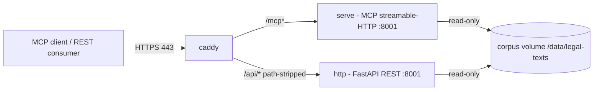

# Docker Compose: working example + production reference

- **Date:** 2026-05-20
- **Status:** Approved (brainstorming) — pending implementation plan
- **Scope:** Fix the broken HTTP Compose example; add a committed, tested
  production Compose reference.

## 1. Context & problem

The repository ships a Docker Compose example for HTTP-mode deployment
(`examples/docker-compose/http/`, merged in #107) and documents production
deployment in `docs/operations/production-deployment.md`. Two concrete
problems.

### 1.1 The merged example does not work

`examples/docker-compose/http/compose.yml` runs `legal-text-mcp-de http` and
sets `PORT=8001`. But `_run_http` in `src/legal_text_mcp_de/cli/_server.py:51`
hard-codes the bind port to `8080` and never reads the `PORT` environment
variable:

```python
effective_port = port if port is not None else 8080
```

This contradicts the function's own docstring, which states it falls back to
"the env-driven settings (HOST/PORT/DATASET_PATH)". Consequences:

- The container's FastAPI app binds `:8080`, not `:8001`.
- The Compose `ports: "8001:8001"` mapping points at a dead container port.
- The example README's verification step (`curl http://localhost:8001/health`)
  fails with connection refused.
- The Dockerfile `HEALTHCHECK` (hard-coded to `:8001`) fails, so the container
  is permanently marked `unhealthy`.

`_run_mcp` (the `serve` command) does it correctly via `settings.port`. Only
the `http` command is affected.

### 1.2 Production deployment is documentation-only

`docs/operations/production-deployment.md` carries Compose snippets only as
copy-pasteable Markdown — nothing committed, nothing tested, free to drift out
of sync with the codebase. The HTTP example covers only the bundled-fixture
quickstart; real operation (mounted corpus, `STRICT_DATASET`, TLS, rate
limiting) is prose.

### 1.3 Known but out of scope

The `deployment/` directory (the `mcp.klein.business` hosted service) is
internally inconsistent — `deployment/Caddyfile` proxies the Compose DNS name
`legal-text-mcp-de:8001` while `deployment/deploy.sh` starts containers with
plain `docker run` under `-blue`/`-green` names and no shared network; and
`deployment/Dockerfile.hosted` pins base image `2.1.0` while the project is at
v2.1.3. This is real but deliberately excluded — see §6.

## 2. Goals / non-goals

**Goals**

- The merged HTTP Compose example works exactly as its README documents.
- A committed, runnable, CI-tested production Compose reference exists,
  exposing both transport surfaces (MCP `serve`, FastAPI `http`) switchable via
  Compose profiles, behind a Caddy reverse proxy.
- `production-deployment.md` references the committed file instead of carrying
  drift-prone inline snippets.

**Non-goals**

- Reworking the `deployment/` hosted-service directory.
- An nginx variant as a committed artifact (stays as prose).
- Rate-limiting middleware, Kubernetes/Helm manifests.

## 3. Part A — `_run_http` port fix

### 3.1 Fix

In `src/legal_text_mcp_de/cli/_server.py`, `_run_http`:

```python
effective_port = port if port is not None else settings.port
```

`settings.port` reads the `PORT` environment variable and defaults to `8001`
(`src/legal_text_mcp_de/config.py:13`). This aligns `_run_http` with its own
docstring and with `_run_mcp`.

### 3.2 Behavioural change (accepted)

The bare default of `http` (no `--port`, no `PORT`) moves **8080 → 8001**.

- `legal-text-mcp-de http --port 8080` continues to work (explicit flag).
- The `--port` help text in `_server.py:74` ("default 8080") is corrected to
  "default from PORT env or 8001".
- Trade-off: `serve` and a bare `http` now share `8001`; running both locally
  at once requires an explicit `--port`. Consistency is preferred over the
  previous implicit port avoidance.

### 3.3 Verification

- A regression test asserts that `PORT` propagates to the uvicorn bind port
  (monkeypatching `uvicorn.run`, consistent with the test indirection the
  `_run_http` docstring describes).
- Any existing test that hard-codes the `8080` default is updated.
- `examples/docker-compose/http/compose.yml` needs **no change** — once the fix
  lands, its `PORT=8001` takes effect and the `:8001` healthcheck turns green.

## 4. Part B — `examples/docker-compose/production/`

A new directory, sibling to `examples/docker-compose/http/`, with four files:
`compose.yaml`, `Caddyfile`, `.env.example`, `README.md`.

### 4.1 Topology



### 4.2 Services (`compose.yaml`)

| Service | Profile(s) | Command | Internal port | Role |
|---|---|---|---|---|
| `serve` | `mcp` | `serve` | `:8001` | MCP streamable-HTTP |
| `http`  | `rest` | `http` | `:8001` | FastAPI REST |
| `caddy` | `mcp`, `rest` | — | — | Reverse proxy, TLS; host `80`/`443` (+`443/udp`) |

- Both app services bind `:8001` by default — `serve` via `settings.port`,
  `http` via the Part A fix — so the production compose needs no `PORT`
  override, and the inherited `:8001` healthcheck and the Caddyfile upstreams
  stay consistent.
- All services use `restart: unless-stopped`.
- `serve` / `http` inherit the Dockerfile `HEALTHCHECK` (probes `:8001/health`,
  exposed by both surfaces).
- `caddy` uses `depends_on` with `condition: service_healthy`.
- The corpus is bind-mounted read-only into both app services.

### 4.3 Profiles

`COMPOSE_PROFILES` is set in `.env` (default `mcp`). `caddy` belongs to both
profiles, so it starts whenever any app profile is active.

- `docker compose up` (default `.env`) → `serve` + `caddy`.
- `COMPOSE_PROFILES=mcp,rest` → both surfaces + `caddy`.

MCP is the default because it is the primary product surface.

### 4.4 Caddy routing

Single domain, path-based:

- `/mcp*` → `serve:8001`
- `/api/*` → path-stripped → `http:8001` (the FastAPI app serves `/laws`,
  `/search`, … at the root)
- `/health` → `serve:8001`
- TLS via Let's Encrypt using `{$DOMAIN}` / `{$ACME_EMAIL}`.
- Defence-in-depth security headers (HSTS, `X-Content-Type-Options`, CSP).
- `request_body { max_size 1MB }` as the proxy-layer body cap — covers both
  surfaces; the app-layer `MAX_REQUEST_BODY_BYTES` cap is FastAPI-only.

The README documents a subdomain split (`mcp.` / `api.`) as an alternative.

### 4.5 Corpus

Production mounts an operator-prepared corpus read-only at `/data/legal-texts`
(the directory convention — the Dockerfile default and the most-documented
path). `STRICT_DATASET=true` and `STRICT_STARTUP=true` make startup fail fast
on a missing or broken corpus. Auto-download is disabled for reproducibility.

> The repository also uses an archive convention (`/data/corpus/latest.tar.zst`,
> in `deployment/Dockerfile.hosted`). This spec standardises the reference
> example on the directory convention; the wider inconsistency is left as-is.

### 4.6 `.env.example`

All operator-tunable values in one place:

| Variable | Example | Purpose |
|---|---|---|
| `DOMAIN` | `legal.example.org` | Domain Caddy serves + ACME |
| `ACME_EMAIL` | `admin@example.org` | Let's Encrypt account |
| `COMPOSE_PROFILES` | `mcp` | Which surfaces run (`mcp`, `rest`, or `mcp,rest`) |
| `IMAGE` | `ghcr.io/klein-business/legal-text-mcp-de:2.1.3@sha256:…` | Digest-pinned image (v2.1.3, as in the HTTP example) |
| `CORPUS_HOST_PATH` | `/srv/legal-corpus` | Host path of the prepared corpus |
| `MAX_REQUEST_BODY_BYTES` | `1048576` | App-layer body cap (bytes) |

## 5. Tests & docs

### 5.1 Tests

- **`docker compose config`** validates both Compose files (HTTP example +
  production) including variable interpolation. Cheap; runs unconditionally.
- **Compose smoke job** — a new CI job (the implementation plan picks the
  workflow after reviewing the existing jobs; `ci.yml` and `e2e.yml` are the
  candidates — there is no general docker-smoke workflow today, and
  `docs/operations/ci-smoke.md` documents only the unrelated `research_topic`
  smoke). It builds the image from the repository `Dockerfile`, boots the app
  services against the bundled fixture corpus, and verifies:
  - profile `mcp`: `POST /mcp` with `tools/list` returns the tool list;
  - profile `rest`: `GET /health` returns `{"status":"ok"}`.
- Caddy is not booted in CI (a real domain would trigger a failing Let's
  Encrypt challenge). The smoke job doubles as the regression test for the
  Part A fix — it proves `PORT=8001` reaches the bind.

### 5.2 Docs

- New `examples/docker-compose/production/README.md`: start / verify / stop,
  profile switching, corpus preparation, a `tls internal` note for local
  testing of the full Caddy stack, and the subdomain alternative.
- `docs/operations/production-deployment.md`: the two inline Compose snippets
  (the Caddy option's `docker-compose.yml` and `Caddyfile`) are replaced by a
  pointer to `examples/docker-compose/production/`. The conceptual content
  (TLS rationale, body-size cap, rate-limiting note, health checks, the
  Kubernetes probe snippet) and the nginx option stay as prose.
- A cross-link is added from `examples/docker-compose/http/README.md` to the
  new production example.
- Changelog: the fix ships as a `fix(cli):` Conventional Commit. The project
  uses `release-please` (`.github/workflows/release-please.yml`), which
  generates `CHANGELOG.md` from commit messages — no manual changelog edit.

## 6. Out of scope

- `deployment/` directory (§1.3): Caddyfile/`deploy.sh` mismatch, stale
  `Dockerfile.hosted` base-image pin.
- nginx as a committed artifact.
- Rate-limiting middleware, Kubernetes/Helm.

## 7. Open points / risks

- **`http` default port change** (§3.2) — confirmed acceptable during
  brainstorming. Watch for tests that assume `8080`.
- **Caddy in CI** — excluded from the smoke job; the full TLS stack is verified
  manually or via the `tls internal` local path documented in the README.
- **Corpus convention split** — the directory-vs-archive inconsistency (§4.5)
  is left in place; only the new reference example is standardised.
